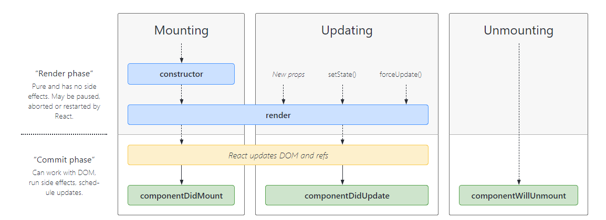
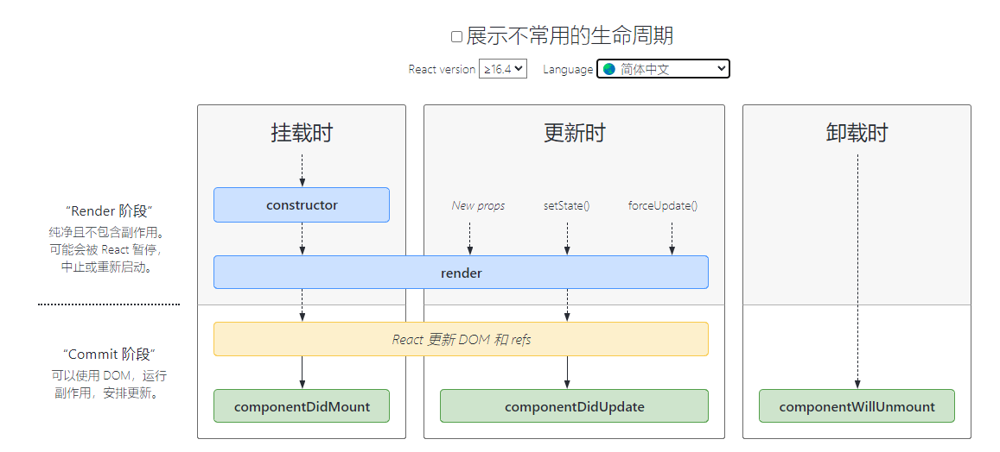
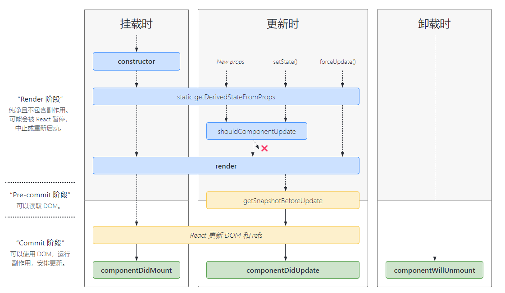
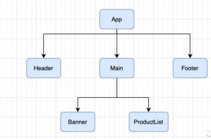
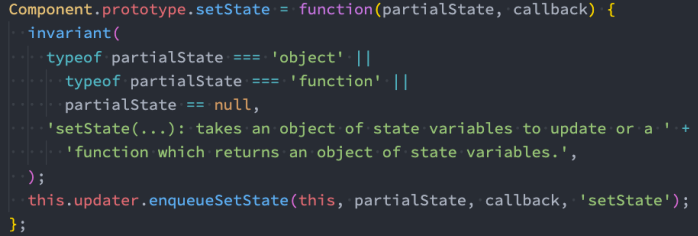
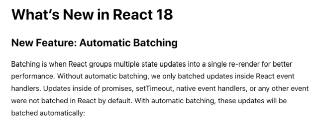

# 组件化开发

## react的组件化开发

### 什么是组件化开发呢？

- 组件化是一种分而治之的思想：

  - 如果我们将一个页面中所有的处理逻辑全部放在一起，处理起来就会变得非常复杂，而且不利于后续的管理以及扩展。

  - 但如果，我们讲一个页面拆分成一个个小的功能块，每个功能块完成属于自己这部分独立的功能，那么之后整个页面的管理和维护就变得非常容易了。

    

- 我们需要通过组件化的思想来思考整个应用程
  序：
  - 我们将一个完整的页面分成很多个组件；
  - 每个组件都用于实现页面的一个功能块；
  - 而每一个组件又可以进行细分；
  - 而组件本身又可以在多个地方进行复用；


### React的组件化

- 组件化是React的核心思想，也是我们后续课程的重点，前面我们封装的App本身就是一个组件：
  - 组件化提供了一种抽象，让我们可以开发出一个个独立可复用的小组件来构造我们的应用。
  - 任何的应用都会被抽象成一颗组件树。


### React的组件化

- 组件化思想的应用：
  - 有了组件化的思想，我们在之后的开发中就要充分的利用它。
  - 尽可能的将页面拆分成一个个小的、可复用的组件。
  - 这样让我们的代码更加方便组织和管理，并且扩展性也更强。
- React的组件相对于Vue更加的灵活和多样，按照不同的方式可以分成很多类组件：
  - 根据组件的定义方式，可以分为：函数组件(Functional Component )和类组件(Class Component)；
  - 根据组件内部是否有状态需要维护，可以分成：无状态组件(Stateless Component )和有状态组件(Stateful Component)；
  - 根据组件的不同职责，可以分成：展示型组件(Presentational Component)和容器型组件(Container Component)；
- 这些概念有很多重叠，但是他们最主要是关注数据逻辑和UI展示的分离：
  - 函数组件、无状态组件、展示型组件主要关注UI的展示；
  - 类组件、有状态组件、容器型组件主要关注数据逻辑；
- 当然还有很多组件的其他概念：比如异步组件、高阶组件等，我们后续再学习。


### 类组件

- 类组件的定义有如下要求：
  - 组件的名称是大写字符开头（无论类组件还是函数组件）
  - 类组件需要继承自 React.Component
  - 类组件必须实现render函数
- 在ES6之前，可以通过create-react-class 模块来定义类组件，但是目前官网建议我们使用ES6的class类定义。
- 使用class定义一个组件：
  - constructor是可选的，我们通常在constructor中初始化一些数据；
  - this.state中维护的就是我们组件内部的数据；
  - render() 方法是 class 组件中唯一必须实现的方法；


```jsx
import React from "react";

class App extends React.Component {
  constructor() {
    super();
    this.state = {
      message: "hhhhh",
    };
  }
  render() {
    const { message } = this.state;
    return <div>App {message}</div>;
  }
}

export default App;

```

### render函数的返回值

- 当 render 被调用时，它会检查 this.props 和 this.state 的变化并返回以下类型之一：
- React 元素：
  - 通常通过 JSX 创建。
  - 例如，`<div />` 会被 React 渲染为 DOM 节点，`<MyComponent />` 会被 React 渲染为自定义组件；
  - 无论是 `<div />` 还是 `<MyComponent />` 均为 React 元素。
- 数组或 fragments：使得 render 方法可以返回多个元素。
- Portals：可以渲染子节点到不同的 DOM 子树中。
- 字符串或数值类型：它们在 DOM 中会被渲染为文本节点
- 布尔类型或 null：什么都不渲染。


### 函数组件

- 函数组件是使用function来进行定义的函数，只是这个函数会返回和类组件中render函数返回一样的内容。 
- 函数组件有自己的特点（当然，后面我们会讲hooks，就不一样了）：
  - **没有生命周期**，也会被更新并挂载，但是没有生命周期函数；
  - this关键字不能指向组件实例（因为没有组件实例）；
  - 没有内部状态（state）；
- 我们来定义一个函数组件：

```jsx
export default function App() {
  return <div>你好</div>;
}
```

## react的生命周期

### 认识生命周期

- 很多的事物都有从创建到销毁的整个过程，这个过程称之为是生命周期；
- React组件也有自己的生命周期，了解组件的生命周期可以让我们在最合适的地方完成自己想要的功能；
- 生命周期和生命周期函数的关系：
- 生命周期是一个抽象的概念，在生命周期的整个过程，分成了很多个阶段；
  - 比如装载阶段（Mount），组件第一次在DOM树中被渲染的过程；
  - 比如更新过程（Update），组件状态发生变化，重新更新渲染的过程；
  - 比如卸载过程（Unmount），组件从DOM树中被移除的过程；
- React内部为了告诉我们当前处于哪些阶段，会对我们组件内部实现的某些函数进行回调，这些函数就是生命周期函数：
  - 比如实现componentDidMount函数：组件已经挂载到DOM上时，就会回调；
  - 比如实现componentDidUpdate函数：组件已经发生了更新时，就会回调；
  - 比如实现componentWillUnmount函数：组件即将被移除时，就会回调；
  - 我们可以在这些回调函数中编写自己的逻辑代码，来完成自己的需求功能；
- 我们谈React生命周期时，主要谈的类的生命周期，因为函数式组件是没有生命周期函数的；（后面我们可以通过hooks来模拟一些生命
  周期的回调）


### 生命周期解析

- 我们先来学习一下最基础、最常用的生命周期函数：





### 生命周期函数

#### Constructor

- 如果不初始化 state 或不进行方法绑定，则不需要为 React 组件实现构造函数。
- constructor中通常只做两件事情：
  - 通过给 this.state 赋值对象来初始化内部的state；
  - 为事件绑定实例（this）；

#### componentDidMount

- componentDidMount() 会在组件挂载后（插入 DOM 树中）立即调用。
- componentDidMount中通常进行哪里操作呢？
  - 依赖于DOM的操作可以在这里进行；
  - 在此处发送网络请求就最好的地方；（官方建议）
  - 可以在此处添加一些订阅（会在componentWillUnmount取消订阅）；


#### componentDidUpdate

- componentDidUpdate() 会在更新后会被立即调用，首次渲染不会执行此方法。
  - 当组件更新后，可以在此处对 DOM 进行操作；
  - 如果你对更新前后的 props 进行了比较，也可以选择在此处进行网络请求；（例如，当 props 未发生变化时，则不会执行网
  络请求）。

#### componentWillUnmount

- componentWillUnmount() 会在组件卸载及销毁之前直接调用。
  - 在此方法中执行必要的清理操作；
  - 例如，清除 timer，取消网络请求或清除在 componentDidMount() 中创建的订阅等；

`App.jxs`

```jsx
import React from "react";
import Com from "./component";

class App extends React.Component {
  constructor() {
    super();
    this.state = {
      isShow: true,
    };
  }

  render() {
    return (
      <div>
        <button onClick={() => this.isShowCom()}>显示</button>
        {this.state.isShow && <Com />}
      </div>
    );
  }
  isShowCom() {
    this.setState({
      isShow: !this.state.isShow,
    });
  }
}
export default App;
```

`component.jsx`

```jsx
import React from "react";

class Com extends React.Component {
  constructor() {
    super();
    this.state = {
      message: "hhhhh",
    };
    console.log("constructor");
  }
  render() {
    const { message } = this.state;
    return (
      <div>
        <div>App {message}</div>
        <button onClick={() => this.btnClick()}>按钮</button>
      </div>
    );
  }
  btnClick() {
    this.setState({
      message: "bbbbb",
    });
  }
  componentDidMount() {
    console.log("componentDidMount");
  }
  componentDidUpdate() {
    console.log("componentDidUpdate");
  }
  componentWillUnmount() {
    console.log("componentWillUnmount");
  }
}

export default Com;
```


### 不常用生命周期函数



- 除了上面介绍的生命周期函数之外，还有一些不常用的生命周期函数：
  - getDerivedStateFromProps：state 的值在任何时候都依赖于 props时使用；该方法返回一个对象来更新state；
  - getSnapshotBeforeUpdate：在React更新DOM之前回调的一个函数，可以获取DOM更新前的一些信息（比如说滚动位置）；
  - shouldComponentUpdate：该生命周期函数很常用，但是我们等待讲性能优化时再来详细讲解；
- 另外，React中还提供了一些过期的生命周期函数，这些函数已经不推荐使用。
- 更详细的生命周期相关的内容，可以参考官网：https://zh-hans.reactjs.org/docs/react-component.html

`App.jxs`

```jsx
import React from "react";
import Com from "./component";

class App extends React.Component {
  constructor() {
    super();
    this.state = {
      isShow: true,
    };
  }

  render() {
    return (
      <div>
        <button onClick={() => this.isShowCom()}>显示</button>
        {this.state.isShow && <Com />}
      </div>
    );
  }
  isShowCom() {
    this.setState({
      isShow: !this.state.isShow,
    });
  }
}
export default App;
```

`component.jsx`

```jsx
import React from "react";

class Com extends React.Component {
  constructor() {
    super();
    this.state = {
      message: "hhhhh",
    };
    console.log("constructor");
  }
  render() {
    const { message } = this.state;
    return (
      <div>
        <div>App {message}</div>
        <button onClick={() => this.btnClick()}>按钮</button>
      </div>
    );
  }
  btnClick() {
    this.setState({
      message: "bbbbb",
    });
  }
  componentDidMount() {
    console.log("componentDidMount");
  }
  componentDidUpdate(prevProps, prevState, snapshot) {
    console.log("componentDidUpdate");
    console.log(prevProps);
    console.log(prevState);
    console.log(snapshot);
    console.log("componentDidUpdate");
  }
  componentWillUnmount() {
    console.log("componentWillUnmount");
  }
  // 不常用生命周期
  // 控制数据更新是否重新渲染
  shouldComponentUpdate() {
    console.log("shouldComponentUpdate");
    // return false;
    return true;
  }

  // 在更新界面之前执行
  // 可以先保存下来更新前的数据,在DidUpdate阶段可以获取到对应数据
  getSnapshotBeforeUpdate() {
    console.log("getSnapshotBeforeUpdate");
    return {
      flag: "你好",
    };
  }
}

export default Com;
```

### 认识组件的嵌套

- 组件之间存在嵌套关系：
  - 在之前的案例中，我们只是创建了一个组件App；
  - 如果我们一个应用程序将所有的逻辑都放在一个组件中，那么这个组件就会变成非常的臃肿和难以维护；
  - 所以组件化的核心思想应该是对组件进行拆分，拆分成一个个小的组件；
  - 再将这些组件组合嵌套在一起，最终形成我们的应用程序；

- 上面的嵌套逻辑如下，它们存在如下关系：
  - App组件是Header、Main、Footer组件的父组件；

  - Main组件是Banner、ProductList组件的父组件；

  

## react组件间的通信

### 认识组件间的通信

- 在开发过程中，我们会经常遇到需要组件之间相互进行通信：
  - 比如App可能使用了多个Header，每个地方的Header展示的内容不同，那么我们就需要使用者传递给Header一些数据，让其进行展示；
  - 又比如我们在Main中一次性请求了Banner数据和ProductList数据，那么就需要传递给他们来进行展示；
  - 也可能是子组件中发生了事件，需要由父组件来完成某些操作，那就需要子组件向父组件传递事件；
- 总之，在一个React项目中，组件之间的通信是非常重要的环节；
- 父组件在展示子组件，可能会传递一些数据给子组件：
  - 父组件通过 属性=值 的形式来传递给子组件数据；
  - 子组件通过 props 参数获取父组件传递过来的数据；

### 父组件传递子组件 - 类组件

`Parent.jsx`

```jsx
import React, { Component } from "react";
import Child from "./Child";

class Parent extends Component {
  constructor() {
    super();
    this.state = {
      message: {
        name: "mjjh",
        age: 18,
      },
    };
  }
  render() {
    const { message } = this.state;
    return (
      <div>
        <div>Parent</div>
        <Child message={message} />
      </div>
    );
  }
}

export default Parent;
```

`Child.jsx`

```jsx
import React, { Component } from "react";

class Child extends Component {
  // 可以不写,内部默认执行
  constructor(props) {
    super(props);
    console.log(props);
  }

  render() {
    const { name, age } = this.props.message;
    return (
      <div>
        <div>Child</div>
        <div>{name} </div>
        <div>{age} </div>
      </div>
    );
  }
}

export default Child;
```

### 父组件传递子组件 -函数组件(后面补充)

### 参数propTypes

- 对于传递给子组件的数据，有时候我们可能希望进行验证，特别是对于大型项目来说：
  - 当然，如果你项目中默认继承了Flow或者TypeScript，那么直接就可以进行类型验证；
  - 但是，即使我们没有使用Flow或者TypeScript，也可以通过 prop-types 库来进行参数验证；
- 从 React v15.5 开始，React.PropTypes 已移入另一个包中：prop-types 库
- 更多的验证方式，可以参考官网：https://zh-hans.reactjs.org/docs/typechecking-with-proptypes.html
  - 比如验证数组，并且数组中包含哪些元素；
  - 比如验证对象，并且对象中包含哪些key以及value是什么类型；
  - 比如某个原生是必须的，使用 requiredFunc: PropTypes.func.isRequired
- 如果没有传递，我们希望有默认值呢？
  - 我们使用defaultProps就可以了

`Parent.jsx`

```jsx
import React, { Component } from "react";
import Child from "./Child";

class Parent extends Component {
  constructor() {
    super();
    this.state = {
      message: {
        name: "mjjh",
        age: 18,
        // age: "18",
      },
    };
  }
  render() {
    const { message } = this.state;
    return (
      <div>
        <div>Parent</div>
        <Child message={message} />
      </div>
    );
  }
}

export default Parent;
```

`Child.jsx`

```jsx
import React, { Component } from "react";
import PropTypes from "prop-types";

export class Child extends Component {
  // 可以不写,内部默认执行
  constructor(props) {
    super(props);
    console.log(props);
  }

  render() {
    const { name, age } = this.props.message;
    return (
      <div>
        <div>Child</div>
        <div>{name} </div>
        <div>{age} </div>
      </div>
    );
  }
}

// 限定传入类型
Child.propTypes = {
  // 指定message传入的是一个obj对象
  message: PropTypes.object,
  // 指定message内部的类型
  // message: PropTypes.oneOfType([
  //   PropTypes.string.isRequired,
  //   PropTypes.number.isRequired,
  // ]),
};

// 传入的默认值
Child.defaultProps = {
  message: {
    name: "jyg",
    age: 22,
  },
};

export default Child;
```


### 子组件传递父组件

- 某些情况，我们也需要子组件向父组件传递消息：
  - 在vue中是通过自定义事件来完成的；
  - 在React中同样是通过props传递消息，只是让父组件给子组件传递一个回调函数，在子组件中调用这个函数即可；
- 我们这里来完成一个案例：
  - 将计数器案例进行拆解；
  - 将按钮封装到子组件中：CounterButton；
  - CounterButton发生点击事件，将内容传递到父组件中，修改counter的值；

`Main.jsx`

```jsx
import React, { Component } from "react";
import AddCounter from "./AddCounter";

class Main extends Component {
  constructor() {
    super();
    this.state = {
      counter: 100,
    };
  }
  render() {
    const { counter } = this.state;
    return (
      <div>
        <div>Main</div>
        <h2>当前计数: {counter}</h2>
        <AddCounter addCount={(count) => this.addCount(count)} />
      </div>
    );
  }
  addCount(num) {
    this.setState({
      counter: this.state.counter + num,
    });
  }
}

export default Main;
```

`AddCounter.jsx`

```jsx
import React, { Component } from "react";

export class AddCounter extends Component {
  btnClick(count) {
    this.props.addCount(count);
  }

  render() {
    return (
      <div>
        <div>AddCounter</div>
        {/* 或者通过一个函数包裹 */}
        <button onClick={() => this.btnClick(1)}>+1</button>
        <button onClick={() => this.btnClick(5)}>+5</button>
        {/* 可以直接调用props中的函数 */}
        <button onClick={() => this.props.addCount(10)}>+10</button>
      </div>
    );
  }
}
export default AddCounter;
```

## react中的插槽

### React中的插槽（slot）

- 在开发中，我们抽取了一个组件，但是为了让这个组件具备更强的通用性，我们不能将组件中的内容限制为固定的div、span等等这些元素。

- 我们应该让使用者可以决定某一块区域到底存放什么内容。

  

- 这种需求在Vue当中有一个固定的做法是通过slot来完成的，React呢？

- React对于这种需要插槽的情况非常灵活，有两种方案可以实现：
  - 组件的children子元素；
  - props属性传递React元素；


### children实现插槽

- 每个组件都可以获取到 props.children：它包含组件的开始标签和结束标签之间的内容。

`Parent.jsx`

```jsx
import React, { Component } from "react";
import Child from "./child";

class Parent extends Component {
  render() {
    return (
      <div className="parent">
        <Child>
          <button>按钮</button>
          <h2>标题</h2>
          <i>文字</i>
        </Child>
      </div>
    );
  }
}

export default Parent;
```

`Child.jsx`

```jsx
import React, { Component } from "react";
import "./style.css";

export class Child extends Component {
  render() {
    const { children } = this.props;
    return (
      <div className="child">
        <div className="left">{children[0]}</div>
        <div className="center">{children[1]}</div>
        <div className="right">{children[2]}</div>
      </div>
    );
  }
}

export default Child;
```

`style.css`

```css
.child {
  display: flex;
}
.left, .right {
  width: 80px;
  background-color: red;
}
.center {
  flex: 1;
  background-color: orange;
}
```


### props实现插槽

- 通过children实现的方案虽然可行，但是有一个弊端：通过索引值获取传入的元素很容易出错，不能精准的获取传入的原生；
  - 如果只传入一个元素 children就会等于那个元素

- 另外一个种方案就是使用 props 实现：
  - 通过具体的属性名，可以让我们在传入和获取时更加的精准；

`Parent.jsx`

```jsx
import React, { Component } from "react";
import Child from "./child";

class Parent extends Component {
  render() {
    return (
      <div className="parent">
        <Child
          leftSlot={<button>按钮</button>}
          centerSlot={<h2>文字2</h2>}
          rightSlot={(message) => this.rightSlot(message)}
        />
      </div>
    );
  }
  rightSlot(message) {
    return <h3>文字3{message}</h3>;
  }
}

export default Parent;
```

`Child.jsx`

```jsx
import React, { Component } from "react";
import "./style.css";

export class Child extends Component {
  render() {
    const { leftSlot, centerSlot, rightSlot } = this.props;
    return (
      <div className="child">
        <div className="left">{leftSlot}</div>
        <div className="center">{centerSlot}</div>
        <div className="right">{rightSlot("你好")}</div>
      </div>
    );
  }
}

export default Child;
```

`style.css`

```css
.child {
  display: flex;
}
.left, .right {
  width: 80px;
  background-color: red;
}
.center {
  flex: 1;
  background-color: orange;
}
```


## react非父子组件通信

### Context应用场景

- 非父子组件数据的共享：
  - 在开发中，比较常见的数据传递方式是通过props属性自上而下（由父到子）进行传递。
  - 但是对于有一些场景：比如一些数据需要在多个组件中进行共享（地区偏好、UI主题、用户登录状态、用户信息等）。
  - 如果我们在顶层的App中定义这些信息，之后一层层传递下去，那么对于一些中间层不需要数据的组件来说，是一种冗余的
  操作。
  
- 我们实现一个一层层传递的案例：
  - Spread Attributes ...展开运算符
  
  - 如果需要传递一个对象的时候, 原本需要传入对应的key和值
  
  - 现在支持直接将这个对象进行解构 然后传递例如
  
    ```jsx
    import React, { Component } from "react";
    import Child from "./Child";
    
    class Parent extends Component {
      constructor() {
        super();
        this.state = {
          message: {
            name: "mjjh",
            age: 18,
          },
        };
      }
      render() {
        const { message } = this.state;
        return (
          <div>
            <div>Parent</div>
            {/* 手动解构之后再传递 */}
            <Child name={message.name} age={message.age} />
            {/* 直接解构对象传递 */}
            <Child {...message} />
          </div>
        );
      }
    }
    
    export default Parent;
    ```
  
  - 层层传递可以在传值的时候使用 ...this.props 直接给子组件传值
  
- 但是，如果层级更多的话，一层层传递是非常麻烦，并且代码是非常冗余的：
  - React提供了一个API：Context；
  - Context 提供了一种在组件之间共享此类值的方式，而不必显式地通过组件树的逐层传递 props；
  - Context 设计目的是为了共享那些对于一个组件树而言是“全局”的数据，例如当前认证的用户、主题或首选语言；


### Context相关API

- React.createContext
  - 创建一个需要共享的Context对象：
  
  - 如果一个组件订阅了Context，那么这个组件会从离自身最近的那个匹配的 Provider 中读取到当前的context值；
  
  - defaultValue是组件在顶层查找过程中没有找到对应的Provider，那么就使用默认值
  
    ```jsx
    const ThemeContext = React.createContext();
    ```
  
- Context.Provider
  - 每个 Context 对象都会返回一个 Provider React 组件，它允许消费组件订阅 context 的变化：
  
  - Provider 接收一个 value 属性，传递给消费组件；
  
  - 一个 Provider 可以和多个消费组件有对应关系；
  
  - 多个 Provider 也可以嵌套使用，里层的会覆盖外层的数据；
  
  - 当 Provider 的 value 值发生变化时，它内部的所有消费组件都会重新渲染；
  
    ```jsx
    {/* value存放给后代共享数据的位置 */}
    <ThemeContext.Provider value={{ message: "你好" }}>
      <Child />
    </ThemeContext.Provider>
    ```


- Class.contextType
  - 挂载在 class 上的 contextType 属性会被重赋值为一个由 React.createContext() 创建的 Context 对象：
  
  - 这能让你使用 this.context 来消费最近 Context 上的那个值；
  
  - 你可以在任何生命周期中访问到它，包括 render 函数中；
  
    ```jsx
    Child.contextType = ThemeContext;
    ```
  
- Context.Consumer
  - 这里，React 组件也可以订阅到 context 变更。这能让你在 函数式组件 中完成订阅 context。
  
  - 这里需要 函数作为子元素（function as child）这种做法；
  
  - 这个函数接收当前的 context 值，返回一个 React 节点；
  
    ```jsx
    {/* value存放给后代共享数据的位置 */}
    <ThemeContext.Consumer>
      {value => {
        return <h2>{value.message}</h2>
        /* 基于 context 值进行渲染 */
      }}
    </ThemeContext.Consumer>
    ```
  
    


### Context代码演练

- Context的基本使用

- 什么时候使用默认值defaultValue呢？

  在没有被包裹时候也去调用了对应的context时

  `ThemeContext.js`

  ```js
  const ThemeContext = React.createContext({message: "你好"});
  ```

  `Parent.jsx`

  ```jsx
  {/* value存放给后代共享数据的位置 */}
  <ThemeContext.Provider value={{ message: "你好" }}>
    <Child />
  </ThemeContext.Provider>
  <Child2 />
  ```

  `Child2.jsx` 这时使用的数据就是默认数据

  ```jsx
  Child2.contextType = ThemeContext;
  ```

- 什么时候使用Context.Consumer呢？
  1. 当使用value的组件是一个函数式组件时；
  2. 当组件中需要使用多个Context时；


## setState使用详情

### 为什么使用setState

- 开发中我们并不能直接通过修改state的值来让界面发生更新：
  - 因为我们修改了state之后，希望React根据最新的State来重新渲染界面，但是这种方式的修改React并不知道数据发生了变
  化；
  - React并没有实现类似于Vue2中的Object.defineProperty或者Vue3中的Proxy的方式来监听数据的变化；
  - 我们必须通过setState来告知React数据已经发生了变化；
  
- 疑惑：在组件中并没有实现setState的方法，为什么可以调用呢？
  - 原因很简单，setState方法是从Component中继承过来的。
  
    

### setState的使用

1. setState的基本使用
2. setState可以传入一个回调函数
   1. 好处一: 可以在回调函数中编写新的state的逻辑
   2. 好处二: 可以直接获取到原来state和props中的内容
3. setState在React的事件处理是一个异步调用
   1. setState后不是立马合并的,而是延迟了一会儿再合并,所以再----的时候还是打印之前的内容
   2. 如果希望再数据更新之后(数据合并),再渠道对应的解构执行了一些逻辑代码
   3. 那么可以在setState中传入第二个参数: callback

```jsx
import React, { Component } from "react";

export class App extends Component {
  constructor() {
    super();
    this.state = {
      message: "hello world",
      count: 0,
    };
  }
  render() {
    const { message, count } = this.state;
    return (
      <div>
        <div>message:{message}</div>
        <button onClick={() => this.changeMessage()}>修改文字</button>
        <div>count:{count}</div>
        <button onClick={() => this.addCount()}>count++</button>
      </div>
    );
  }
  addCount() {
    this.setState({
      count: this.state.count + 1,
    });
  }
  changeMessage() {
    // 1.setState的基本使用
    // this.setState({
    //   message: "你好",
    // });

    // 2.setState可以传入一个回调函数
    // 好处一:可以在回调函数中编写新的state的逻辑
    // 好处二:可以直接获取到原来state和props中的内容
    // this.setState(() => {
    //   console.log(this.state.message, this.props);
    //   return {
    //     message: "你好",
    //   };
    // });

    // 3.setState在React的事件处理是一个异步调用
    // setState后不是立马合并的,而是延迟了一会儿再合并,所以再----的时候还是打印之前的内容
    // 如果希望再数据更新之后(数据合并),再渠道对应的解构执行了一些逻辑代码
    // 那么可以在setState中传入第二个参数: callback
    this.setState(
      {
        message: "你好",
      },
      () => {
        console.log("++++++", this.state.message);
      }
    );
    console.log("------", this.state.message);
  }
}

export default App;

```

### setState异步更新

- setState的更新是异步的？
  - 最终打印结果是Hello World；
  - 可见setState是异步的操作，我们并不能在执行完setState之后立马拿到最新的state的结果

```jsx
import React, { Component } from "react";

export class App extends Component {
  constructor() {
    super();
    this.state = {
      message: "hello world",
    };
  }
  render() {
    const { message } = this.state;
    return (
      <div>
        <div>message:{message}</div>
        <button onClick={() => this.changeMessage()}>修改文字</button>
      </div>
    );
  }
  changeMessage() {
    this.setState(
      {
        message: "你好",
      }
    );
    console.log("------", this.state.message);
  }
}

export default App;
```

- 为什么setState设计为异步呢？
  - setState设计为异步其实之前在GitHub上也有很多的讨论；
  - React核心成员（Redux的作者）Dan Abramov也有对应的回复，有兴趣的同学可以参考一下；
  - https://github.com/facebook/react/issues/11527#issuecomment-360199710；
- 我对其回答做一个简单的总结：
- **setState设计为异步，可以显著的提升性能；**
  - **如果每次调用 setState都进行一次更新，那么意味着render函数会被频繁调用，界面重新渲染，这样效率是很低的；**
  - **最好的办法应该是获取到多个更新，之后进行批量更新；**
- **如果同步更新了state，但是还没有执行render函数，那么state和props不能保持同步；**
  - **state和props不能保持一致性，会在开发中产生很多的问题；**


### 如何获取异步的结果

- 那么如何可以获取到更新后的值呢？

- 方式一：setState的回调
  - setState接受两个参数：第二个参数是一个回调函数，这个回调函数会在更新后会执行；
  - 格式如下：setState(partialState, callback)

- 方式二：当然，我们也可以在生命周期函数：

  ```jsx
  import React, { Component } from "react";
  
  export class App extends Component {
    constructor() {
      super();
      this.state = {
        message: "hello world",
      };
    }
    render() {
      const { message } = this.state;
      return (
        <div>
          <div>message:{message}</div>
          <button onClick={() => this.changeMessage()}>修改文字</button>
        </div>
      );
    }
    changeMessage() {
      // setState在React的事件处理是一个异步调用
      // setState后不是立马合并的,而是延迟了一会儿再合并,所以再----的时候还是打印之前的内容
      // 如果希望再数据更新之后(数据合并),再渠道对应的解构执行了一些逻辑代码
      // 那么可以在setState中传入第二个参数: callback
      this.setState(
        {
          message: "你好",
        },
        () => {
          console.log("++++++", this.state.message);
        }
      );
      console.log("------", this.state.message);
    }
    // 声明周期函数
    componentDidUpdate() {
      console.log("componentDidUpdate",this.state.message);
    }
  }
  
  export default App;
  ```


### setState一定是异步的吗?（React18之前）

- 验证一：在setTimeout中的更新：

  - 开一个宏任务, 不再由react回调, 而是使用浏览器去回调
  - react18之后也还是异步的

  ```js
  changeMessage() {
    setTimeout(() => {
      this.setState(
        {
          message: "你好",
        },
      );
      console.log("------", this.state.message);
      // react18之前 你好
      // react18之后 hello world
    }, 0)
  }
  ```

- 验证二：原生DOM事件：

  - 使用浏览器去回调

  ```jsx
  changeMessage() {
    const btnEl = document.getElementById("btn")
    btnEl.addEventListener('click',() => {
      this.setState(
        {
          message: "你好",
        },
      );
      console.log("------", this.state.message);
      // react18之前 你好
      // react18之后 hello world
    })
  }
  ```

- 在react18之前, 其实分成两种情况：

  - 在组件生命周期或React合成事件中，setState是异步；
  - 在setTimeout或者原生dom事件中，setState是同步；

### setState默认是异步的（React18之后）

- 但是在React18之后，默认所有的操作都被放到了批处理中（异步处理）。

  

- 如果希望代码可以同步会拿到，则需要执行特殊的flushSync操作：

  - 需要从react-dom包中导入flushSync

```jsx
import React, { Component } from "react";
import { flushSync } from "react-dom";

export class App extends Component {
  constructor() {
    super();
    this.state = {
      message: "hello world",
    };
  }
  render() {
    const { message } = this.state;
    return (
      <div>
        <div>message:{message}</div>
        <button onClick={() => this.changeMessage()}>修改文字</button>
      </div>
    );
  }
  changeMessage() {

    flushSync(() => {
      this.setState({
        message: "你好",
      });
    });
    console.log("------", this.state.message);
  }
}

export default App;

```

