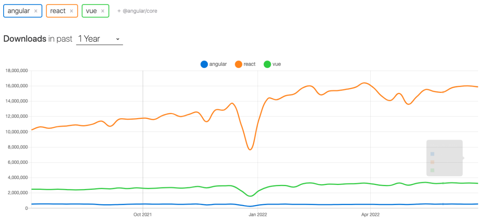

# 初识Vue

## Vue与前端

### 认识Vue

- Vue (读音 /vjuː/，类似于 view) 是一套用于构建用户界面的渐进式 JavaScript框架。
  - 全称是Vue.js或者Vuejs；
  - 它基于标准 HTML、CSS 和 JavaScript 构建，并提供了一套声明式的、组件化的编程模型；
  - 帮助你高效地开发用户界面，无论任务是简单还是复杂；
- 什么是渐进式框架呢？
  - 表示我们可以在项目中一点点来引入和使用Vue，而不一定需要全部使用Vue来开发整个项目；
    


### Vue在前端处于什么地位？

- 目前前端最流行的是三大框架：Vue、React、Angular。

  

### 框架数据对比

- google

  

- 百度

  

- GitHub

  

- npm

  

### 谁是最好的前端框架？

- 当然，我不会去给出我的结论：
  - 首先，这是一个敏感的话题，在很多地方都争论不休，就像很多人喜欢争论谁才是世界上最好的语言一样；
  - 其次，争论这个话题是没有意义的，争论不休的话题；
- 但是，我们从现实的角度，分析一下，学习哪一门语言更容易找到工作？
  - 找后端的工作：优先推荐Java、其次推荐Go、再次推荐Node（JavaScript），可能不推荐PHP、C#；
  - 找前端的工作：优先推荐JavaScript（TypeScript）、其次Flutter、再次Android（Java、Kotlin）、iOS（OC、Swift）；
  - 也有很多的其他方向：游戏开发、人工智能、算法工程师等等；
- 那么，就前端来说，学习了HTML、CSS、JavaScript，哪一个框架更容易找到工作？
  - 如果去国外找工作，优先推荐React、其次是Vue和Angular；
  - 如果在国内找工作，优先推荐、必须学习Vue，其次是React，其次是Angular；

### 学习vue2还是vue3？


- 在2020年的9月19日，万众期待的Vue3终于发布了正式版，命名为“One Piece”。
  - 更好的性能；
  - 更小的包体积；
  - 更好的TypeScript集成；
  - 更优秀的API设计。

## 引入Vue的方式

### 如何使用Vue呢？

- Vue的本质，就是一个JavaScript的库：
  - 刚开始我们不需要把它想象的非常复杂；
  - 我们就把它理解成一个已经帮助我们封装好的库；
  - 在项目中可以引入并且使用它即可。
- 那么安装和使用Vue这个JavaScript库有哪些方式呢？
  - 方式一：在页面中通过CDN的方式来引入；
  - 方式二：下载Vue的JavaScript文件，并且自己手动引入；
  - 方式三：通过npm包管理工具安装使用它（webpack再讲）；
  - 方式四：直接通过Vue CLI创建项目，并且使用它；

### 方式一：CDN引入

- Vue的CDN引入：

  ```html
  <script src="https://unpkg.com/vue@next"></script>
  ```

- Hello Vue案例的实现：

  ```vue
  <div id="app"></div>
  
  <script src="https://unpkg.com/vue@next"></script>
  
  <script>
  	// Vue相关的代码
    const app = Vue.createApp({
      template: '<h2>Hellow Vue3</h2>'
    })
    
    // 将app挂载到id为app的div上
    app.mount("#app")
  </script>
  ```

### 方式二：下载和引入


- 下载Vue的源码，可以直接打开CDN的链接：

  - 打开链接，复制其中所有的代码；
  - 创建一个新的文件，比如vue.js，将代码复制到其中；

- 通过script标签，引入刚才的文件：

  ```html
  <script src="../js/vue.js"></script>
  ```

- 你好啊，Vue3，案例的实现：

  ```vue
  <div id="app"></div>
  
  <script src="../js/vue.js"></script>
  
  <script>
  	// Vue相关的代码
    const app = Vue.createApp({
      template: '<h2>Hello Vue3</h2>'
    })
    
    // 将app挂载到id为app的div上
    app.mount("#app")
  </script>
  ```

## Vue初体验

### 案例体验一：动态展示Hello Vue+展示列表的数据

```vue
<!DOCTYPE html>
<html lang="en">
<head>
  <meta charset="UTF-8">
  <meta http-equiv="X-UA-Compatible" content="IE=edge">
  <meta name="viewport" content="width=device-width, initial-scale=1.0">
  <title>Document</title>
</head>
<body>
  <div id="app">
    <h2>
      {{title}}
    </h2>
    <h2>
      电影列表
    </h2>
    <ul>
      <li v-for="item in movies">{{item}}</li>
    </ul>
  </div>
  
  <script src="https://unpkg.com/vue@next"></script>
  
  <script>
    // Vue相关的代码
    const app = Vue.createApp({
      data() {
        return {
          title: "Hello Vue3",
          movies: ['1','2','3','4']
        }
      }
    })
    
    // 将app挂载到id为app的div上
    app.mount("#app")
  </script>
</body>
</html>
```


### 案例体验三：计数器功能实现

#### 逻辑


- 如果我们希望实现一个计数器的案例：
  - 点击+1，那么内容会显示数字+1；
  - 点击-1，那么内容会显示数字-1；
- 我们可以选择很多种方式来实现：
  - 在这里我们就对比原生和Vue的实现方式的不同。


####  计数器原生实现

```vue
<!DOCTYPE html>
<html lang="en">
<head>
  <meta charset="UTF-8">
  <meta http-equiv="X-UA-Compatible" content="IE=edge">
  <meta name="viewport" content="width=device-width, initial-scale=1.0">
  <title>Document</title>
</head>
<body>
  <!-- 原生实现 -->
  <h2 class="title"></h2>
  <button class="increment">+</button>
  <button class="decrement">-</button>
  <script>
    const titleEl = document.querySelector('.title')
    const inBtn = document.querySelector('.increment')
    const deBtn = document.querySelector('.decrement')

    let counter = 0

    titleEl.innerHTML = counter

    inBtn.addEventListener('click', ()=> {
      counter +=1
      titleEl.innerHTML = counter
    })
    deBtn.addEventListener('click', ()=> {
      counter -=1
      titleEl.innerHTML = counter
    })

  </script>
</body>
</html>
```

####  计数器Vue实现

```vue
<!DOCTYPE html>
<html lang="en">
<head>
  <meta charset="UTF-8">
  <meta http-equiv="X-UA-Compatible" content="IE=edge">
  <meta name="viewport" content="width=device-width, initial-scale=1.0">
  <title>Document</title>
</head>
<body>
  <!-- Vue实现 -->
  <div id="app">
    <h2>{{counter}}</h2>
    <button @click="increment">+</button>
    <button @click="decrement">-</button>
  </div>

  <script src="https://unpkg.com/vue@next"></script>
  <script>
    const app = Vue.createApp({
      data() {
        return {
          counter: 0
        }
      },
      methods: {
        increment() {
          this.counter++
        },
        decrement() {
          this.counter--
        }
      }
    })
    app.mount("#app")
  </script>
</body>
</html>
```

## vue的架构

### 声明式编程和命令式编程


- 原生开发和Vue开发的模式和特点，我们会发现是完全不同的，这里其实涉及到两种不同的编程范式：
  - 命令式编程和声明式编程；
  - 命令式编程关注的是 “how to do”自己完成整个how的过程；
  - 声明式编程关注的是 “what to do”，由框架(机器)完成 “how”的过程；
- 在原生的实现过程中，我们是如何操作的呢？
  - 我们每完成一个操作，都需要通过JavaScript编写一条代码，来给浏览器一个指令；
  - 这样的编写代码的过程，我们称之为命令式编程；
  - 在早期的原生JavaScript和jQuery开发的过程中，我们都是通过这种命令式的方式在编写代码的；
- 在Vue的实现过程中，我们是如何操作的呢？
  - 我们会在createApp传入的对象中声明需要的内容，模板template、数据data、方法methods；
  - 这样的编写代码的过程，我们称之为是声明式编程；
  - 目前Vue、React、Angular、小程序的编程模式，我们称之为声明式编程；

### MVVM模型


- MVC和MVVM都是一种软件的体系结构
  - MVC是Model – View –Controller的简称，是在前期被使用非常框架的架构模式，比如iOS、前端；
  - MVVM是Model-View-ViewModel的简称，是目前非常流行的架构模式；
- 通常情况下，我们也经常称Vue是一个MVVM的框架。
  - Vue官方其实有说明，Vue虽然并没有完全遵守MVVM的模型，但是整个设计是受到它的启发的。
    

### data属性


- data属性是传入一个函数，并且该函数需要返回一个对象：
  - 在Vue2.x的时候，也可以传入一个对象（虽然官方推荐是一个函数）；
  - 在Vue3.x的时候，必须传入一个函数，否则就会直接在浏览器中报错；
- data中返回的对象会被Vue的响应式系统劫持，之后对该对象的修改或者访问都会在劫持中被处理：
  - 所以我们在template或者app中通过 {{counter}} 访问counter，可以从对象中获取到数据；
  - 所以我们修改counter的值时，app中的 {{counter}}也会发生改变；
- 具体这种响应式的原理，我们后面会有专门的篇幅来讲解。

### methods属性


- methods属性是一个对象，通常我们会在这个对象中定义很多的方法：

  - 这些方法可以被绑定到 模板中；
  - 在该方法中，我们可以使用this关键字来直接访问到data中返回的对象的属性；

- 对于有经验的同学，在这里我提一个问题，官方文档有这么一段描述：

  - 问题一：为什么不能使用箭头函数（官方文档有给出解释）？

  - 问题二：不使用箭头函数的情况下，this到底指向的是什么？（可以作为一道面试题）

    

#### 问题一：不能使用箭头函数？


- 我们在methods中要使用data返回对象中的数据：
  - 那么这个this是必须有值的，并且应该可以通过this获取到data返回对象中的数据。
- 那么我们这个this能不能是window呢？
  - 不可以是window，因为window中我们无法获取到data返回对象中的数据；
  - 但是如果我们使用箭头函数，那么这个this就会是window了；
- 为什么是window呢？
  - 这里涉及到箭头函数使用this的查找规则，它会在自己的上层作用于中来查找this；
  - 最终刚好找到的是script作用于中的this，所以就是window；

#### 问题二：this到底指向什么？


- 事实上Vue的源码当中就是对methods中的所有函数进行了遍历，并且通过bind绑定了this：
  