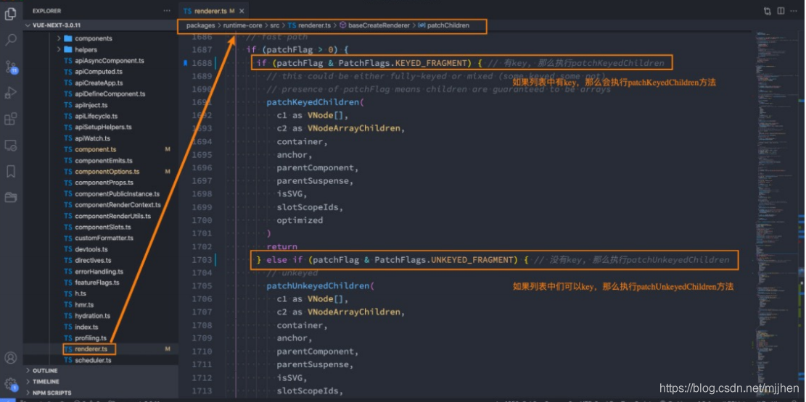
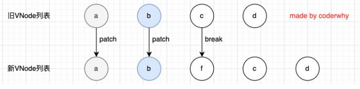
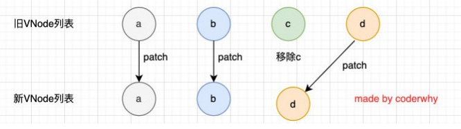

# Vue 基础-模板语法

## 代码片段

### vs-code 代码片段

- 设置-用户代码片段-选择语言
- 将需要的代码片段拷贝到https://snippet-generator.app网站下，并且填写完Description，和Tab trigger 后，拷贝到 vs-code 即可

## 模板语法

### 什么是模板语法

- React 的开发模式
  - React 使用的 jsx,所以对应的代码都是编写的类似于 js 的一种语法
  - 之后通过 Babe 将 js 编译成 React. create Element 函数调用
- vue 也支持 jsx 的开发模式(后续有时间也会讲到):
  - 但是大多数情况下,使用基于 HTML 的模板语法
  - 在模板中,允许开发者以声明式的方式将 DOM 和底层组件实例的数据绑定在-起;口在底层的实现中,vue 将模板编译成虚拟 DOM 渲染函数,这个我会在后续给大家讲到;

### mustache 语法

- 基本使用

  ```html
  <h2>{{message}}</h2>
  ```

- 表达式

  ```html
  <h2>{{message*10}}</h2>
  ```

- 函数

  ```html
  <h2>{{message.split(" ").reverse()join(" ")}}</h2>
  ```

- 三元运算符

  ```html
  <h2>{{isShow ? "hhhh":""}}</h2>
  ```

## 不常用指令

#### v-once

- v-once 用于指定元素或者组件只渲染一次

  - 当数据发生变化时,元素或者组件以及其所有的子元素将视为静态内容并且跳过;

  - 该指令可以用于性能优化;

    ```html
    <h2 v-once>{{counter}}</h2>
    <button @click="increment">+1</button>
    ```

- 如果是子节点的化，也只能渲染一次

  ```html
  <div v-once>
    <h2>{{counter}}</h2>
    <h2>{{message}}</h2>
  </div>
  <button @click="increment">+1</button>
  ```

#### v-text

- 用于更新元素的 textContent

  ```html
  <h2 v-text="message"></h2>
  <!-- 等价于 -->
  <h2>{{message}}</h2>
  ```

#### v-html

- 默认情况下，如果我们展示的内容本身是 html 的，那么 vue 并不会对其进行特殊的解析。

  - 如果我们希望这个内容被 Vue 可以解析出来，那么可以使用 v-html 来展示

    ```html
    <template id="my-app">
      <div>{{msg}}</div>
      <div v-html="msg"></div>
    </template>

    <script>
      const App = {
        template: "#my-app",
        data() {
          return {
            msg: '<span style="color:red; background: blue;">哈哈哈</span>',
          };
        },
      };
    </script>
    ```

#### v-pre

- v-pre 用于跳过元素和它的子元素的编译过程，显示原始的 Mustache 标签：

  - 跳过不需要编译的节点，加快编译的速度

    ```html
    <template id="my-app">
      <h2 v-pre>{{message}}</h2>
    </template>
    ```

#### v-cloak

- 这个指令保持在元素上直到关联组件实例结束编译。

  - 和 CSS 规则如 [v-cloak] { display: none } 一起用时，这个指令可以隐藏未编译的 Mustache 标签直到组件实例准备完毕

    ```html
    <template id="my-app">
      <h2 v-cloak>{{message}}</h2>
    </template>

    <script>
      const App = {
        template: "#my-app",
        data() {
          return {
            message: "Hello World",
          };
        },
      };
    </script>
    ```

  - 不会显示，直到编译结束

## v-bind

#### v-bind 的绑定属性

- 有用的小知识 Vue3 支持多个根元素
- 前端讲的一系列指令，主要是将值插入到模板内容中。
- 但是，除了内容需要动态来决定外，某些属性我们也希望动态来绑定。
  - 比如动态绑定 a 元素的 href 属性；
  - 比如动态绑定 img 元素的 src 属性；
- 绑定属性我们使用 v-bind：
- 缩写：:
- 预期：any (with argument) | Object (without argument)
- 参数：attrOrProp (optional)
- 修饰符：
  - .camel - 将 kebab-case attribute 名转换为 camelCase。
- 用法：动态地绑定一个或多个 attribute，或一个组件 prop 到表达式。

#### v-bind 绑定基本属性

- v-bind 用于绑定一个或多个属性值，或者向另一个组件传递 props 值（这个学到组件时再介绍）；

- 在开发中，有哪些属性需要动态进行绑定呢？

  - 还是有很多的，比如图片的链接 src、网站的链接 href、动态绑定一些类、样式等等

- v-bind 有一个对应的语法糖（:），也就是简写方式。

- 在开发中，我们通常会使用语法糖的形式，因 为这样更加简洁

  ```html
  <template id="my-app">
    <!-- 1.v-bind的基本使用 -->
    
    <a v-bind:href="link">百度一下</a>

    <!-- 2.v-bind提供一个语法糖 : -->
    
    
  </template>
  ```

#### v-bind 绑定 class

- 在开发中,有时候我们的元素 class 也是动态的,比如

  - 当数据为某个状态时,字体显示红色。
  - 当数据另一个状态时,字体显示黑色

- 绑定 class 有两种方式：

  - 对象语法
  - 数组语法

- 绑定 class-对象语法

  - 对象语法：我们可以传给 :class (v-bind:class 的简写) 一个对象，以动态地切换 class

    ```html
    <template id="my-app">
      <div :class="className">哈哈哈哈</div>
      <!-- 对象语法: {'active': boolean} -->
      <div :class="{'active': isActive}">呵呵呵呵</div>
      <button @click="toggle">切换</button>

      <!-- 也可以有多个键值对 -->
      <div :class="{active: isActive, title: true}">呵呵呵呵</div>

      <!-- 默认的class和动态的class结合 -->
      <div class="abc cba" :class="{active: isActive, title: true}">
        呵呵呵呵
      </div>

      <!-- 将对象放到一个单独的属性中 -->
      <div class="abc cba" :class="classObj">呵呵呵呵</div>

      <!-- 将返回的对象放到一个methods(computed)方法中 -->
      <div class="abc cba" :class="getClassObj()">呵呵呵呵</div>
    </template>

    <script src="../js/vue.js"></script>
    <script>
      const App = {
        template: "#my-app",
        data() {
          return {
            className: "mjjh",
            isActive: true,
            title: "abc",
            classObj: {
              active: true,
              title: true,
            },
          };
        },
        methods: {
          toggle() {
            this.isActive = !this.isActive;
          },
          getClassObj() {
            return {
              active: true,
              title: true,
            };
          },
        },
      };

      Vue.createApp(App).mount("#app");
    </script>
    ```

- 绑定 class – 数组语法

  - 数组语法：我们可以把一个数组传给 :class，以应用一个 class 列表

    ```html
    <template id="my-app">
      <div :class="['abc', title]">哈哈哈哈</div>
      <div :class="['abc', title, isActive ? 'active': '']">哈哈哈哈</div>
      <div :class="['abc', title, {active: isActive}]">哈哈哈哈</div>
    </template>

    <script src="../js/vue.js"></script>
    <script>
      const App = {
        template: "#my-app",
        data() {
          return {
            message: "Hello World",
            title: "cba",
            isActive: true,
          };
        },
      };

      Vue.createApp(App).mount("#app");
    </script>
    ```

#### 绑定 style

- 我们可以利用 v-bind:style 来绑定一些 CSS 内联样式

  - 这次因为某些样式我们需要根据数据动态来决定
  - 比如某段文字的颜色，大小等等

- CSS property 名可以用驼峰式 (camelCase) 或短横线分隔 (kebab-case，记得用引号括起来) 来命名

- 绑定 class 有两种方式

  - 对象语法
  - 数组语法

- 绑定 style 演练

  - 对象语法

    ```html
    <template id="my-app">
      <!-- :style="{cssPropertyName: cssPropertyValue}" -->
      <div :style="{color: finalColor, 'font-size': '30px'}">哈哈哈哈</div>
      <div :style="{color: finalColor, fontSize: '30px'}">哈哈哈哈</div>
      <div :style="{color: finalColor, fontSize: finalFontSize + 'px'}">
        哈哈哈哈
      </div>

      <!-- 绑定一个data中的属性值, 并且是一个对象 -->
      <div :style="finalStyleObj">呵呵呵呵</div>
      <!-- 调用一个方法 -->
      <div :style="getFinalStyleObj()">呵呵呵呵</div>
    </template>
    ```

  - 数组语法

    - style 的数组语法可以将多个样式对象应用到同一个元素上

      ```html
      <template id="my-app">
        <div :style="[style1Obj, style2Obj]">哈哈哈</div>
        
        <a :href=""></a>
        <div :class></div>
      </template>
      ```

#### 动态绑定属性

- 在某些情况下，我们属性的名称可能也不是固定的

  - 前端我们无论绑定 src、href、class、style，属性名称都是固定的

  - 如果属性名称不是固定的，我们可以使用 :[属性名]=“值” 的格式来定义

  - 这种绑定的方式，我们称之为动态绑定属性；

    ```html
    <template id="my-app">
      <div :[name]="value">哈哈哈</div>
    </template>
    ```

#### 绑定一个对象

- 如果我们希望将一个对象的所有属性，绑定到元素上的所有属性，应该怎么做呢？

  - 非常简单，我们可以直接使用 v-bind 绑定一个 对象

- 案例：info 对象会被拆解成 div 的各个属性

  ```html
  <template id="my-app">
    <div v-bind="info">哈哈哈哈</div>
    <div :="info">哈哈哈哈</div>
  </template>
  ```

## v-on

- v-on 绑定事件

  - 前面我们绑定了元素的内容和属性，在前端开发中另外一个非常重要的特性就是交互。
  - 在前端开发中，我们需要经常和用户进行各种各样的交互
    - 这个时候，我们就必须监听用户发生的事件，比如点击、拖拽、键盘事件等等
    - 在 Vue 中如何监听事件呢？使用 v-on 指令。

#### v-on 的用法

- 缩写：@
- 预期：Function | Inline Statement | Object
- 参数：event p 修饰符：
  - .stop - 调用 event.stopPropagation()。
  - .prevent - 调用 event.preventDefault()。
  - .capture - 添加事件侦听器时使用 capture 模式。
  - .self - 只当事件是从侦听器绑定的元素本身触发时才触发回调。
  - .{keyAlias} - 仅当事件是从特定键触发时才触发回调。
  - .once - 只触发一次回调。
  - .left - 只当点击鼠标左键时触发。
  - .right - 只当点击鼠标右键时触发。
  - .middle - 只当点击鼠标中键时触发。
  - .passive - { passive: true } 模式添加侦听器
- 用法：绑定事件监听

#### v-on 的使用

```html
<template id="my-app">
  <!-- 完整写法: v-on:监听的事件="methods中方法" -->
  <button v-on:click="btn1Click">按钮1</button>
  <div class="area" v-on:mousemove="mouseMove">div</div>
  <!-- 语法糖 -->
  <button @click="btn1Click">按钮1</button>
  <!-- 绑定一个表达式: inline statement -->
  <button @click="counter++">{{counter}}</button>
  <!-- 绑定一个对象 -->
  <div class="area" v-on="{click: btn1Click, mousemove: mouseMove}"></div>
  <div class="area" @="{click: btn1Click, mousemove: mouseMove}"></div>
</template>
```

#### v-on 参数传递

- 当通过 methods 中定义方法，以供@click 调用时，需要注意参数问题：

- 情况一：如果该方法不需要额外参数，那么方法后的()可以不添加。

  - 但是注意：如果方法本身中有一个参数，那么会默认将原生事件 event 参数传递进去

- 情况二：如果需要同时传入某个参数，同时需要 event 时，可以通过$event 传入事件。

  ```html
  <template id="my-app">
    <!-- 默认传入event对象, 可以在方法中获取 -->
    <button @click="btn1Click">按钮1</button>
    <!-- $event可以获取到事件发生时的事件对象 -->
    <button @click="btn2Click($event, 'codermjjh', 18)">按钮2</button>
  </template>
  <script>
    btn1Click(event) {
       console.log(event)
     },
      btn2Click(event,message) {
       console.log(event, message)
     }
  </script>
  ```

#### v-on 的修饰符

- v-on 支持修饰符，修饰符相当于对事件进行了一些特殊的处理：

  - .stop - 调用 event.stopPropagation()。

  - .prevent - 调用 event.preventDefault()。

  - .capture - 添加事件侦听器时使用 capture 模式。

  - .self - 只当事件是从侦听器绑定的元素本身触发时才触发回调。

  - .{keyAlias} - 仅当事件是从特定键触发时才触发回调。

  - .once - 只触发一次回调。

  - .left - 只当点击鼠标左键时触发。

  - .right - 只当点击鼠标右键时触发。

  - .middle - 只当点击鼠标中键时触发。

  - .passive - { passive: true } 模式添加侦听器

  ```html
  <template id="my-app">
    <div @click="divClick">
      <button @click.stop="btnClick">按钮</button>
    </div>
    <input type="text" @keyup.enter="enterKeyup" />
  </template>
  ```

## 条件渲染

- 在某些情况下，我们需要根据当前的条件决定某些元素或组件是否渲染，这个时候我们就需要进行条件判断了。

  - Vue 提供了下面的指令来进行条件判断：
    - v-if
    - v-else
    - v-else-if
    - v-show

#### v-if、v-else、v-else-if

- 用于根据条件来渲染某一块的内容：

- 这些内容只有在条件为 true 时，才会被渲染出来；

- 这三个指令与 JavaScript 的条件语句 if、else、else if 类似；

  ```html
  <template id="my-app">
    <input type="text" v-model="score" />
    <h2 v-if="score > 90">优秀</h2>
    <h2 v-else-if="score > 60">良好</h2>
    <h2 v-else>不及格</h2>
  </template>
  ```

- v-if 的渲染原理：

  - v-if 是惰性的；
  - 当条件为 false 时，其判断的内容完全不会被渲染或者会被销毁掉；
  - 当条件为 true 时，才会真正渲染条件块中的内容;

#### template 元素

- 因为 v-if 是一个指令，所以必须将其添加到一个元素上：

  - 但是如果我们希望切换的是多个元素呢？
  - 此时我们渲染 div，但是我们并不希望 div 这种元素被渲染； p
  - 这个时候，我们可以选择使用 template；

- template 元素可以当做不可见的包裹元素，并且在 v-if 上使用，但是最终 template 不会被渲染出来：

  - 有点类似于小程序中的 block

    ```html
    <template id="my-app">
      <template v-if="isShowHa">
        <h2>哈哈哈哈</h2>
        <h2>哈哈哈哈</h2>
        <h2>哈哈哈哈</h2>
      </template>

      <template v-else>
        <h2>呵呵呵呵</h2>
        <h2>呵呵呵呵</h2>
        <h2>呵呵呵呵</h2>
      </template>
      <button @click="toggle">切换</button>
    </template>
    ```

#### v-show

- v-show 和 v-if 的用法看起来是一致的，也是根据一个条件决定是否显示元素或者组件

  ```html
  <template id="my-app">
    <h2 v-show="isShow">哈哈哈哈</h2>
  </template>
  ```

#### v-show 和 v-if 的区别

- 首先，在用法上的区别：
  - v-show 是不支持 template；
  - v-show 不可以和 v-else 一起使用；
- 其次，本质的区别：
  - v-show 元素无论是否需要显示到浏览器上，它的 DOM 实际都是有渲染的，只是通过 CSS 的 display 属性来进行 切换；
  - v-if 当条件为 false 时，其对应的元素压根不会被渲染到 DOM 中；
- 开发中如何进行选择呢？
  - 如果我们的元素需要在显示和隐藏之间频繁的切换，那么使用 v-show；
  - 如果不会频繁的发生切换，那么使用 v-if；

## 列表渲染

- 在真实开发中，我们往往会从服务器拿到一组数据，并且需要对其进行渲染。

  - 这个时候我们可以使用 v-for 来完成；
  - v-for 类似于 JavaScript 的 for 循环，可以用于遍历一组数据；

#### v-for 基本使用

- n v-for 的基本格式是 "item in 数组"：

  - 数组通常是来自 data 或者 prop，也可以是其他方式；
  - item 是我们给每项元素起的一个别名，这个别名可以自定来定义；

- 我们知道，在遍历一个数组的时候会经常需要拿到数组的索引：

  - 如果我们需要索引，可以使用格式： "(item, index) in 数组"；

  - 注意上面的顺序：数组元素项 item 是在前面的，索引项 index 是在后面的；

    ```html
    <template id="my-app">
      <h2>电影列表</h2>
      <ul>
        <!-- 遍历数组 -->
        <li v-for="(movie, index) in movies">{{index+1}}.{{movie}}</li>
      </ul>
      <h2>个人信息</h2>
      <ul>
        <!-- 遍历对象 -->
        <li v-for="(value, key, index) in info">{{value}}-{{key}}-{{index}}</li>
      </ul>
      <h2>遍历数字</h2>
      <ul>
        <li v-for="(num, index) in 10">{{num}}-{{index}}</li>
      </ul>
    </template>
    ```

#### v-for 支持的类型

- v-for 也支持遍历对象，并且支持有一二三个参数：
  - 一个参数： "value in object";
  - 二个参数： "(value, key) in object";
  - 三个参数： "(value, key, index) in object";
- v-for 同时也支持数字的遍历：
  - 每一个 item 都是一个数字；

#### template 元素

- 类似于 v-if，你可以使用 template 元素来循环渲染一段包含多个元素的内容：

  - 我们使用 template 来对多个元素进行包裹，而不是使用 div 来完成；

    ```html
    <template id="my-app">
      <ul>
        <template v-for="(value, key) in info">
          <li>{{key}}</li>
          <li>{{value}}</li>
          <li class="divider"></li>
        </template>
      </ul>
    </template>
    ```

- 数组更新检测

  - Vue 将被侦听的数组的变更方法进行了包裹，所以它们也将会触发视图更新。这些被包裹过的方法包括：

    - push()
    - pop()
    - shift()
    - unshift()
    - splice()
    - sort()
    - reverse()

  - 替换数组的方法

    - 上面的方法会直接修改原来的数组，但是某些方法不会替换原来的数组，而是会生成新的数组，比如 filter()、 concat() 和 slice()。

      ```html
      <template id="my-app">
        <h2>电影列表</h2>
        <ul>
          <li v-for="(movie, index) in movies">{{index+1}}.{{movie}}</li>
        </ul>
        <input type="text" v-model="newMovie" />
        <button @click="addMovie">添加电影</button>
      </template>

      <script src="../js/vue.js"></script>
      <script>
        const App = {
          template: "#my-app",
          data() {
            return {
              newMovie: "",
              movies: ["星际穿越", "盗梦空间", "大话西游", "教父", "少年派"],
            };
          },
          methods: {
            addMovie() {
              this.movies.push(this.newMovie);
              this.newMovie = "";

              // this.movies = this.movies.filter(item => item.length > 2);
            },
          },
        };

        Vue.createApp(App).mount("#app");
      </script>
      ```

#### v-for 中的 key 是什么作用？

- 在使用 v-for 进行列表渲染时，我们通常会给元素或者组件绑定一个 key 属性。
- 这个 key 属性有什么作用呢？我们先来看一下官方的解释：
  - key 属性主要用在 Vue 的虚拟 DOM 算法，在新旧 nodes 对比时辨识 VNodes；
  - 如果不使用 key，Vue 会使用一种最大限度减少动态元素并且尽可能的尝试就地修改/复用相同类型元素的算法；
  - 而使用 key 时，它会基于 key 的变化重新排列元素顺序，并且会移除/销毁 key 不存在的元素；
- 官方的解释对于初学者来说并不好理解，比如下面的问题：
  - 什么是新旧 nodes，什么是 VNode？
  - 没有 key 的时候，如何尝试修改和复用的？
  - 有 key 的时候，如何基于 key 重新排列的？

## 认识 VNode

- 我们先来解释一下 VNode 的概念：

  - 因为目前我们还没有比较完整的学习组件的概念，所以目前我们先理解 HTML 元素创建出来的 VNode；
  - VNode 的全称是 Virtual Node，也就是虚拟节点；
  - 事实上，无论是组件还是元素，它们最终在 Vue 中表示出来的都是一个个 VNode；
  - VNode 的本质是一个 JavaScript 的对象；

  

#### 虚拟 DOM

- 如果我们不只是一个简单的 div，而是有一大堆的元素，那么它们应该会形成一个 VNode Tree：

  

#### 插入节点的案例

- 我们先来看一个案例：这个案例是当我点击按钮时会在中间插入一个 f；

- 我们可以确定的是，这次更新对于 ul 和 button 是不需要进行更新，需 要更新的是我们 li 的列表：

  - 在 Vue 中，对于相同父元素的子元素节点并不会重新渲染整个列 表；
  - 因为对于列表中 a、b、c、d 它们都是没有变化的；
  - 在操作真实 DOM 的时候，我们只需要在中间插入一个 f 的 li 即可；

- 那么 Vue 中对于列表的更新究竟是如何操作的呢？

  - Vue 事实上会对于有 key 和没有 key 会调用两个不同的方法；

  - 有 key，那么就使用 patchKeyedChildren 方法；

  - 没有 key，那么久使用 patchUnkeyedChildren 方法；

    ```vue
    <template id="my-app">
      <ul>
        <li v-for="item in letters" :key="item">{{ item }}</li>
      </ul>
      <button @click="insertF">插入F元素</button>
    </template>

    <script src="../js/vue.js"></script>
    <script>
    const App = {
      template: "#my-app",
      data() {
        return {
          letters: ["a", "b", "c", "d"],
        };
      },
      methods: {
        insertF() {
          this.letters.splice(2, 0, "f");
        },
      },
    };

    Vue.createApp(App).mount("#app");
    </script>
    ```

#### Key 的作用

Vue 源码对于 key 的判断



- 没有 key 的操作

  

  - 没有 key 的操作过程

    - 我们会发现上面的 diff 算法效率并不高：

      - c 和 d 来说它们事实上并不需要有任何的改动；

      - 但是因为我们的 c 被 f 所使用了，所有后续所有的内容都要一次进行改动，并且最后进行新增；

        

- 有 key 执行操作

  

  - 有 key 的操作过程-diff 算法

    - 第一步的操作是从头开始进行遍历、比较：

      - a 和 b 是一致的会继续进行比较；

      - c 和 f 因为 key 不一致，所以就会 break 跳出循环；

        

    - 第二步的操作是从尾部开始进行遍历、比较

      

    - 第三步是如果旧节点遍历完毕，但是依然有新的节点，那么就新增节点：

      

    - 第四步是如果新的节点遍历完毕，但是依然有旧的节点，那么就移除旧节点：

      

    - 第五步是最特色的情况，中间还有很多未知的或者乱序的节点：

      

- 有无 key 的结论

  - 所以我们可以发现，Vue 在进行 diff 算法的时候，会尽量利用我们的 key 来进行优化操作：
    - 在没有 key 的时候我们的效率是非常低效的；
    - 在进行插入或者重置顺序的时候，保持相同的 key 可以让 diff 算法更加的高效；
