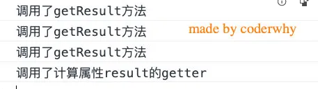
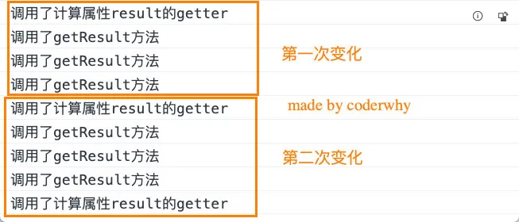
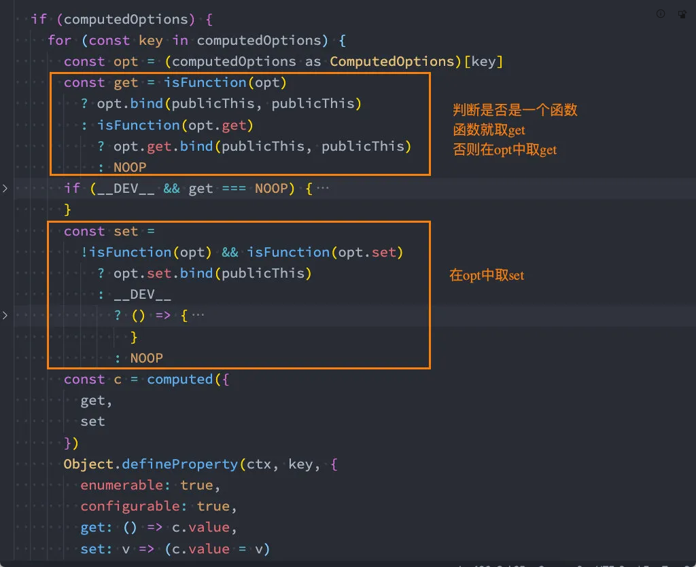
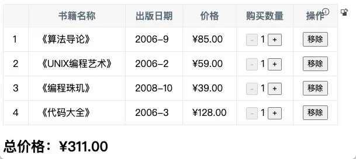
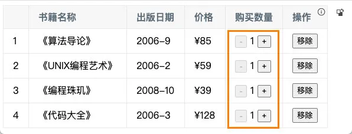

# Vue的Options API

## computed

### 复杂的data处理方式

- 我们知道，在模板中可以直接通过插值语法显示一些data中的数据。

- 但是在某些情况，我们可能需要对数据进行一些转化后再显示，或者需要将多个数据结合起来进行显示；

  - 比如我们需要对多个data数据进行运算、三元运算符来决定结果、数据进行某种转化后显示；

  - 在模板中使用表达式，可以非常方便的实现，但是设计它们的初衷是用于简单的运算；

  - 在模板中放入太多的逻辑会让模板过重和难以维护；

  - 并且如果多个地方都使用到，那么会有大量重复的代码；


- 我们有没有什么方法可以将逻辑抽离出去呢？

  - 可以，其中一种方式就是将逻辑抽取到一个method中，放到methods的options中；

  - 但是，这种做法有一个直观的弊端，就是所有的data使用过程都会变成了一个方法的调用；

  - 另外一种方式就是使用计算属性computed；


### 认识计算属性computed

- 什么是计算属性呢？

  - 官方并没有给出直接的概念解释；

  - 而是说：对于任何包含响应式数据的复杂逻辑，你都应该使用**计算属性**；

  - 计算属性将被混入到组件实例中。所有 getter 和 setter 的 `this` 上下文自动地绑定为组件实例；


- 那接下来我们通过案例来理解一下这个计算属性。

- 计算属性的用法：

  - **选项：**computed


  - **类型：**`{ [key: string]: Function | { get: Function, set: Function } }`


### 计算属性使用案例

- 我们来看三个案例：

  - 我们有两个变量：firstName和lastName，希望它们拼接之后在界面上显示；


  - 我们有一个分数：score

    - 当score大于60的时候，在界面上显示及格；

    - 当score小于60的时候，在界面上显示不及格；


  - 我们有一个变量message，记录一段文字：比如Hello World

    - 某些情况下我们是直接显示这段文字；

    - 某些情况下我们需要对这段文字进行反转；


- 我们可以有三种实现思路：

  - 思路一：在模板语法中直接使用表达式；

  - 思路二：使用method对逻辑进行抽取；

  - 思路三：使用计算属性computed；


- 思路一的实现：模板语法

  - 缺点一：模板中存在大量的复杂逻辑，不便于维护（模板中表达式的初衷是用于简单的计算）；

  - 缺点二：当有多次一样的逻辑时，存在重复的代码；

  - 缺点三：多次使用的时候，很多运算也需要多次执行，没有缓存；


```vue
<template id="my-app">
<!-- 1.实现思路一: -->
<h2>{{ firstName + lastName }}</h2>
<h2>{{ score >= 60 ? "及格": "不及格" }}</h2>
<h2>{{ message.split("").reverse().join(" ") }}</h2>
</template>
```

- 思路二的实现：method实现

  - 缺点一：我们事实上先显示的是一个结果，但是都变成了一种方法的调用；

  - 缺点二：多次使用方法的时候，没有缓存，也需要多次计算；


```vue
<!-- 2.实现思路二: -->
<template id="my-app">
<h2>{{ getFullName()}}</h2>
<h2>{{ getResult() }}</h2>
<h2>{{ getReverseMessage() }}</h2>
</template>


<script src="../js/vue.js"></script>
<script>
  const App = {
    template: '#my-app',
    data() {
      return {
        firstName: "Kobe",
        lastName: "Bryant",
        score: 80,
        message: "Hello World"
      }
    },
    methods: {
      getFullName() {
        return this.firstName + " " + this.lastName;
      },
      getResult() {
        return this.score >= 60 ? "及格": "不及格";
      },
      getReverseMessage() {
        return this.message.split(" ").reverse().join(" ");
      }
    }
  }

  Vue.createApp(App).mount('#app');
</script>
```

- 思路三的实现：computed实现

  - 注意：计算属性看起来像是一个函数，但是我们在使用的时候不需要加()，这个后面讲setter和getter时会讲到；

  - 我们会发现无论是直观上，还是效果上计算属性都是更好的选择；

  - 并且计算属性是有缓存的；


```vue
<!-- 3.实现思路三: -->
<template id="my-app">
<h2>{{ fullName }}</h2>
<h2>{{ result }}</h2>
<h2>{{ reverseMessage }}</h2>
</template>

<script src="../js/vue.js"></script>
<script>
  const App = {
    template: '#my-app',
    data() {
      return {
        firstName: "Kobe",
        lastName: "Bryant",
        score: 80,
        message: "Hello World"
      }
    },
    computed: {
      fullName() {
        return this.firstName + this.lastName;
      },
      result() {
        return this.score >= 60 ? "及格": "不及格";
      },
      reverseMessage() {
        return this.message.split(" ").reverse().join(" ");
      }
    }
  }

  Vue.createApp(App).mount('#app');
</script>
```

### 计算属性 vs methods

- 在上面的实现思路中，我们会发现计算属性和methods的实现看起来是差别是不大的，而且我们多次提到计算属性有缓存。

- 接下来我们来看一下同一个计算多次使用，计算属性和methods的差异：


```vue
<div id="app"></div>

<template id="my-app">
<!-- 1.使用methods -->
<h2>{{getResult()}}</h2>
<h2>{{getResult()}}</h2>
<h2>{{getResult()}}</h2>

<!-- 2.使用computed -->
<h2>{{result}}</h2>
<h2>{{result}}</h2>
<h2>{{result}}</h2>
</template>

<script src="../js/vue.js"></script>
<script>
  const App = {
    template: '#my-app',
    data() {
      return {
        score: 90
      }
    },
    computed: {
      result() {
        console.log("调用了计算属性result的getter");
        return this.score >= 60 ? "及格": "不及格";
      }
    },
    methods: {
      getResult() {
        console.log("调用了getResult方法");
        return this.score >= 60 ? "及格": "不及格";
      }
    }
  }

  Vue.createApp(App).mount('#app');
</script>
```

- 打印结果如下：

  - 我们会发现methods在多次使用时，会调用多次；

  - 而计算属性虽然使用了三次，但是计算的过程只调用了一次；




#### 计算属性的缓存

- 这是什么原因呢？

  - 这是因为计算属性会基于它们的依赖关系进行缓存；

  - 在数据不发生变化时，计算属性是不需要重新计算的；

  - 但是如果依赖的数据发生变化，在使用时，计算属性依然会重新进行计算；


```vue
<template id="my-app">
<input type="text" v-model="score">

<!-- 省略代码 -->
</template>

<script src="../js/vue.js"></script>
<script>
  const App = {
    template: '#my-app',
    data() {
      return {
        score: 90
      }
    },
    // 省略代码
  }

  Vue.createApp(App).mount('#app');
</script>
```

- 我们来看一下当分数变化时，方法和计算属性的反应：




### 计算属性的setter和getter

- 计算属性在大多数情况下，只需要一个getter方法即可，所以我们会将计算属性直接写成一个函数。

- 但是，如果我们确实想设置计算属性的值呢？

  - 这个时候我们也可以给计算属性设置一个setter的方法；


```vue
<template id="my-app">
<h2>{{fullName}}</h2>
<button @click="setNewName">设置新名字</button>
</template>

<script src="../js/vue.js"></script>
<script>
  const App = {
    template: '#my-app',
    data() {
      return {
        firstName: "Kobe",
        lastName: "Bryant"
      }
    },
    computed: {
      fullName: {
        get() {
          return this.firstName + " " + this.lastName;
        },
        set(value) {
          const names = value.split(" ");
          this.firstName = names[0];
          this.lastName = names[1];
        }
      }
    },
    methods: {
      setNewName() {
        this.fullName = "coder mjjh";
      }
    }
  }

  Vue.createApp(App).mount('#app');
</script>
```

- 你可能觉得很奇怪，Vue内部是如何对我们传入的是一个getter，还是说是一个包含setter和getter的对象进行处理的呢？

  - 事实上非常的简单，Vue源码内部只是做了一个逻辑判断而已；




## 侦听器watch

### 认识侦听器watch

- 侦听器的用法如下：

  - **选项：**watch

  - **类型：**`{ [key: string]: string | Function | Object | Array}`


- 什么是侦听器呢？

  - 开发中我们在data返回的对象中定义了数据，这个数据通过插值语法等方式绑定到template中；

  - 当数据变化时，template会自动进行更新来显示最新的数据；

  - 但是在某些情况下，我们希望在代码逻辑中监听某个数据的变化，这个时候就需要用侦听器watch来完成了；


### 侦听器案例

- 举个栗子（例子）：

  - 比如现在我们希望用户在input中输入一个问题；

  - 每当用户输入了最新的内容，我们就获取到最新的内容，并且使用该问题去服务器查询答案；

  - 那么，我们就需要实时的去获取最新的数据变化；


```vue
<div id="app"></div>

<template id="my-app">
<label for="question">
  请输入问题:
  <input type="text" id="question" v-model="question">
  </label>
</template>

<script src="../js/vue.js"></script>
<script>
  const App = {
    template: '#my-app',
    data() {
      return {
        question: "",
        info: {
          name: "mjjh"
        }
      }
    },
    watch: {
      question(newValue, oldValue) {
        this.getAnwser(newValue);
      }
    },
    methods: {
      getAnwser(question) {
        console.log(`${question}的问题答案是哈哈哈哈`);
      }
    }
  }

  Vue.createApp(App).mount('#app');
</script>
```

### 侦听器watch的配置选项

- 我们先来看一个例子：

  - 当我们点击按钮的时候会修改info.name的值；

  - 这个时候我们使用watch来侦听info，可以侦听到吗？答案是不可以。


```vue
<div id="app"></div>

<template id="my-app">
<button @click="btnClick">修改info</button>
</template>

<script src="../js/vue.js"></script>
<script>
  const App = {
    template: '#my-app',
    data() {
      return {
        info: {
          name: "mjjh"
        }
      }
    },
    watch: {
      info(newValue, oldValue) {
        console.log(newValue, oldValue);
      }
    },
    methods: {
      btnClick() {
        this.info.name = "kobe";
      }
    }
  }

  Vue.createApp(App).mount('#app');
</script>
```

- 这是因为默认情况下，watch只是在侦听info的引用变化，对于内部属性的变化是不会做出相应的：

  - 这个时候我们可以使用一个选项deep进行更深层的侦听；

  - 注意前面我们说过watch里面侦听的属性对应的也可以是一个Object；


```js
watch: {  
  info: {    
    handler(newValue, oldValue) {      
    console.log(newValue, oldValue);    
  },    
  deep: true  
}}
```

- 还有另外一个属性，是希望一开始的就会立即执行一次：

  - 这个时候无论后面数据是否有变化，侦听的函数都会有限执行一次；


```js
watch: {  
  info: {    
    handler(newValue, oldValue) {      
    console.log(newValue, oldValue);    
  },    
  deep: true,    
  immediate: true  
}}
```

### 侦听器watch的其他方式

- 我们直接来看官方文档的案例：


```js
const app = Vue.createApp({
  data() {
    return {
      a: 1,
      b: 2,
      c: {
        d: 4
      },
      e: 'test',
      f: 5
    }
  },
  watch: {
    a(val, oldVal) {
      console.log(`new: ${val}, old: ${oldVal}`)
    }, // 字符串方法名
    b: 'someMethod', // 该回调会在任何被侦听的对象的 property 改变时被调用，不论其被嵌套多深
    c: {
      handler(val, oldVal) {
        console.log('c changed')
      },
      deep: true
    }, // 该回调将会在侦听开始之后被立即调用
    e: {
      handler(val, oldVal) {
        console.log('e changed')
      },
      immediate: true
    }, // 你可以传入回调数组，它们会被逐一调用
    f: [
      'handle1',
      function handle2(val, oldVal) {
        console.log('handle2 triggered')
      },
      {
        handler: function handle3(val, oldVal) {
          console.log('handle3 triggered')
        }
      }
    ]
  },
  methods: {
    someMethod() {
      console.log('b changed')
    }, handle1() { console.log('handle 1 triggered') }
  }
})
```

- 另外一个是Vue3文档中没有提到的，但是Vue2文档中有提到的是侦听对象的属性：


```js
'info.name': function(newValue, oldValue) {
	console.log(newValue, oldValue);
}
```

- 还有另外一种方式就是使用 $watch 的API：


- 我们可以在created的生命周期（后续会讲到）中，使用 this.$watchs 来侦听；
  - 第一个参数是要侦听的源；
  - 第二个参数是侦听的回调函数callback；
  - 第三个参数是额外的其他选项，比如deep、immediate；


```js
created() {
  this.$watch('message', (newValue, oldValue) => {
  console.log(newValue, oldValue);  
}, {deep: true, immediate: true})
}
```

## 阶段案例

### 案例介绍

- 现在我们来做一个相对综合一点的练习：书籍购物车

- 案例效果如下：




- 案例说明：

  1. 在界面上以表格的形式，显示一些书籍的数据；
  2. 在底部显示书籍的总价格；
  3. 点击+或者-可以增加或减少书籍数量（如果为1，那么不能继续-）；
  4. 点击移除按钮，可以将书籍移除（当所有的书籍移除完毕时，显示：购物车为空~）；

### 项目搭建

### 模板引擎的搭建

- 我们先来搭建一下模板引擎：

  - 它需要一个table来包裹需要展示的书籍内容；

  - 需要一个h2元素用于计算商品的总价格；


- 在这里我们有一些数据和方法需要在组件对象（createApp传入的对象）中定义：

  - 比如book的数据；

  - formatPrice、decrement、increment、handleRemove的方法等；


```vue
<template id="my-app">
  <table>
    <thead>
      <tr>
        <th></th>
        <th>书籍名称</th>
        <th>出版日期</th>
        <th>价格</th>
        <th>购买数量</th>
        <th>操作</th>
      </tr>
    </thead>
    <tbody>
      <tr v-for="(item, index) in books" :key="item.id">
        <td>{{ index + 1 }}</td>
        <td>{{ item.name }}</td>
        <td>{{ item.date }}</td>
        <td>{{ formatPrice(item.price) }}</td>
        <td>
          <button @click="decrement(index)">-</button> {{ item.count }}
          <button @click="increment(index)">+</button>
        </td>
        <td><button @click="handleRemove(index)">移除</button></td>
      </tr>
    </tbody>
  </table>
  <h2>总价: {{ formatPrice(totalPrice) }}</h2>
</template>
```

### css样式的实现

为了让表格好看一点，我们来实现一些css的样式：

```css
table {
  border: 1px solid #e9e9e9;
  border-collapse: collapse;
  border-spacing: 0;
}

th,
td {
  padding: 8px 16px;
  border: 1px solid #e9e9e9;
  text-align: left;
}

th {
  background-color: #f7f7f7;
  color: #5c6b77;
  font-weight: 600;
}
```

### 代码逻辑的实现

接下来我们来看一下代码逻辑的实现：

```js
const App = {
  template: '#my-app',
  data() {
    return {
      books: [{
        id: 1,
        name: '《算法导论》',
        date: '2006-9',
        price: 85.00,
        count: 1
      }, {
        id: 2,
        name: '《UNIX编程艺术》',
        date: '2006-2',
        price: 59.00,
        count: 1
      }, {
        id: 3,
        name: '《编程珠玑》',
        date: '2008-10',
        price: 39.00,
        count: 1
      }, {
        id: 4,
        name: '《代码大全》',
        date: '2006-3',
        price: 128.00,
        count: 1
      }, ]
    }
  },
  computed: {
    filterBooks() {
      return this.books.map(item => {
        item.price = "¥" + item.price;
        return item;
      });
    },
    totalPrice() {
      return this.books.reduce((preValue, item) => { return preValue + item.price * item.count; }, 0)
    }
  },
  methods: {
    formatPrice(price) { return "¥" + price; },
    decrement(index) {
      this.books[index].count--;
    },
    increment(index) { this.books[index].count++; },
    handleRemove(index) { this.books.splice(index, 1); }
  }
}
Vue.createApp(App).mount('#app');
```

### 细节补充

这里我们补充一个小的细节，当我们的数量减到1的时候就不能再减了：



这里我们可以对button进行逻辑判断：

- 当item.count的数量 `<=` 1的时候，我们可以将disabled设置为true；

```html
<button @click="decrement(index)" :disabled="item.count <= 1">-</button>
```

