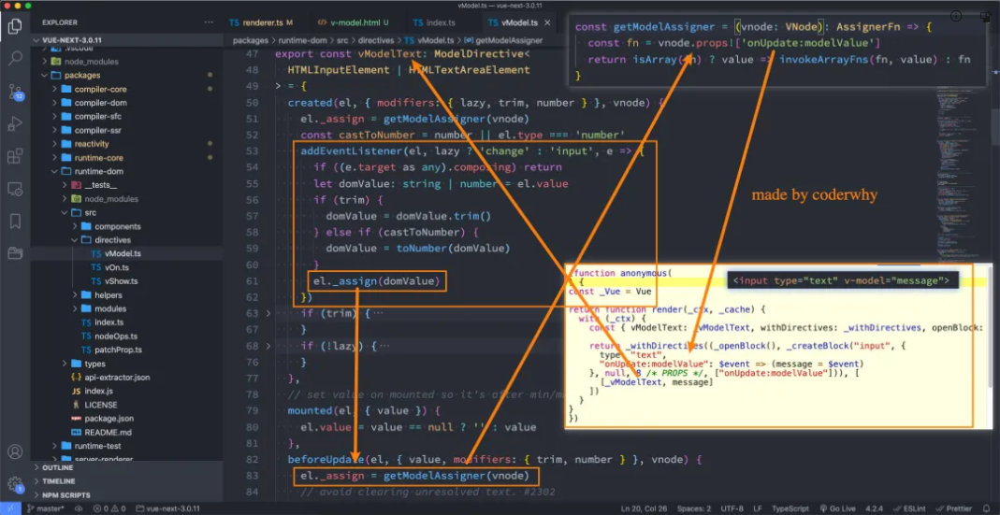

# v-model

## 表单输入

### v-model 基本用法

- 表单提交是开发中非常常见的功能，也是和用户交互的重要手段：

  - 比如用户在登录、注册时需要提交账号密码；

  - 比如用户在检索、创建、更新信息时，需要提交一些数据；

- 这些都要求我们可以在代码逻辑中获取到用户提交的数据，我们通常会使用 v-model 指令来完成：

  - v-model 指令可以在表单 `input`、`textarea`以及`select`元素上创建双向数据绑定；

  - 它会根据控件类型自动选取正确的方法来更新元素；

  - 尽管有些神奇，但 `v-model` 本质上不过是语法糖，它负责监听用户的输入事件来更新数据，并在某种极端场景下进行一些特殊处理；

```html
<div id="app"></div>
<template id="my-app">
  <input type="text" v-model="message" />
  <h2>{{ message }}</h2>
</template>
<script src="https://unpkg.com/vue@next"></script>
<script>
  const App = {
    template: "#my-app",
    data() {
      return {
        message: "Hello World",
      };
    },
  };
  Vue.createApp(App).mount("#app");
</script>
```


### v-model 的原理

- 官方有说到，v-model 的原理其实是背后有两个操作：

  - `v-bind`绑定 value 属性的值；

  - `v-on`绑定 input 事件监听到函数中，函数会获取最新的值赋值到绑定的属性中；


- v-model 的事实上 v-model 的原理会比上面的更加复杂：



## v-model 绑定其他数据

### 其他的表单类型绑定

- 我们再来绑定一下其他的表单类型：textarea、checkbox、radio、select

```vue
<div id="app"></div>
<template id="my-app">
  <!-- 1.绑定textarea -->
  <div>
    <textarea v-model="article" cols="30" rows="10"></textarea>
    <h2>article当前的值是: {{ article }}</h2>
  </div>
  <!-- 2.绑定checkbox -->
  <!-- 2.1.单选框 -->
  <div>
    <label for="agreement">
      <input id="agreement" type="checkbox" v-model="isAgree" />同意协议
    </label>
    <h2>isAgree当前的值是: {{ isAgree }}</h2>
  </div>
  <!-- 2.2.多选框 -->
  <div>
    <label for="basketball">
      <input
        id="basketball"
        type="checkbox"
        value="basketball"
        v-model="hobbies"
      />篮球
    </label>
    <label for="football">
      <input
        id="football"
        type="checkbox"
        value="football"
        v-model="hobbies"
      />足球
    </label>
    <label for="tennis">
      <input id="tennis" type="checkbox" value="tennis" v-model="hobbies" />网球
    </label>
    <h2>hobbies当前的值是: {{ hobbies }}</h2>
  </div>
  <!-- 3.绑定radio -->
  <div>
    <label for="male">
      <input type="radio" id="male" v-model="gender" value="male" />男
    </label>
    <label for="female">
      <input type="radio" id="female" v-model="gender" value="female" />女
    </label>
    <h2>gender当前的值是: {{ gender }}</h2>
  </div>
  <!-- 4.绑定select -->
  <div>
    <select v-model="fruit">
      <option disabled value="">请选择喜欢的水果</option>
      <option value="apple">苹果</option>
      <option value="orange">橘子</option>
      <option value="banana">香蕉</option>
    </select>
    <h2>fruit当前的值是: {{ fruit }}</h2>
  </div>
</template>
<script src="../js/vue.js"></script>
<script>
const App = {
  template: "#my-app",
  data() {
    return {
      article: "Hello World",
      isAgree: false,
      gender: "male",
      fruit: "",
    };
  },
};
Vue.createApp(App).mount("#app");
</script>
```

### v-model 的值绑定

- 目前我们在前面的案例中大部分的值都是在 template 中固定好的：

  - 比如 gender 的两个输入框值 male、female；

  - 比如 hobbies 的三个输入框值 basketball、football、tennis；

- 在真实开发中，我们的数据可能是来自服务器的，那么我们就可以先将值请求下来，绑定到 data 返回的对象中，再通过 v-bind 来进行值的绑定，这个过程就是**值绑定**。
- 这里不再给出具体的做法，因为还是 v-bind 的使用过程。

## v-model 的修饰符

- v-model 在使用的时候可以在后面跟一些修饰符，来完成一些特殊的操作。

### lazy 修饰符

- lazy 修饰符是什么作用呢？

  - 默认情况下，v-model 在进行双向绑定时，绑定的是`input`事件，那么会在每次内容输入后就将最新的值和绑定的属性进行同步；

  - 如果我们在 v-model 后跟上 lazy 修饰符，那么会将绑定的事件切换为 `change` 事件，只有在提交时（比如回车）才会触发；

```html
<template id="my-app">
  <input type="text" v-model.lazy="message" />
  <h2>{{message}}</h2>
</template>
```

### number 修饰符

- 我们先来看一下 v-model 绑定后的值是什么类型的：
  - message 总是 string 类型，即使在我们设置 type 为 number 也是 string 类型；

```html
<template id="my-app">
  <!-- 类型 -->
  <input type="text" v-model="message" />
  <input type="number" v-model="message" />
  <h2>{{ message }}</h2>
</template>
<script src="../js/vue.js"></script>
<script>
  const App = {
    template: '#my-app',
    data() {
      return {
        message: ''
      }
    },
    watch: {
      message(newValue) {
        console.log(newValue, typeof newValue)
      }
    }
    Vue.createApp(App).mount('#app');
  }
</script>
```

- 如果我们希望转换为数字类型，那么可以使用 `.number` 修饰符：

```html
<template id="my-app">
  <!-- 类型 -->
  <input type="text" v-model.number="score" />
</template>
```

- 另外，在我们进行逻辑判断时，如果是一个 string 类型，在可以转化的情况下会进行隐式转换的：
  - 下面的 score 在进行判断的过程中会进行隐式转化的；

```js
const score = "100";
if (score > 90) {
  console.log("优秀");
}
```

### trim 修饰符

如果要自动过滤用户输入的首尾空白字符，可以给 v-model 添加 `trim` 修饰符：

```html
<template id="my-app">
  <!-- 去除空格 -->
  <input type="text" v-model.trim="message" />
</template>
```
