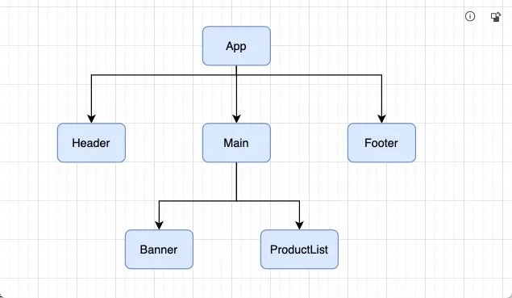
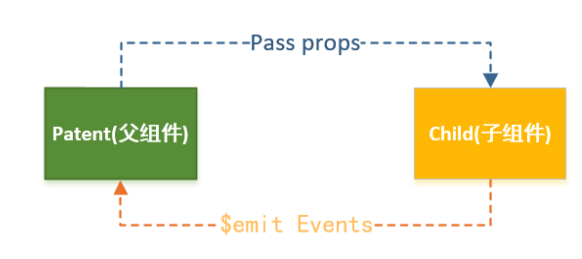
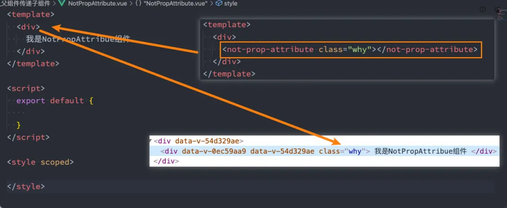
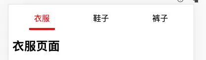

# 组件之间的通信

## 组件的嵌套

### 认识组件的嵌套

- 前面我们是将所有的逻辑放到一个 App.vue 中：

  - 在之前的案例中，我们只是创建了一个组件 App；

  - 如果我们一个应用程序将所有的逻辑都放在一个组件中，那么这个组件就会变成非常的臃肿和难以维护；

  - 所以组件化的核心思想应该是对组件进行拆分，拆分成一个个小的组件；

  - 再将这些组件组合嵌套在一起，最终形成我们的应用程序；

- 我们来分析一下下面代码的嵌套逻辑，假如我们将所有的代码逻辑都放到一个 App.vue 组件中：

```vue
<template>
  <div>
    <h2>Header</h2>
    <h2>NavBar</h2>
  </div>
  <div>
    <h2>Banner</h2>
    <ul>
      <li>商品列表1</li>
      <li>商品列表2</li>
      <li>商品列表3</li>
      <li>商品列表4</li>
      <li>商品列表5</li>
    </ul>
  </div>
  <div>
    <h2>Footer</h2>
    <h2>免责声明</h2>
  </div>
</template>

<script>
export default {};
</script>

<style scoped></style>
```

- 我们会发现，将所有的代码逻辑全部放到一个组件中，代码是非常的臃肿和难以维护的。
- 并且在真实开发中，我们会有更多的内容和代码逻辑，对于扩展性和可维护性来说都是非常差的。
- 所有，在真实的开发中，我们会对组件进行拆分，拆分成一个个功能的小组件。

### 组件的拆分

- 我们可以按照如下的方式进行拆分：



- 按照如上的拆分方式后，我们开发对应的逻辑只需要去对应的组件编写就可。

`Header.vue`

```html
<template>
  <div>
    <h2>Header</h2>
    <h2>NavBar</h2>
  </div>
</template>
```

`Main.vue`

```html
<template>
  <div>
    <banner></banner>
    <product-list></product-list>
  </div>
</template>
```

`Banner.vue`

```html
<template>
  <h2>Banner</h2>
</template>
```

`ProductList`

```html
<template>
  <ul>
    <li>商品列表1</li>
    <li>商品列表2</li>
    <li>商品列表3</li>
    <li>商品列表4</li>
    <li>商品列表5</li>
  </ul>
</template>
```

`Footer.vue`

```html
<template>
  <div>
    <h2>Footer</h2>
    <h2>免责声明</h2>
  </div>
</template>
```

### 组件的通信

- 上面的嵌套逻辑如下，它们存在如下关系：

  - App 组件是 Header、Main、Footer 组件的父组件；

  - Main 组件是 Banner、ProductList 组件的父组件；

- 在开发过程中，我们会经常遇到需要组件之间相互进行通信：

  - 比如 App 可能使用了多个 Header，每个地方的 Header 展示的内容不同，那么我们就需要使用者传递给 Header 一些数据，让其进行展示；

  - 又比如我们在 Main 中一次性请求了 Banner 数据和 ProductList 数据，那么就需要传递给他们来进行展示；

  - 也可能是子组件中发生了事件，需要有父组件来完成某些操作，那就需要子组件向父组件传递事件；

- 总之，在一个 Vue 项目中，组件之间的通信是非常重要的环节，所以接下来我们就具体学习一下组件之间是如何相互之间传递数据的；

## 父子组件的相互通信

### 父子之间的通信

- 父子组件之间如何进行通信呢?
  - 父组件传递给子组件: 通过 props 属性
  - 子组件传递给父组件: 通过$emit 触发事件



### 父组件传递给子组件

- 在开发中很常见的就是父子组件之间通信，比如父组件有一些数据，需要子组件来进行展示：

  - 这个时候我们可以通过 props 来完成组件之间的通信；

- 什么是 Props 呢？

  - Props 是你可以在组件上注册一些自定义的 attribute (属性)；

  - 父组件给这些 attribute 赋值，子组件通过 attribute 的名称获取到对应的值；

- Props 有两种常见的用法：

  - 方式一：字符串数组，数组中的字符串就是 attribute 的名称；

  - 方式二：对象类型，对象类型我们可以在指定 attribute 名称的同时，指定它需要传递的类型、是否是必须的、默认值等等；

#### props 的数组用法

- 封装 ShowMessage.vue 组件：

```vue
<template>
  <div>
    <h2>组件展示的title:{{ title }}</h2>
    <p>组件展示的content: {{ content }}</p>
  </div>
</template>

<script>
export default {
  props: ["title", "content"],
};
</script>
```

- 通过 App.vue 传递给组件数据：

```vue
<template>
  <div>
    <show-message title="哈哈哈" content="我是哈哈哈"></show-message>
    <show-message title="呵呵呵" content="我是呵呵呵"></show-message>
  </div>
</template>

<script>
import ShowMessage from "./ShowMessage.vue";

export default {
  components: {
    ShowMessage,
  },
};
</script>
```

- 当然，我们也可以将 data 中的数据传递给子组件：

```vue
<template>
  <div>
    <show-message :title="title1" :content="content1"></show-message>
    <show-message :title="title2" :content="content2"></show-message>
  </div>
</template>

<script>
import ShowMessage from "./ShowMessage.vue";

export default {
  components: {
    ShowMessage,
  },
  data() {
    return {
      title1: "哈哈哈",
      content1: "我是哈哈哈",
      title2: "呵呵呵",
      content2: "我是呵呵呵",
    };
  },
};
</script>
```

- 当然，我们也可以直接传递一个对象：

```vue
<template>
  <div>
    <show-message
      :title="message.title"
      :content="message.content"
    ></show-message>
    <show-message v-bind="message"></show-message>
  </div>
</template>

<script>
import ShowMessage from "./ShowMessage.vue";

export default {
  components: {
    ShowMessage,
  },
  data() {
    return {
      message: {
        title: "嘿嘿嘿",
        content: "我是嘿嘿嘿",
      },
    };
  },
};
</script>
```

#### props 的对象用法

- 数组用法中我们只能说明传入的 attribute 的名称，并不能对其进行任何形式的限制，接下来我们来看一下对象的写法是如何让我们的 props 变得更加完善的。

- ShowMessage.vue 的 props 对象写法：

```vue
<template>
  <div>
    <h2>组件展示的title:{{ title }}</h2>
    <p>组件展示的content: {{ content }}</p>
  </div>
</template>
<script>
export default {
  props: {
    // 指定类型
    title: String,
    // 指定类型，同时指定是否必选、默认值
    content: {
      type: String,
      require: true,
      default: "哈哈哈",
    },
  },
};
</script>
```

##### 细节一：那么 type 的类型都可以是哪些呢？

- String
- Number
- Boolean
- Array
- Object
- Date
- Function
- Symbol

##### 细节二：对象类型的其他写法

```js
<script>
  export default {
    props: {
      // 基础的类型检查 (`null` 和 `undefined` 会通过任何类型验证)
      propA: Number,

      // 多个可能的类型
      propB: [String, Number],

      // 必填的字符串
      propC: {
        type: String,
        required: true,
      },

      // 带有默认值的数字
      propD: {
        type: Number,
        default: 100,
      },

      // 带有默认值的对象
      propE: {
        type: Object,
        // 对象或数组默认值必须从一个工厂函数获取
        default() {
          return { message: "hello" };
        },
      },

      // 自定义验证函数
      propF: {
        validator(value) {
          // 这个值必须匹配下列字符串中的一个
          return ["success", "warning", "danger"].includes(value);
        },
      },

      // 具有默认值的函数
      propG: {
        type: Function,
        // 与对象或数组默认值不同，这不是一个工厂函数 —— 这是一个用作默认值的函数
        default() {
          return "Default function";
        },
      },
    },
  };
</script>
```

##### 细节三：Prop 的大小写命名(camelCase vs kebab-case)

- HTML 中的 attribute 名是大小写不敏感的，所以浏览器会把所有大写字符解释为小写字符；
- 这意味着当你使用 DOM 中的模板时，camelCase (驼峰命名法) 的 prop 名需要使用其等价的 kebab-case (短横线分隔命名) 命名；

- ShowMessage.vue 组件：

```vue
<template>
  <div>
    <p>{{ messageInfo }}</p>
  </div>
</template>
<script>
export default { props: { messageInfo: String } };
</script>
```

- App.vue 组件中传入：

```vue
<template>
  <div>
    <show-message messageInfo="哈哈哈"></show-message>
    <show-message message-info="哈哈哈"></show-message>
  </div>
</template>
```

#### 非 Prop 的 Attribute

- 什么是非 Prop 的 Attribute 呢？

  - 当我们传递给一个组件某个属性，但是该属性并没有定义对应的 props 或者 emits 时，就称之为 非 Prop 的 Attribute；

  - 常见的包括 class、style、id 属性等；

- Attribute 继承
  - 当组件有单个根节点时，非 Prop 的 Attribute 将自动添加到根节点的 Attribute 中：



#### 禁用 Attribute 继承

- 如果我们不希望组件的根元素继承 attribute，可以在组件中设置 `inheritAttrs: false`：

  - 禁用 attribute 继承的常见情况是需要将 attribute 应用于根元素之外的其他元素；

  - 我们可以通过 `$attrs`来访问所有的 `非props的attribute`；

```vue
<template>
  <div>
    我是NotPropAttribue组件
    <h2 :class="$attrs.class"></h2>
  </div>
</template>
<script>
export default { inheritAttrs: false };
</script>
```

#### 多个根节点的 attribute

- 多个根节点的 attribute 如果没有显示的绑定，那么会报警告，我们必须手动的指定要绑定到哪一个属性上：

```vue
<template>
  <div :class="$attrs.class">我是NotPropAttribue组件1</div>
  <div>我是NotPropAttribue组件2</div>
  <div>我是NotPropAttribue组件3</div>
</template>
```

### 子组件传递给父组件

- 什么情况下子组件需要传递内容到父组件呢？

  - 当子组件有一些事件发生的时候，比如在组件中发生了点击，父组件需要切换内容；

  - 子组件有一些内容想要传递给父组件的时候；

- 我们如何完成上面的操作呢？

  - 首先，我们需要在子组件中定义好在某些情况下触发的事件名称；

  - 其次，在父组件中以 v-on 的方式传入要监听的事件名称，并且绑定到对应的方法中；

  - 最后，在子组件中发生某个事件的时候，根据事件名称触发对应的事件；

  - 实现逻辑: 子组件去调用父组件的方法，给父组件传值

#### 自定义事件的流程

- 我们封装一个 CounterOperation.vue 的组件：

  - 内部其实是监听两个按钮的点击，点击之后通过 `this.$emit的方式发出去事件`；

```vue
<template>
  <div>
    <button @click="increment">+1</button>
    <button @click="decrement">-1</button>
  </div>
</template>
<script>
export default {
  emits: ["addOne", "subOne"],
  methods: {
    increment() {
      this.$emit("addOne");
    },
    decrement() {
      this.$emit("subOne");
    },
  },
};
</script>
```

- 我们可以在 App.vue 中来监听自定义组件发出的事件：

```vue
<template>
  <div>
    <h2>当前计数: {{ counter }}</h2>
    <counter-operation @addOne="add" @subOne="sub"></counter-operation>
  </div>
</template>
<script>
import CounterOperation from "./CounterOperation.vue";
export default {
  components: {
    CounterOperation,
  },
  data() {
    return {
      counter: 0,
    };
  },
  methods: {
    add() {
      this.counter++;
    },
    sub() {
      this.counter--;
    },
  },
};
</script>
```

#### 自定义事件的参数

- 自定义事件的时候，我们也可以传递一些参数给父组件：

```vue
<template>
  <div>
    <button @click="increment">+1</button>
    <button @click="incrementTen">+10</button>
    <button @click="decrement">-1</button>
  </div>
</template>
<script>
export default {
  methods: {
    incrementTen() {
      this.$emit("addTen", 10);
    },
  },
};
</script>
<style scoped></style>
```

#### 自定义事件的验证

- 在 vue3 当中，我们可以对传递的参数进行验证：

```vue
<template>
  <div><button @click="incrementTen">+10</button></div>
</template>
<script>
export default {
  emits: {
    addTen: function (payload) {
      if (payload === 10) {
        return true;
      }
      return false;
    },
  },
  methods: {
    incrementTen() {
      this.$emit("addTen", 10);
    },
  },
};
</script>
```

### 组件间通信案例练习

- 我们来做一个相对综合的练习：



#### TabControl 实现

- TabControl.vue 的实现代码：

```vue
<template>
  <div class="tab-control">
    <template v-for="(item, index) in titles" :key="item">
      <div
        class="tab-control-item"
        @click="itemClick(index)"
        :class="{ active: index === currentIndex }"
      >
        <span class="underline">{{ item }}</span>
      </div>
    </template>
  </div>
</template>
<script>
export default {
  props: {
    titles: {
      type: Array,
      default() {
        return [];
      },
    },
  },
  emits: ["titleClick"],
  data() {
    return { currentIndex: 0 };
  },
  methods: {
    itemClick(index) {
      this.currentIndex = index;
      this.$emit("titleClick", index);
    },
  },
};
</script>
<style scoped>
.tab-control {
  display: flex;
  justify-content: space-between;
}
.tab-control-item {
  flex: 1;
  text-align: center;
  height: 40px;
  line-height: 40px;
}
.tab-control-item.active {
  color: red;
}
.tab-control-item.active span {
  display: inline-block;
  border-bottom: 4px solid red;
  padding: 0 10px;
}
</style>
```

#### App 中的使用

- 我们在 App 中的使用过程如下：

```vue
<template>
  <div>
    <tab-control :titles="titles" @titleClick="titleClick"></tab-control>
    <h2>{{ contents[currentIndex] }}</h2>
  </div>
</template>
<script>
import TabControl from "./TabControl.vue";
export default {
  components: { TabControl },
  data() {
    return {
      titles: ["衣服", "鞋子", "裤子"],
      contents: ["衣服页面", "鞋子页面", "裤子页面"],
      currentIndex: 0,
    };
  },
  methods: {
    titleClick(index) {
      this.currentIndex = index;
    },
  },
};
</script>
```
