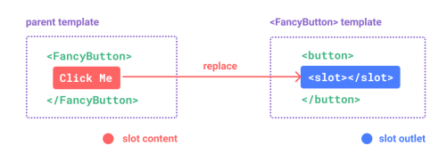
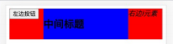
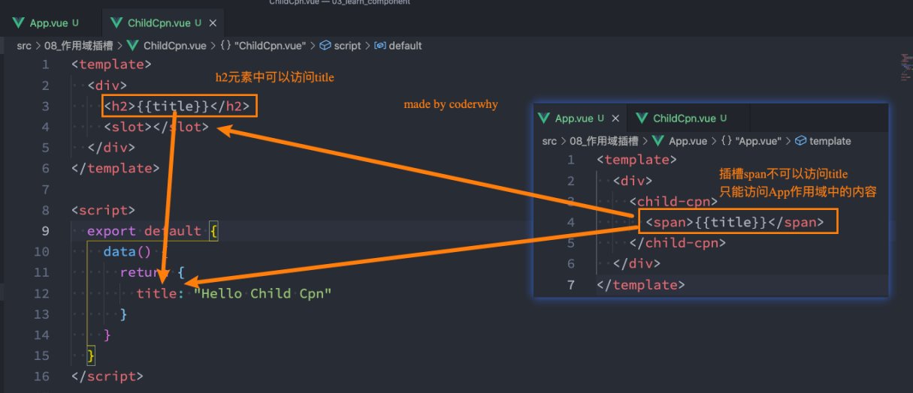
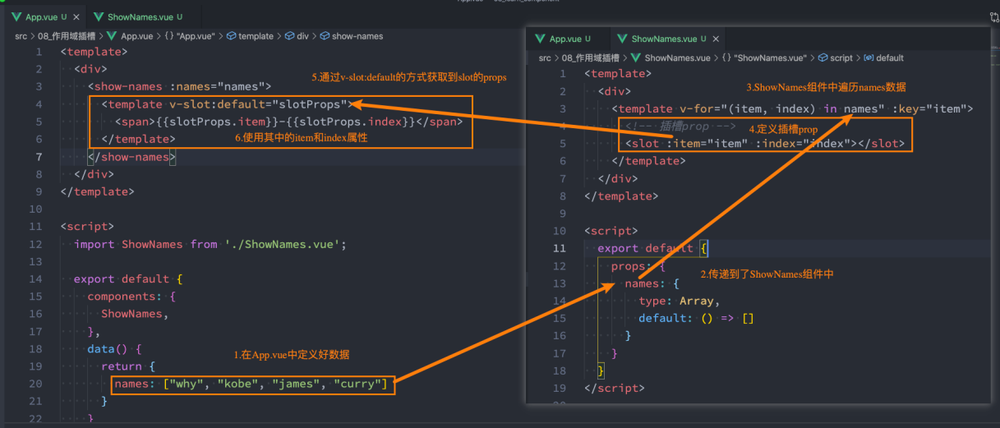
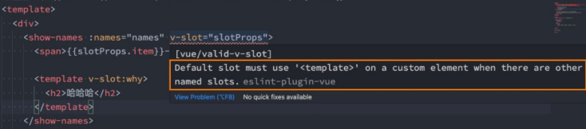
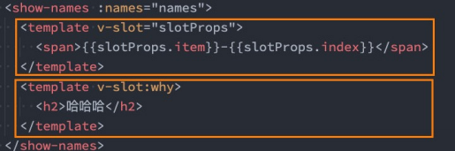

#  插槽Slot

## 认识插槽的作用

### 认识插槽Slot

- 在开发中，我们会经常封装一个个可复用的组件：

  - 前面我们会通过props传递给组件一些数据，让组件来进行展示； 
  - 但是为了让这个组件具备更强的通用性，我们不能将组件中的内容限制为固定的div、span等等这些元素； 
  - 比如某种情况下我们使用组件，希望组件显示的是一个按钮，某种情况下我们使用组件希望显示的是一张图片； 
  - 我们应该让使用者可以决定某一块区域到底存放什么内容和元素； 

- 举个栗子：假如我们定制一个通用的导航组件 - NavBar 

  - 这个组件分成三块区域：左边-中间-右边，每块区域的内容是不固定； 

  - 左边区域可能显示一个菜单图标，也可能显示一个返回按钮，可能什么都不显示；

  - 中间区域可能显示一个搜索框，也可能是一个列表，也可能是一个标题，等等； 

  - 右边可能是一个文字，也可能是一个图标，也可能什么都不显示；

    

### 如何使用插槽slot？

- 这个时候我们就可以来定义插槽slot：

  - 插槽的使用过程其实是抽取共性、预留不同；
  - 我们会将共同的元素、内容依然在组件内进行封装；
  - 同时会将不同的元素使用slot作为占位，让外部决定到底显示什么样的元素； 

- 如何使用slot呢？

  - Vue中将  元素作为承载分发内容的出口；

  - 在封装组件中，使用特殊的元素就可以为封装组件开启一个插槽；

  - 该插槽插入什么内容取决于父组件如何使用；

    

## 插槽的基本使用

### 插槽的基本使用

- 我们一个组件MySlotCpn.vue：该组件中有一个插槽，我们可以在插槽中放入需要显示的内容； 
- 我们在App.vue中使用它们：我们可以插入普通的内容、html元素、组件元素，都可以是可以的；

`MySlotCpn`

```vue
<template>
	<div>
    <h2>MySlotCpn开始</h2>
    <slot></slot>
    <h2>MySlotCpn结束</h2>
  </div>
</template>
```

`App`

```vue
<template>
	<div>
    <my-slot-cpn>
    <!-- 1.普通的元素 -->
      hello world
    <!-- 2.html元素 -->
      <button>
        我是按钮
      </button>
    <!-- 3.组件元素 -->
      <my-button></my-button>
    </my-slot-cpn>
  </div>
</template>
```

### 插槽的默认内容

- 有时候我们希望在使用插槽时，如果没有插入对应的内容，那么我们需要显示一个默认的内容：

  - 当然这个默认的内容只会在没有提供插入的内容时，才会显示；

`MySlotCpn`

```vue
<template>
	<div>
    <h2>MySlotCpn开始</h2>
    <slot>
  		<h2>我是默认显示的内容</h2>
  	</slot>
    <h2>MySlotCpn结束</h2>
  </div>
</template>
```

`App`

```vue
<template>
	<div>
    <my-slot-cpn>
    </my-slot-cpn>
  </div>
</template>
```

### 多个插槽的效果

- 我们先测试一个知识点：如果一个组件中含有多个插槽，我们插入多个内容时是什么效果？

  - 我们会发现默认情况下每个插槽都会获取到我们插入的内容来显示

`NavBar`

```vue
<template>
	<div class="nav-bar">
    <div class="left">
      <slot></slot>
  	</div>
    <div class="center">
      <slot></slot>
  	</div>
    <div class="right">
      <slot></slot>
  	</div>
  </div>
</template>
```

`App`

```vue
<template>
	<div>
  	<nav-bar>
  		<button>左边按钮</button>
  		<h2>中间标题</h2>
  		<i>右边i元素</i>
  	</nav-bar>
  </div>
</template>
```


## 具名插槽

### 具名插槽的使用

- 事实上，我们希望达到的效果是插槽对应的显示，这个时候我们就可以使用 具名插槽：

  - 具名插槽顾名思义就是给插槽起一个名字， 元素有一个特殊的 attribute：name； 
  - 一个不带 name 的slot，会带有隐含的名字 default；


`NavBar`

```vue
<template>
	<div class="nav-bar">
    <div class="left">
      <slot name="left"></slot>
  	</div>
    <div class="center">
      <slot name="center"></slot>
  	</div>
    <div class="right">
      <slot name="right"></slot>
  	</div>
  </div>
</template>
```

`App`

```vue
<template>
	<div>
  	<nav-bar>
      <template v-slot:left>
  			<button>左边按钮</button>
			</template>
      <template v-slot:center>
  			<h2>中间标题</h2>
      </template>
      <template v-slot:right>
  			<i>右边i元素</i>
			</template>
  	</nav-bar>
  </div>
</template>
```



### 动态插槽名

- 什么是动态插槽名呢？ 

  - 目前我们使用的插槽名称都是固定的；
  - 比如 v-slot:left、v-slot:center等等； 
  - 我们可以通过 v-slot:[dynamicSlotName]方式动态绑定一个名称；

```vue
<template>
	<div>
  	<nav-bar>
      <template v-slot:[name]>
  			<button>左边按钮</button>
			</template>
      <template v-slot:center>
  			<h2>中间标题</h2>
      </template>
      <template v-slot:right>
  			<i>右边i元素</i>
			</template>
  	</nav-bar>
  </div>
</template>
<script>
	// 略
  data() {
    return {
      name: "left"
    }
  }
  // 略
</script>
```

### 具名插槽使用的时候缩写

- 具名插槽使用的时候缩写： 

  - 跟 v-on 和 v-bind 一样，v-slot 也有缩写； 

  - 即把参数之前的所有内容 (v-slot:) 替换为字符 #；


```vue
<template>
	<div>
  	<nav-bar>
      <template #left>
  			<button>左边按钮</button>
			</template>
      <template #center>
  			<h2>中间标题</h2>
      </template>
      <template #right>
  			<i>右边i元素</i>
			</template>
  	</nav-bar>
  </div>
</template>
```

## 作用域插槽

### 渲染作用域

- 在Vue中有渲染作用域的概念：

  - 父级模板里的所有内容都是在父级作用域中编译的； 
  - 子模板里的所有内容都是在子作用域中编译的；

- 如何理解这句话呢？我们来看一个案例

  - 在我们的案例中ChildCpn自然是可以让问自己作用域中的title内容的；
  - 但是在App中，是访问不了ChildCpn中的内容的，因为它们是跨作用域的访问；




### 认识作用域插槽 

- 但是有时候我们希望插槽可以访问到子组件中的内容是非常重要的： 

  - 当一个组件被用来渲染一个数组元素时，我们使用插槽，并且希望插槽中没有显示每项的内容；
  - 这个Vue给我们提供了作用域插槽；

- 我们来看下面的一个案例：

  1. 在App.vue中定义好数据 
  2. 传递给ShowNames组件中
  3. ShowNames组件中遍历names数据 
  4. 定义插槽的prop 
  5. 通过v-slot:default的方式获取到slot的props 
  6. 使用slotProps中的item和index 




### 独占默认插槽的缩写

- 如果我们的插槽是默认插槽default，那么在使用的时候 v-slot:default="slotProps"可以简写为v-slot="slotProps"：

  ```vue
  <show-names :names="names">
  	<template v-slot="slotProps">
    	<span>{{slotProps.item}}-{{slotProps.index}}</span>
    </template>
  </show-names>
  ```

- 并且如果我们的插槽只有默认插槽时，组件的标签可以被当做插槽的模板来使用，这样，我们就可以将 v-slot 直 接用在组件上：

  ```vue
  <show-names :names="names" v-slot="slotProps">
    <span>{{slotProps.item}}-{{slotProps.index}}</span>
  </show-names>
  ```

### 默认插槽和具名插槽混合

- 但是，如果我们有默认插槽和具名插槽，那么按照完整的template来编写。 

  

- 只要出现多个插槽，请始终为所有的插槽使用完整的基于 

  