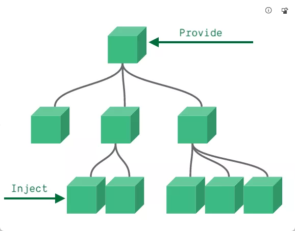
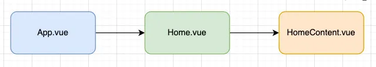
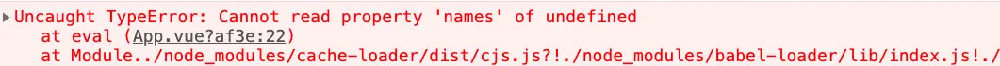
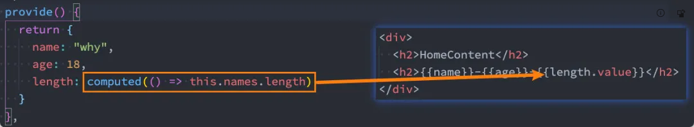

# 非父子组件的相互通信

## 非父子组件通信

- 在开发中，我们构建了组件树之后，除了父子组件之间的通信之外，还会有非父子组件之间的通信。

- 这里我们主要讲两种方式：

  - Provide/Inject (提交/注入)

  - 全局事件总线；

## 全局事件总线

### mitt 库的使用

- Vue3 从实例中移除了 `$on`、`$off` 和 `$once` 方法，所以我们如果希望继续使用全局事件总线，要通过第三方的库：

  - Vue3 官方有推荐一些库，例如 mitt 或 tiny-emitter；

  - 这里我们主要讲解一下 mitt 库的使用；

- 首先，我们需要先安装这个库：

```sh
npm install mitt
```

- 其次，我们可以封装一个工具 eventbus.js：

```js
import mitt from "mitt";
// 可以创建很多个emitter对象
const emitter = mitt();
export default emitter;
```

### 使用事件总线工具

- 在项目中可以使用它们：

  - 我们在 Home.vue 中监听事件；

  - 我们在 App.vue 中触发事件；

- Home.vue 组件中监听事件：

```vue
<template>
  <div></div>
</template>
<script>
import emitter from "./eventBus";
export default {
  created() {
    emitter.on("mjjh", (info) => {
      console.log("mjjh event:", info);
    });
    emitter.on("kobe", (info) => {
      console.log("kobe event:", info);
    });
    emitter.on("*", (type, e) => {
      console.log("* event:", type, e);
    });
  },
};
</script>
```

- App.vue 中触发事件：

```vue
<template>
  <div>
    <home />
    <button @click="triggerEvent">触发事件</button>
  </div>
</template>
<script>
import Home from "./Home.vue";
import emitter from "./eventBus";
export default {
  components: { Home },
  methods: {
    triggerEvent() {
      emitter.emit("mjjh", { name: "mjjh", age: 18 });
    },
  },
};
</script>
```

- 其他 API 的补充，如果在某些情况下我们想要取消事件，可以使用下面的 API：

```JS
// 取消emitter中所有的监听
emitter.all.clear()
// 定义一个函数
function onFoo() { }
// 监听
emitter.on('foo', onFoo)
// 取消监听
emitter.off('foo', onFoo)
```

## Provide/Inject

- Provide/Inject (提交/注入) 用于非父子组件之间共享数据：

  - 比如有一些深度嵌套的组件，子组件想要获取父组件的部分内容；

  - 在这种情况下，如果我们仍然将 props 沿着组件链逐级传递下去，就会非常的麻烦；

- 对于这种情况下，我们可以使用 `Provide` 和 `Inject` ：

  - 无论层级结构有多深，父组件都可以作为其所有子组件的依赖提供者；

  - 父组件有一个 `provide` 选项来提供数据；

  - 子组件有一个 `inject` 选项来开始使用这些数据；



- 实际上，你可以将依赖注入看作是“long range props”，除了：

  - 父组件不需要知道哪些子组件使用它 provide 的 property

  - 子组件不需要知道 inject 的 property 来自哪里

#### 基本使用

- 我们开发一个这样的结构：



- App.vue 组件提供数据：

```vue
<template>
  <div>
    <home></home>
  </div>
</template>
<script>
import Home from "./Home.vue";
export default {
  components: {
    Home,
  },
  provide: {
    name: "mjjh",
    age: 18,
  },
};
</script>
```

- Home.vue 是中间的组件：

```vue
<template>
  <div>
    <home-content></home-content>
  </div>
</template>
<script>
import HomeContent from "./HomeContent.vue";
export default {
  components: {
    HomeContent,
  },
};
</script>
```

- HomeContent.vue 是获取数据的组件：

```vue
<template>
  <div>
    <h2>HomeContent</h2>
    <h2>{{ name }}-{{ age }}</h2>
  </div>
</template>
<script>
export default { inject: ["name", "age"] };
</script>
```

#### Provide 和 Inject 函数的写法

- 如果 Provide 中提供的一些数据是来自 data，那么我们可能会想要通过 this 来获取：

```vue
<template>
  <div>
    <home></home>
  </div>
</template>
<script>
import Home from "./Home.vue";
export default {
  components: {
    Home,
  },
  data() {
    return {
      names: ["abc", "cba"],
    };
  },
  provide: {
    name: "mjjh",
    age: 18,
    length: this.names.length, // 获取data中的this
  },
};
</script>
```

- 这个时候会报错：

  - 这里给大家留一个思考，我们的 this 使用的是哪里的 this？



- 如何解决这个问题呢？
  - 由于使用之前的形式,this 的作用域是 script 标签的作用域
  - 我们需要将 provide 转成为返回对象的函数；
  - 函数有对应的作用域可以获取到对应的 this

```js
provide() {
  return {
    name: "mjjh",
    age: 18,
    length: this.names.length // 获取data中的this
  }
},
```

#### 处理响应式

- 我们先来验证一个结果：如果我们修改了 this.names 的内容，那么使用 length 的子组件会不会是响应式的？

```vue
<template>
  <div>
    <home></home>
    <button @click="addName">添加name</button>
  </div>
</template>
<script>
import Home from "./Home.vue";
export default {
  components: { Home },
  data() {
    return { names: ["abc", "cba"] };
  },
  provide() {
    return { name: "mjjh", age: 18, length: this.names.length };
  },
  methods: {
    addName() {
      this.names.push("mjjh");
    },
  },
};
</script>
```

- 我们会发现对应的子组件中是没有反应的：

  - 因为当我们修改了 names 之后，之前在 provide 中引入的 `this.names.length` 本身并不是响应式的；

- 那么怎么样可以让我们的数据变成响应式的呢？

  - 非常的简单，我们可以使用响应式的一些 API 来完成这些功能，比如说 computed 函数；

  - 当然，这个 computed 是 vue3 的新特性，在后面我会专门讲解，这里大家可以先直接使用一下；

- 注意：我们在使用 length 的时候需要获取其中的 value

  - 这是因为 computed 返回的是一个 ref 对象，需要取出其中的 value 来使用；


