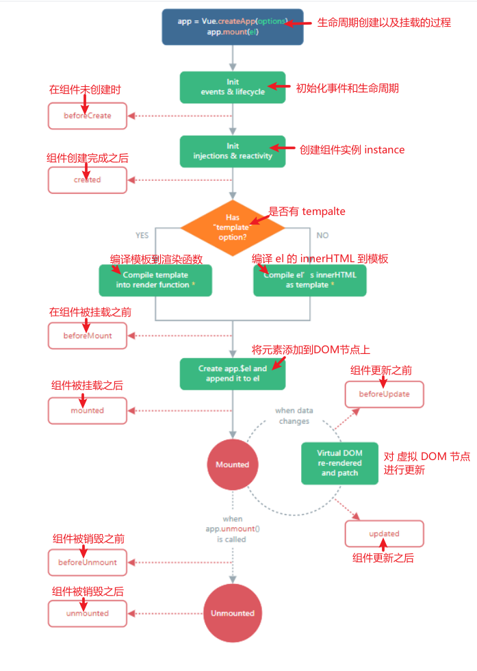

## 生命周期

### 认识生命周期

- 什么是生命周期呢？ 
  - 每个组件都可能会经历从创建、挂载、更新、卸载等一系列的过程；
  - 在这个过程中的某一个阶段，用于可能会想要添加一些属于自己的代码逻辑（比如组件创建完后就请求一些服务器数据）；
  - 但是我们如何可以知道目前组件正在哪一个过程呢？Vue给我们提供了组件的生命周期函数；
- 生命周期函数：
  - 生命周期函数是一些钩子函数，在某个时间会被Vue源码内部进行回调；
  - 通过对生命周期函数的回调，我们可以知道目前组件正在经历什么阶段； 
  - 那么我们就可以在该生命周期中编写属于自己的逻辑代码了；

### 组件的生命周期

1. beforeCreate( )——准备创建
   1. 创建组件实例
2. created( )——创建完成
   1. template模板编译
   2. **重要操作: **
      1. **发送网络请求**
      2. **事件监听**
      3. **watch数据监听**
3. beforeMount( )—挂载之前
   1. 挂在到虚拟DOM(JS) 
   2. 虚拟DOM->真实的DOM->界面看到的内容
4. mounted( )——挂载完成
   1. 数据更新message改变
   2. **重要操作**
      1. **获取DOM**
      2. **使用DOM**
5. beforeUpdate( )——更新之前
   1. 根据最新的数据生成性的VNode 生产新的虚拟DOM->真实DOM
6. updated( )——更新完成
   1. 不再销毁 v-if = false的标签
7. **activated( )——当组件在 keep-alive 内被切换的时候它的 mounted( ) 被取代为activated**
8. **deactivated( )——当组件在 keep-alive 内被切换的时候它的 unmounted( ) 被取代为deactivated**
9. beforeUnmount( )—卸载之前
   1. 将之前挂载在虚拟DOM中的VNode从虚拟DOM中移除
10. unmounted( )——卸载完成
    1. 将组件实例销毁
    2. **重要操作**
       1. **回收的操作(取消事件监听)**
11. errorCaptured——返回子孙组件中的错误
12. renderTracked——虚拟 DOM 重新渲染时调用。接收 `debugger event` 作为参数。告诉你哪个操作跟踪了组件以及该操作的目标对象和键。
13. renderTiggered——虚拟 DOM 重新渲染被触发时调用。接收 `debugger event` 作为参数。告诉你是什么操作触发了重新渲染，以及该操作的目标对象和键

### 生命周期的流程

