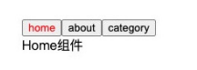
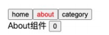

## 动态组件

### 切换组件案例

- 比如我们现在想要实现了一个功能：

  - 点击一个 tab-bar，切换不同的组件显示；

    

- 这个案例我们可以通过两种不同的实现思路来实现：

  - 方式一：通过 v-if 来判断，显示不同的组件；
  - 方式二：动态组件的方式；

- 准备工作

  - 创建三个子文件

    ```vue
    <template>
      <div>
        <h2>XXX组件</h2>
      </div>
    </template>

    <script>
    export default {};
    </script>

    <style scoped></style>
    ```

### v-if 显示不同的组件

- 我们可以先通过 v-if 来判断显示不同的组件，这个可以使用我们之前讲过的知识来实现：

  ```vue
  <template>
    <div class="app">
      <div class="tabs">
        <template v-for="(item, index) in tabs" :key="item">
          <button
            :class="{ active: currentTab === item }"
            @click="itemClick(item)"
          >
            {{ item }}
          </button>
        </template>
      </div>
      <div class="view">
        <!-- 1.第一种做法: v-if进行判断逻辑, 决定要显示哪一个组件 -->
        <template v-if="currentIndex === 0">
          <home></home>
        </template>
        <template v-else-if="currentIndex === 1">
          <about></about>
        </template>
        <template v-else-if="currentIndex === 2">
          <category></category>
        </template>
      </div>
    </div>
  </template>

  <script>
  import Home from "./views/Home.vue";
  import About from "./views/About.vue";
  import Category from "./views/Category.vue";

  export default {
    components: {
      Home,
      About,
      Category,
    },
    data() {
      return {
        currentIndex: 0,
      };
    },
    methods: {
      itemClick(tab) {
        this.currentTab = tab;
      },
    },
  };
  </script>

  <style scoped>
  .active {
    color: red;
  }
  </style>
  ```

### 动态组件的实现

- 动态组件是使用 component 组件，通过一个特殊的 attribute is 来实现：

  ```vue
  <template>
    <div class="app">
      <div class="tabs">
        <template v-for="(item, index) in tabs" :key="item">
          <button
            :class="{ active: currentTab === item }"
            @click="itemClick(item)"
          >
            {{ item }}
          </button>
        </template>
      </div>
      <div class="view">
        <!-- 2.第二种做法: 动态组件 component -->
        <!-- is中的组件需要来自两个地方: 1.全局注册的组件 2.局部注册的组件 -->
        <!-- <component :is="tabs[currentIndex]"></component> -->
        <component name="mjjh" :age="18" :is="currentTab"> </component>
      </div>
    </div>
  </template>

  <script>
  import Home from "./views/Home.vue";
  import About from "./views/About.vue";
  import Category from "./views/Category.vue";

  export default {
    components: {
      Home,
      About,
      Category,
    },
    data() {
      return {
        tabs: ["home", "about", "category"],
        currentTab: "home",
      };
    },
    methods: {
      itemClick(tab) {
        this.currentTab = tab;
      },
    },
  };
  </script>

  <style scoped>
  .active {
    color: red;
  }
  </style>
  ```

- 这个 currentTab 的值需要是什么内容呢？

  - 可以是通过 component 函数注册的组件；
  - 在一个组件对象的 components 对象中注册的组件；

### 动态组件的传值

- 如果是动态组件我们可以给它们传值和监听事件吗？

  - 也是一样的；
  - 只是我们需要将属性和监听事件放到 component 上来使用；

  ```vue
  <template>
    <div class="app">
      <div class="tabs">
        <template v-for="(item, index) in tabs" :key="item">
          <button
            :class="{ active: currentTab === item }"
            @click="itemClick(item)"
          >
            {{ item }}
          </button>
        </template>
      </div>
      <div class="view">
        <!-- 2.第二种做法: 动态组件 component -->
        <!-- is中的组件需要来自两个地方: 1.全局注册的组件 2.局部注册的组件 -->
        <!-- <component :is="tabs[currentIndex]"></component> -->
        <component
          name="mjjh"
          :age="18"
          @homeClick="homeClick"
          :is="currentTab"
        >
        </component>
      </div>
    </div>
  </template>
  ```

```vue
<script>
import Home from "./views/Home.vue";
import About from "./views/About.vue";
import Category from "./views/Category.vue";

export default {
  components: {
    Home,
    About,
    Category,
  },
  data() {
    return {
      tabs: ["home", "about", "category"],
      currentTab: "home",
    };
  },
  methods: {
    itemClick(tab) {
      this.currentTab = tab;
    },
    homeClick(payload) {
      console.log("homeClick:", payload);
    },
  },
};
</script>

<style scoped>
.active {
  color: red;
}
</style>
```

### 认识 keep-alive

- 我们先对之前的案例中 About 组件进行改造：

- 在其中增加了一个按钮，点击可以递增的功能；

  

- 比如我们将 counter 点到 10，那么在切换到 home 再切换回来 about 时，状态是否可以保持呢？

- 答案是否定的；

- 这是因为默认情况下，我们在切换组件后，about 组件会被销毁掉，再次回来时会重新创建组件；

- 但是，在开发中某些情况我们希望继续保持组件的状态，而不是销毁掉，这个时候我们就可以使用一个内置组件： keep-alive。

```vue
<template>
  <div class="app">
    <div class="tabs">
      <template v-for="(item, index) in tabs" :key="item">
        <button
          :class="{ active: currentTab === item }"
          @click="itemClick(item)"
        >
          {{ item }}
        </button>
      </template>
    </div>
    <div class="view">
      <!-- include: 组件的名称来自于组件定义时name选项  -->
      <keep-alive include="home,about">
        <component :is="currentTab"></component>
      </keep-alive>
    </div>
  </div>
</template>

<script>
import Home from "./views/Home.vue";
import About from "./views/About.vue";
import Category from "./views/Category.vue";

export default {
  components: {
    Home,
    About,
    Category,
  },
  data() {
    return {
      tabs: ["home", "about", "category"],
      // currentIndex: 0
      currentTab: "home",
    };
  },
  methods: {
    itemClick(tab) {
      this.currentTab = tab;
    },
  },
};
</script>

<style scoped>
.active {
  color: red;
}
</style>
```

### keep-alive 属性

- keep-alive 有一些属性：

  - include - string | RegExp | Array。只有名称匹配的组件会被缓存；
  - exclude - string | RegExp | Array。任何名称匹配的组件都不会被缓存；
  - max - number | string。最多可以缓存多少组件实例，一旦达到这个数字，那么缓存组件中最近没有被访问的实例会被销毁；

- include 和 exclude prop 允许组件有条件地缓存：

  - 二者都可以用逗号分隔字符串、正则表达式或一个数组来表示；

  - 匹配首先检查组件自身的 name 选项；

    ```html
    <!-- 逗号分割符  -->
    <keep-alive include="home,about">
      <component :is="currentTab"></component>
    </keep-alive>
    <!-- regex(使用 'v-bing') -->
    <keep-alive include="home,about">
      <component :is="currentTab"></component>
    </keep-alive>
    <!-- Array(使用 'v-bing') -->
    <keep-alive include="home,about">
      <component :is="currentTab"></component>
    </keep-alive>
    ```

### 缓存组件的生命周期

- 对于缓存的组件来说，再次进入时，我们是不会执行 created 或者 mounted 等生命周期函数的：

  - 但是有时候我们确实希望监听到何时重新进入到了组件，何时离开了组件；
  - 这个时候我们可以使用 activated 和 deactivated 这两个生命周期钩子函数来监听；

```js
activated() {
  console.log("about activated")
}
deactivated() {
  console.log("about deactivated")
}
```
