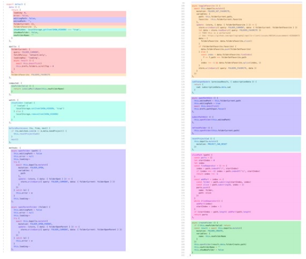
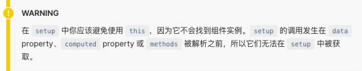
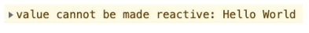
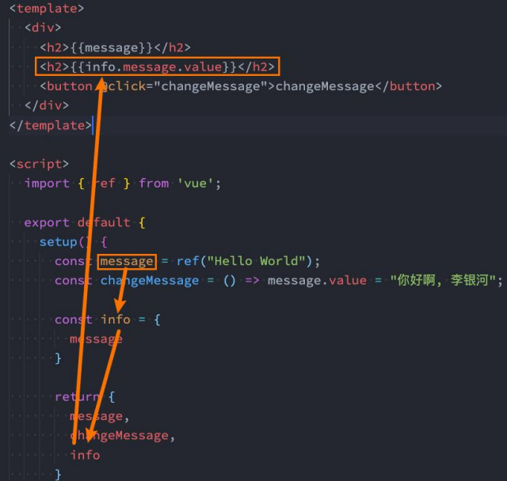
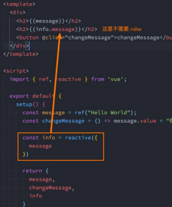
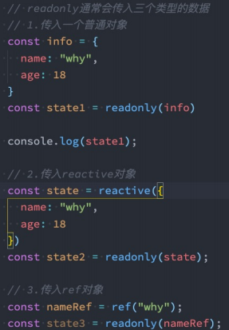
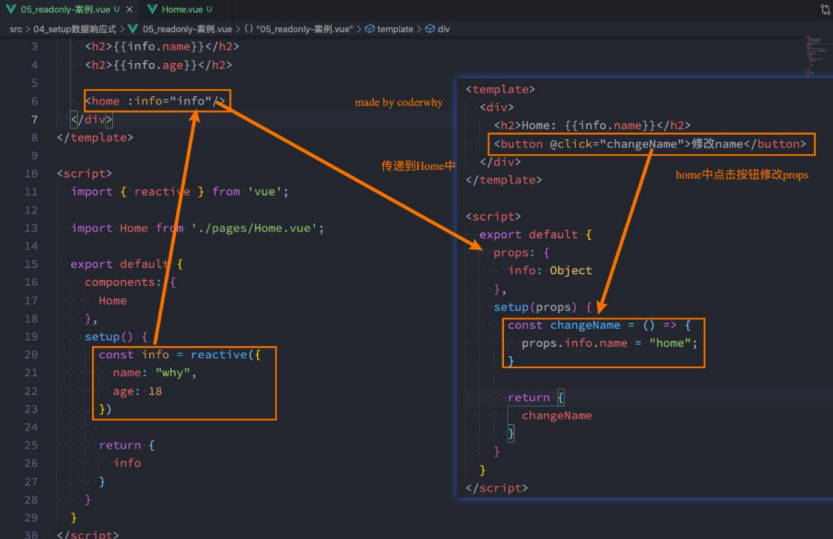
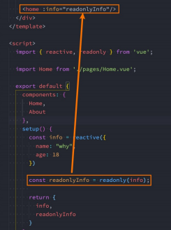
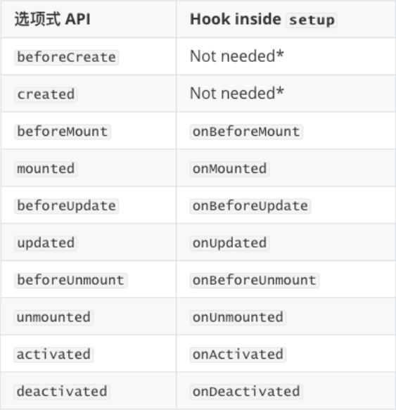
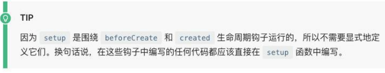

# Composition API

## Compsition API 是什么

### Options API的弊端

- 在Vue2中，我们编写组件的方式是Options API：
  - Options API的一大特点就是在对应的属性中编写对应的功能模块；
  - 比如data定义数据、methods中定义方法、computed中定义计算属性、watch中监听属性改变，也包括生命 周期钩子；
- 但是这种代码有一个很大的弊端：
  - 当我们实现某一个功能时，这个功能对应的代码逻辑会被拆分到各个属性中；
  - 当我们组件变得更大、更复杂时，逻辑关注点的列表就会增长，那么同一个功能的逻辑就会被拆分的很分散；
  - 尤其对于那些一开始没有编写这些组件的人来说，这个组件的代码是难以阅读和理解的（阅读组件的其他人）；
- 下面我们来看一个非常大的组件，其中的逻辑功能按照颜色进行了划分：
  - 这种碎片化的代码使用理解和维护这个复杂的组件变得异常困难，并且隐藏了潜在的逻辑问题；
  - 并且当我们处理单个逻辑关注点时，需要不断的跳到相应的代码块中；  

### 大组件的逻辑分散



- 如果我们能将同一个逻辑关注 点相关的代码收集在一起会更 好。
- 这就是Composition API想要做的事情，以及可以帮助我们完成的事情。
- 也有人把Vue Composition API简称为VCA。 

### 认识Composition API 

- 那么既然知道Composition API想要帮助我们做什么事情，接下来看一下到底是怎么做呢？
  - 为了开始使用Composition API，我们需要有一个可以实际使用它（编写代码）的地方；
  - 在Vue组件中，这个位置就是 setup 函数；
- setup其实就是组件的另外一个选项：
  - 只不过这个选项强大到我们可以用它来替代之前所编写的大部分其他选项；
  - 比如methods、computed、watch、data、生命周期等等；

## setup

### setup函数的参数 

- 我们先来研究一个setup函数的参数，它主要有两个参数：
  - 第一个参数：props
  - 第二个参数：context
- props非常好理解，它其实就是父组件传递过来的属性会被放到props对象中，我们在setup中如果需要使用，那么就可以直接通过props参数获取：
  - 对于定义props的类型，我们还是和之前的规则是一样的，在props选项中定义；
  - 并且在template中依然是可以正常去使用props中的属性，比如message；
  - 如果我们在setup函数中想要使用props，那么不可以通过 this 去获取（后面我会讲到为什么）；
  - 因为props有直接作为参数传递到setup函数中，所以我们可以直接通过参数来使用即可；
- 另外一个参数是context，我们也称之为是一个SetupContext，它里面包含三个属性：
  - attrs：所有的非prop的attribute；
  - slots：父组件传递过来的插槽（这个在以渲染函数返回时会有作用，后面会讲到）；
  - emit：当我们组件内部需要发出事件时会用到emit（因为我们不能访问this，所以不可以通过 this.$emit发出事件）； 

```vue
<template>
  <div class="app">
    <!-- template中ref对象自动解包 -->
    <h2>当前计数: {{ counter }}</h2>
    <button @click="increment">+1</button>
    <button @click="decrement">-1</button>
  </div>
</template>

<script>
import { ref } from 'vue'
import useCounter from './hooks/useCounter'

export default {
  setup() {
    // 1.定义counter的内容
    // 默认定义的数据都不是响应式数据
     let counter = ref(100)
     const increment = () => {
       counter.value++
       console.log(counter.value)
     }
     const decrement = () => {
       counter.value--
     }
     const { counter, increment, decrement } = useCounter()

    return {
      ...useCounter()
    }
  }
}
</script>

<style>
</style>
```

### setup函数的返回值 

- setup既然是一个函数，那么它也可以有返回值，它的返回值用来做什么呢？

  - setup的返回值可以在模板template中被使用；
  - 也就是说我们可以通过setup的返回值来替代data选项；

- 甚至是我们可以返回一个执行函数来代替在methods中定义的方法：

  ```js
  let counter = ref(100)
  const increment = () => {
    counter.value++
    console.log(counter.value)
  }
  const decrement = () => {
    counter.value--
  }
  
  return {
    counter,
    increment,
    decrement
  }
  
  // 与上方相同
  
  // const { counter, increment, decrement } = useCounter()
  // return {
  //   ...useCounter()
  // }
  ```

- 但是，如果我们将 counter 在 increment 或者 decrement进行操作时，是否可以实现界面的响应式呢？

  - 答案是不可以；
  - 这是因为对于一个定义的变量来说，默认情况下，Vue并不会跟踪它的变化，来引起界面的响应式操作； 

### setup不可以使用this

- 首先为什么不能使用this，因为在源码中setup函数再执行的时候，根本就没有进行函数的绑定



###  setup内部源码的执行过程

- 在阅读源码的过程中，代码是按照如下顺序执行的：
  - 调用 createComponentInstance 创建组件实例；
  - 调用 setupComponent 初始化component内部的操作；
  - 调用 setupStatefulComponent 初始化有状态的组件；
  - 在 setupStatefulComponent 取出了 setup 函数；
  - 通过callWithErrorHandling 的函数执行 setup；
- 从上面的代码我们可以看出， 组件的instance肯 定是在执行 setup 函数之前就创建出来的

## 响应式 REF

### Reactive API

- 如果想为在setup中定义的数据提供响应式的特性，那么我们可以使用reactive的函数：

  ```js
  const state = reactive({
  	name: "mjjh",
  	counter: 100
  })
  ```

- 那么这是什么原因呢？为什么就可以变成响应式的呢？

  - 这是因为当我们使用reactive函数处理我们的数据之后，数据再次被使用时就会进行依赖收集；
  - 当数据发生改变时，所有收集到的依赖都是进行对应的响应式操作（比如更新界面）；
  - 事实上，我们编写的data选项，也是在内部交给了reactive函数将其编程响应式对象的；

### ref API

- reactive API对传入的类型是有限制的，它要求我们必须传入的是一个对象或者数组类型：

  - 如果我们传入一个基本数据类型（String、Number、Boolean）会报一个警告；

    

- 这个时候Vue3给我们提供了另外一个API：

  - ref 会返回一个可变的响应式对象，该对象作为一个 响应式的引用维护着它内部的值，这就是ref名称的来源；

  - 它内部的值是在ref的 value 属性中被维护的；

    ```js
    const message = ref("Hello World")
    ```

- 这里有两个注意事项：

  - 在模板中引入ref的值时，Vue会自动帮助我们进行解包操作，所以我们并不需要在模板中通过 ref.value 的方式 来使用；
  - 但是在 setup 函数内部，它依然是一个 ref 引用， 所以对其进行操作时，我们依然需要使用 ref.value的方式；

### Ref自动解包 

- 模板中的解包是浅层的解包，如果我们的代码是下面的方式：
- 如果我们将ref放到一个reactive的属性当中，那么在模板中使用时，它会自动解包： 



### 认识readonly 

- 我们通过reactive或者ref可以获取到一个响应式的对象，但是某些情况下，我们传入给其他地方（组件）的这个 响应式对象希望在另外一个地方（组件）被使用，但是不能被修改，这个时候如何防止这种情况的出现呢？
  - Vue3为我们提供了readonly的方法；
  - readonly会返回原生对象的只读代理（也就是它依然是一个Proxy，这是一个Proxy的set方法被劫持，并且不 能对其进行修改）；
- 在开发中常见的readonly方法会传入三个类型的参数：
  - 类型一：普通对象；
  - 类型二：reactive返回的对象；
  - 类型三：ref的对象； 

### readonly的使用 

- 在readonly的使用过程中，有如下规则：
  - readonly返回的对象都是不允许修改的；
  - 但是经过readonly处理的原来的对象是允许被修改的； 
    - 比如 const info = readonly(obj)，info对象是不允许被修改的； 
    - 当obj被修改时，readonly返回的info对象也会被修改；
    - 但是我们不能去修改readonly返回的对象info；
- 其实本质上就是readonly返回的对象的setter方法被劫持了而已； 



### readonly的应用 

- 那么这个readonly有什么用呢？
- 在我们传递给其他组件数据时，往往希望其他组件使用我们传递的内容，但是不允许它们修改时，就可以使用 readonly了； 





### Reactive判断的API 

- isProxy
  - 检查对象是否是由 reactive 或 readonly创建的proxy。
- isReactive
  - 检查对象是否是由 reactive创建的响应式代理：
  - 如果该代理是 readonly 建的，但包裹了由 reactive 创建的另一个代理，它也会返回 true；
- isReadonly
  - 检查对象是否是由 readonly 创建的只读代理。
- toRaw
  - 返回 reactive 或 readonly 代理的原始对象（不建议保留对原始对象的持久引用。请谨慎使用）
- shallowReactive
  - 创建一个响应式代理，它跟踪其自身
  - roperty 的响应性，但不执行嵌套对象的深层响应式转换 (深层还是原生对象)。
- shallowReadonly
  - 创建一个proxy，使其自身的property 为只读，但不执行嵌套对象的深度只读转换（深层还是可读、可写的）。 

### toRef 

- 如果我们使用ES6的解构语法，对reactive返回的对象进行解构获取值，那么之后无论是修改结构后的变量，还是修改reactive 返回的state对象，数据都不再是响应式的：

  ```js
  const state = reactive({
  	name: "mjjh",
  	age: 18
  })
  
  const { name, age } = state
  ```

- 那么有没有办法让我们解构出来的属性是响应式的呢？

  - Vue为我们提供了一个toRefs的函数，可以将reactive返回的对象中的属性都转成ref；

  - 那么我们再次进行结构出来的 name 和 age 本身都是 ref 的；

    ```js
    // 当我们这样来做的时候, 会返回两个ref对象, 他们是响应式的
    const { name, age } = toRefs(state)
    ```

- 这种做法相当于已经在state.name和ref.value之间建立了 链接，任何一个修改都会引起另外一个变化

### toRefs 

- 如果我们只希望转换一个reactive对象中的属性为ref, 那么可以使用toRef的方法： 

  ```js
  // 如果我们只希望转换一个reactive对象中的属性为ref, 那么可以使用toRef的方式
  const name = toRef(state, 'name');
  const { age } = state;
  const changeName = () => state.name = "mjjh"
  ```

### ref其他的API

- unref
  - 如果我们想要获取一个ref引用中的value，那么也可以通过unref方法：
    - 如果参数是一个 ref，则返回内部值，否则返回参数本身；
    - 这是 val = isRef(val) ? val.value : val 的语法糖函数；
- isRef
  - 判断值是否是一个ref对象。
- shallowRef
  - 创建一个浅层的ref对象；
- triggerRef
  - 手动触发和 shallowRef 相关联的副作用： ref其他的API 

### setup中使用ref

- 在setup中如何使用ref获取元素或者组件？ 

  - 其实非常简单，我们只需要定义一个ref对象，绑定到元素或者组件的ref属性上即可；

  ```vue
  <template>
  	<div>
      <h2 ref="titleRef">
      	我是标题 
    	</h2>
    </div>
  </template>
  
  <script>
  	import { ref } from "vue"
    
    export default {
      setup() {
        const titleRef = ref(null)
        return {
          titleRef
        }
      }
    }
  </script>
  ```

## computed 

- 在前面我们讲解过计算属性computed：当我们的某些属性是依赖其他状态时，我们可以使用计算属性来处理

  - 在前面的Options API中，我们是使用computed选项来完成的；
  - 在Composition API中，我们可以在 setup 函数中使用 computed 方法来编写一个计算属性；

- 如何使用computed呢？

  - 方式一：接收一个getter函数，并为 getter 函数返回的值，返回一个不变的 ref 对象；

    ```js
    const fullName = computed(() => {
      return firstName.value + " " + lastName.value
    })
    ```

  - 方式二：接收一个具有 get 和 set 的对象，返回一个可变的（可读写）ref 对象； 

    ```js
    const fullName = computed({
    	get: () => {
    		return firstName.value + " " + lastName.value;
    	},
      set: newValue => {
        const names = newValue.split(" ");
        firstName.value = name[0];
        firstName.value = name[1];
      }
    })
    ```

## 生命周期钩子

- 我们前面说过 setup 可以用来替代 data 、 methods 、 computed 等等这些选项，也可以替代 生命周期钩子。

- 那么setup中如何使用生命周期函数呢？

  - 可以使用直接导入的 onX 函数注册生命周期钩子；

  ```js
  onMounted(() => {
  	console.log("onMounted")
  })
  onUpdated(() => {
  	console.log("onUpdated")
  })
  onUnmounted(() => {
  	console.log("onUnmounted")
  })
  ```

  



## Provide和Inject

### Provide函数

- 事实上我们之前还学习过Provide和Inject，Composition API也可以替代之前的 Provide 和 Inject 的选项。

- 我们可以通过 provide来提供数据：

  - 可以通过 provide 方法来定义每个 Property；

- provide可以传入两个参数：

  - name：提供的属性名称；
  - value：提供的属性值；

  ```js
  let counter = 100
  let info = {
    name: "mjjh"
  	age: 10
  }
  
  provide("counter", counter)
  provide("info", info)
  ```

### Inject函数

- 在 后代组件 中可以通过 inject 来注入需要的属性和对应的值：

  - 可以通过 inject 来注入需要的内容；

- inject可以传入两个参数：

  - 要 inject 的 property 的 name；
  - 默认值；

  ```js
  const counter = injectt("counter")
  const info = inject("info")
  ```

### 数据的响应式

- 为了增加 provide 值和 inject 值之间的响应性，我们可以在 provide 值时使用 ref 和 reactive。

  ```js
  let counter = ref(100)
  let info = reactive({
    name: "mjjh"
  	age: 10
  })
  
  provide("counter", counter)
  provide("info", info)
  ```

## 侦听数据的变化

- 在前面的Options API中，我们可以通过watch选项来侦听data或者props的数据变化，当数据变化时执行某一些操作。
- 在Composition API中，我们可以使用watchEffect和watch来完成响应式数据的侦听；
  - watchEffect：用于自动收集响应式数据的依赖；
  - watch：需要手动指定侦听的数据源；

### Watch的使用

- watch的API完全等同于组件watch选项的Property：

  - watch需要侦听特定的数据源，并且执行其回调函数；
  - 默认情况下它是惰性的，只有当被侦听的源发生变化时才会执行回调；

  ```js
  const name = ref("mjjh")
  watch(name, (newValue, oldValue) => {
    console.log(newValue, oldValue)
  })
  
  const changeName = () => {
    name.value = "james"
  }
  ```

### 侦听多个数据源

- 侦听器还可以使用数组同时侦听多个源：

```js
const name = ref("mjjh")
const age = ref(18)

watch([name, age], (newValue, oldValue) => {
  console.log(newValue, oldValue)
})

const changeName = () => {
  name.value = "james"
}
```

### watch的选项

- 如果我们希望侦听一个深层的侦听，那么依然需要设置 deep 为true：

  - 也可以传入 immediate 立即执行；

  ```js
  const info = reactive({
  	name: "mjjh",
  	age: 18,
  	friend: {
  		name: "mjr"
  	}
  })
  
  watch(info, (newValue, oldValue) => {
    console.log(newValue, oldValue)
  }, {
    immediate: true,
    deep: true
  })
  ```

### watchEffect

- 当侦听到某些响应式数据变化时，我们希望执行某些操作，这个时候可以使用 watchEffect。

- 我们来看一个案例：

  - 首先，watchEffect传入的函数会被立即执行一次，并且在执行的过程中会收集依赖；
  - 其次，只有收集的依赖发生变化时，watchEffect传入的函数才会再次执行；

  ```js
  const name = ref("mjjh");
  const age = ref(18);
  
  watchEffect(() => {
    console.log("watchEffect执行~", name.value, age.value);
  })
  ```

### watchEffect的停止侦听

- 如果在发生某些情况下，我们希望停止侦听，这个时候我们可以获取watchEffect的返回值函数，调用该函数即可。

- 比如在上面的案例中，我们age达到20的时候就停止侦听：

  ```js
  const name = ref("mjjh");
  const age = ref(18);
  
  const stopWatch =  watchEffect(() => {
    console.log("watchEffect执行~", name.value, age.value);
  })
  
  const changeAge = () => {
    age.value++;
    if (age.value > 20) {
      stopWatch();
    }
  }
  
  ```

## Hook实战

### useCounter

我们先来对之前的counter逻辑进行抽取：

```js
import { ref } from 'vue'

export function useCounter() {
  const counter = ref(0)
  
  const increment = () => counter.value++
  const decrement = () => counter.value--
  
  return {
    counter,
    increment,
    decrement
  }
}
```

### useTitle

我们编写一个修改title的Hook：

```js
import { ref, watch } from 'vue'

export function useTitle(title = '默认值') {
  const titleRef = ref(title);
  
  watch(titleRef, (newValue) => {
    document.title = newValue
  },{
    immediate: true
  })
  return {
    titleRef
  }
}
```

### useScrollPosition

我们来完成一个监听界面滚动位置的Hook：

```js
import { ref } from 'vue'

export function useCounter() {
  const scrollX = ref(0)\
  const scrollY = ref(0)
  
  document.addEventListener('scroll', () => {
    scrollX.value = window.scrollX
    scrollY.value = window.scrollY
  })
  
  return {
    scrollX,
    scrollY
  }
}
```

## script setup语法

- `<script setup>` 是在单文件组件 (SFC) 中使用组合式 API 的编译时语法糖，当同时使用 SFC 与组合式 API 时则推荐该语法。

  - 更少的样板内容，更简洁的代码；
  - 能够使用纯 Typescript 声明 prop 和抛出事件；
  - 更好的运行时性能 ；
  - 更好的 IDE 类型推断性能 ；

- 使用这个语法，需要将 setup attribute 添加到 `<script>` 代码块上：

  ```js
  <script setup>
  	console.log("hello World")
  </script>  
  ```

- 里面的代码会被编译成组件 setup() 函数的内容：

  - 这意味着与普通的` <script>` 只在组件被首次引入的时候执行一次不同；
  - `<script setup>` 中的代码会在每次组件实例被创建的时候执行。

### 顶层的绑定会被暴露给模板

- 当使用 `<script setup>` 的时候，任何在 `<script setup>` 声明的顶层的绑定 (包括变量，函数声明，以及 import 引入的内容) 

```js
<template>
	<h2>message: {{ message }}</h2>
	<button @click="btnClick">按钮</button>
</template>

<script setup>
	const message = "Hello World"
	function btnClick() {
    console.log('btnClick')
  }
</script>
```

- 响应式数据需要通过ref、reactive来创建。

### 导入的组件直接使用

- `<script setup>` 范围里的值也能被直接作为自定义组件的标签名使用：

```js
<template>
	<show-info></show-info>
</template>

<script setup>
	import ShowInfo from './ShowInfo.vue'
</script>
```

### defineProps() 和 defineEmits()

- 为了在声明 props 和 emits 选项时获得完整的类型推断支持，我们可以使用 defineProps 和 defineEmits API，它们将自动地在 `<script setup>` 中可用：

```js
<template>
	<h2>ShowInfo: {{ name }}--{{ age }}</h2>
	<button @click="changeAge">修改age</button>
</template>

<script setup>
	const props = defineProps({
    name: {
      type: String,
      default: ""
    },
    age: {
      type: Number,
      default: 0
    }
  })
	const emit = defineEmits(["changeAge"])
  functon changeAge() {
    emit("changeAge", 200)
  }
</script>
```

### defineExpose()

- 使用` <script setup>` 的组件是默认关闭的：

  - 通过模板 ref 或者 $parent 链获取到的组件的公开实例，不会暴露任何在 `<script setup>` 中声明的绑定；

- 通过 defineExpose 编译器宏来显式指定在 `<script setup>` 组件中要暴露出去的 property：

  ```js
  <script setup>
  	function foo() {
      console.log("foo function")
    }
    defineExpose({
      foo
    })
  </script>
  ```

  ```js
  <script setup>
  	import { ref } from 'vue'
  	const showInfo = ref(null)
    function callShowInfo() {
      showInfoRef.value.foo()
    }
  </script>
  
  ```