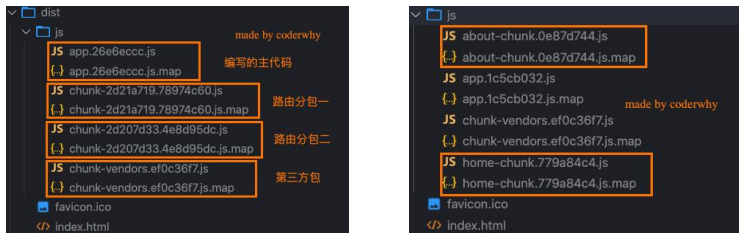
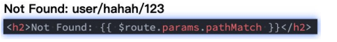
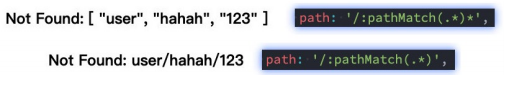
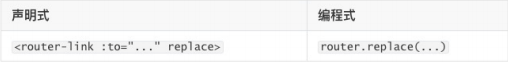

# VueRouter 路由

## HTML 路由

### 认识前端路由

- 路由其实是网络工程中的一个术语：
  - 在架构一个网络时，非常重要的两个设备就是路由器和交换机。
  - 当然，目前在我们生活中路由器也是越来越被大家所熟知，因为我们生活中都会用到路由器：
  - 事实上，路由器主要维护的是一个映射表；
  - 映射表会决定数据的流向；
- 路由的概念在软件工程中出现，最早是在后端路由中实现的，原因是 web 的发展主要经历了这样一些阶段：
  - 后端路由阶段；
  - 前后端分离阶段；
  - 单页面富应用（SPA）；

### 后端路由阶段

- 早期的网站开发整个 HTML 页面是由服务器来渲染的.
  - 服务器直接生产渲染好对应的 HTML 页面, 返回给客户端进行展示.
- 但是, 一个网站, 这么多页面服务器如何处理呢?
  - 一个页面有自己对应的网址, 也就是 URL；
  - URL 会发送到服务器, 服务器会通过正则对该 URL 进行匹配, 并且最后交给一个 Controller 进行处理；
  - Controller 进行各种处理, 最终生成 HTML 或者数据, 返回给前端.
- 上面的这种操作, 就是后端路由：
  - 当我们页面中需要请求不同的路径内容时, 交给服务器来进行处理, 服务器渲染好整个页面, 并且将页面返回给客户端.
  - 这种情况下渲染好的页面, 不需要单独加载任何的 js 和 css, 可以直接交给浏览器展示, 这样也有利于 SEO 的优化.
- 后端路由的缺点:
  - 一种情况是整个页面的模块由后端人员来编写和维护的；
  - 另一种情况是前端开发人员如果要开发页面, 需要通过 PHP 和 Java 等语言来编写页面代码；
  - 而且通常情况下 HTML 代码和数据以及对应的逻辑会混在一起, 编写和维护都是非常糟糕的事情；

### 前后端分离阶段

- 前端渲染的理解：
  - 每次请求涉及到的静态资源都会从静态资源服务器获取，这些资源包括 HTML+CSS+JS，然后在前端对这些请 求回来的资源进行渲染；
  - 需要注意的是，客户端的每一次请求，都会从静态资源服务器请求文件；
  - 同时可以看到，和之前的后端路由不同，这时后端只是负责提供 API 了；
- 前后端分离阶段：
  - 随着 Ajax 的出现, 有了前后端分离的开发模式；
  - 后端只提供 API 来返回数据，前端通过 Ajax 获取数据，并且可以通过 JavaScript 将数据渲染到页面中；
  - 这样做最大的优点就是前后端责任的清晰，后端专注于数据上，前端专注于交互和可视化上；
  - 并且当移动端(iOS/Android)出现后，后端不需要进行任何处理，依然使用之前的一套 API 即可；
  - 目前比较少的网站采用这种模式开发（jQuery 开发模式）；

### URL 的 hash

- 前端路由是如何做到 URL 和内容进行映射呢？监听 URL 的改变。

- URL 的 hash

  - URL 的 hash 也就是锚点(#), 本质上是改变 window.location 的 href 属性；

  - 我们可以通过直接赋值 location.hash 来改变 href, 但是页面不发生刷新；

    ```html
    <div id="app">
      <a href="#/home">home</a>
      <a href="#/about">about</a>

      <div class="router-view">Default</div>
    </div>

    <script>
      // 1.获取router-view
      const contentEl = document.querySelector(".router-view");

      // 2.监听hashchange
      window.addEventListener("hashchange", () => {
        switch (location.hash) {
          case "#/home":
            contentEl.innerHTML = "Home";
            break;
          case "#/about":
            contentEl.innerHTML = "About";
            break;
          default:
            contentEl.innerHTML = "Default";
        }
      });
    </script>
    ```

  - hash 的优势就是兼容性更好，在老版 IE 中都可以运行，但是缺陷是有一个#，显得不像一个真实的路径。

### HTML 的 History

- history 接口是 HTML5 新增的, 它有六种模式改变 URL 而不刷新页面：

  - replaceState：替换原来的路径；
  - pushState：使用新的路径； (实际上就是一个压栈的操作)
  - popState：路径的回退；（出栈）
  - go：向前或向后改变路径；
  - forward：向前改变路径；
  - back：向后改变路径

  ```html
  <div id="app">
    <a href="/home">home</a>
    <a href="/about">about</a>

    <div class="router-view">Default</div>
  </div>

  <script>
    // 1.获取router-view
    const contentEl = document.querySelector(".router-view");

    // 4.执行设置页面操作
    const historyContent = () => {
      console.log("-----");
      switch (location.pathname) {
        case "/home":
          contentEl.innerHTML = "Home";
          break;
        case "/about":
          contentEl.innerHTML = "About";
          break;
        default:
          contentEl.innerHTML = "Default";
      }
    };

    // 2.监听所有的a元素
    const aEls = document.getElementsByTagName("a");
    for (let aEl of aEls) {
      aEl.addEventListener("click", (e) => {
        e.preventDefault();

        const href = aEl.getAttribute("href");
        console.log(href);
        history.pushState({}, "", href);
        // history.replaceState({}, "", href);
        historyContent();
      });
    }

    // 3.监听popstat和go的操作
    window.addEventListener("popstate", historyContent);
    window.addEventListener("go", historyContent);
  </script>
  ```

## Vue-router 的基本使用

### 认识 Vue-router

- 目前前端流行的三大框架, 都有自己的路由实现:

  - Angular 的 ngRouter
  - React 的 ReactRouter
  - Vue 的 vue-router

- Vue Router 是 Vue.js 的官方路由。它与 Vue.js 核心深度集成，让用 Vue.js 构建单页应用变得非常容易。

  - 目前 Vue 路由最新的版本是 4.x
  - vue-router 是基于路由和组件的
  - 路由用于设定访问路径, 将路径和组件映射起来.
  - 在 vue-router 的单页面应用中, 页面的路径的改变就是组件的切换.

- 安装 Vue Router：

  ```sh
  npm install vue-router
  ```

### 路由的使用步骤

- 使用 vue-router 的步骤:
  1. 创建路由组件的组件（打算显示的页面）；
  2. 通过 createRouter 创建路由对象，并且传入 routes 和 history 模式；
     1. 配置路由映射: 组件和路径映射关系的 routes 数组；
     2. 创建基于 hash 或者 history 的模式；
  3. 使用 app 注册路由对象（use 方法）；
  4. 使用路由: 通过`router-link`和`router-view`；

### 路由的基本使用流程

```js
import { createRouter, createWebHashHistory } from "vue-router";

//导入创建的组件
import Home from "../pages/Home.vue";
import About from "../page/About.vue";

//配置路由的映射
const routes = [
  { path: "/home", component: Home },
  { path: "/about", component: About },
];

//创建router对象
const router = createRouter({
  routes,
  history: createWebHashHistory(),
});
```

```vue
<template>
  <div class="app">
    <p>
      <router-link to="/home"></router-link>
      <router-link to="/about"></router-link>
    </p>
  </div>
</template>

<script>
export default {
  name: "App",
  components: {},
};
</script>

<style scoped></style>
```

```js
import router from "./router";

creartApp(App).use(router).mount("#app");
```

### 路由的默认路径

- 我们这里还有一个不太好的实现:

  - 默认情况下, 进入网站的首页, 我们希望渲染首页的内容；
  - 但是我们的实现中, 默认没有显示首页组件, 必须让用户点击才可以；

- 如何可以让路径默认跳到到首页, 并且渲染首页组件呢?

  ```js
  const routes = [
    { path: "/", redirect: "/home" },
    { path: "/home", redirect: home },
    { path: "/about", redirect: About },
  ];
  ```

- 我们在 routes 中又配置了一个映射：

  - path 配置的是根路径: /
  - redirect 是重定向, 也就是我们将根路径重定向到/home 的路径下, 这样就可以得到我们想要的结果了

### history 模式

- 另外一种选择的模式是 history 模式：

  ```js
  import { createRouter, createWebHistory } from "vue-router";
  //创建router对象
  const router = createRouter({
    routes,
    history: createWebHistory(),
  });
  ```

  

### router-link

- router-link 事实上有很多属性可以配置：
  - to 属性：
    - 是一个字符串，或者是一个对象
  - replace 属性：
    - 设置 replace 属性的话，当点击时，会调用 router.replace()，而不是 router.push()；
  - active-class 属性：
    - 设置激活 a 元素后应用的 class，默认是 router-link-active
  - exact-active-class 属性：
    - 链接精准激活时，应用于渲染的 的 class，默认是 router-link-exact-active；

## 路由的其他属性

- name 属性：路由记录独一无二的名称；

- meta 属性：自定义的数据

  ```js
  {
  	path: '/about',
    name: 'about-router'
    component: () => import('../pages/About.vue')
    meta: {
      name: 'mjjh',
      age: 18
    }
  }
  ```

## 路由懒加载

- 当打包构建应用时，JavaScript 包会变得非常大，影响页面加载：

  - 如果我们能把不同路由对应的组件分割成不同的代码块，然后当路由被访问的时候才加载对应组件，这样就会 更加高效；
  - 也可以提高首屏的渲染效率；

- 其实这里还是我们前面讲到过的 webpack 的分包知识，而 Vue Router 默认就支持动态来导入组件：

  - 这是因为 component 可以传入一个组件，也可以接收一个函数，该函数 需要放回一个 Promise；
  - 而 import 函数就是返回一个 Promise

  ```js
  const routes = [
    { path: "/", redirect: "/home" },
    { path: "/home", component: () => import("../pages/Home.vue") },
    { path: "/about", component: () => import("../pages/About.vue") },
  ];
  ```

### 打包效果

- 我们会发现分包是没有一个很明确的名称的，其实 webpack 从 3.x 开始支持对分包进行命名（chunk name）：

  ```js
  { path: '/home', component: () => import(/* webpackChunkName: "home-chunk" */'../pages/Home.vue') },
  ```



## Vue-router 进阶

### 动态路由

#### 动态路由基本匹配

- 很多时候我们需要将给定匹配模式的路由映射到同一个组件：

  - 例如，我们可能有一个 User 组件，它应该对所有用户进行渲染，但是用户的 ID 是不同的；

  - 在 Vue Router 中，我们可以在路径中使用一个动态字段来实现，我们称之为 路径参数；

    ```js
    {
      path: "user/:id";
      component: () => import("../pages/User.vue");
    }
    ```

  - 再 router-link 中进行跳转

    ```vue
    <router-link to="/user/123"></router-link>
    ```

#### 获取动态路由的值

- 那么在 User 中如何获取到对应的值呢？

  - 在 template 中，直接通过 $route.params 获取值；

    - 在 created 中，通过 this.$route.params 获取值；

    - 在 setup 中，我们要使用 vue-router 库给我们提供的一个 hook useRoute；

      - 该 Hook 会返回一个 Route 对象，对象中保存着当前路由相关的值；

  ```js
  <template>
  	<div>
        <h2>用户界面： {{ $route.params.id }}</h2>
    </div>
  </template>
  ```

export default {
created() {
console.log(this.$route.params.id)
},
setup() {
const route = useRoute()
console.log(route)
console.log(route.params.id)
}
}

````

#### 匹配多个参数

```js
{
	path: '/user/:id/info/:name',
	component: () => import('../pages/User.vue')
}
````

| 匹配模式              | 匹配路径             | $route.params           |
| --------------------- | -------------------- | ----------------------- |
| /users/id             | /users/123           | id: '123'               |
| /users/:id/info/:name | /users/123/info/mjjh | id: '123', name: 'mjjh' |

### NotFound

- 对于哪些没有匹配到的路由，我们通常会匹配到固定的某个页面

  - 比如 NotFound 的错误页面中，这个时候我们可编写一个动态路由用于匹配所

    ```js
    {
      path: '/:pathMatch(.*)',
      component: () => import('../pages/NotFound.vue')
    }
    ```

- 我们可以通过￥ route.params.pathMatch 获取传入的参数

  

### 匹配规则加\*

- 另一种写法

  - 再原本的、：pathMatch(._)后面又加了一个_；

    ```js
    {
    	path: '/:pathMatch(.*)*',
    	component: () => import('../pages/NotFound.vue')
    }
    ```

- 区别在于解析的时候，是否解析/



### 路由的嵌套

- 什么是路由的嵌套呢？
  - 目前我们匹配的 Home、About、User 等都属于底层路由，我们在它们之间可以来回进行切换；
  - 但是呢，我们 Home 页面本身，也可能会在多个组件之间来回切换：
    - 比如 Home 中包括 Product、Message，它们可以在 Home 内部来回切换
  - 这个时候我们就需要使用嵌套路由，在 Home 中也使用 router-view 来占位之后需要渲染的组件；

#### 路由的嵌套配置

```js
{
    path: "/home",
    name: "home",
    component: () => import(/* webpackChunkName: "home-chunk" */"../pages/Home.vue"),
    meta: {
      name: "mjjh",
      age: 18,
      height: 1.88
    },
    children: [
      {
        path: "",
        redirect: "/home/message"
      },
      {
        path: "message",
        component: () => import("../pages/HomeMessage.vue")
      },
      {
        path: "shops",
        component: () => import("../pages/HomeShops.vue")
      }
    ]
  },
```

### 代码的页面跳转

- 有时候我们希望通过代码来完成页面的跳转，比如点击的是一个按钮：

  ```js
  jumpToProfile(){
  	this.$router.push('/profile')
  }
  ```

- 当然，我们也可以传入一个对象：

  ```js
  jumpToProfile(){
  	this.$router.push({
  		path: '/profile'
  	})
  }
  ```

- 如果是在 setup 中编写的代码，那么我们可以通过 useRouter 来获取：

  ```js
  const router = useRouter();

  const jumpToProfile = () => {
    router.replace("/profile");
  };
  ```

### query 方式的参数

- 我们也可以通过 query 的方式来传递参数：

  ```js
  jumpToProfile(){
  	this.$route.push({
  		pathL '/profile',
  		queryL { name: 'why', age: 18}
  	})
  }
  ```

- 在界面中通过 $route.query 来获取参数：

  ```html
  <h2>query : {{ $route.query.name }}-{{ $route.query.age }}</h2>
  ```

### 替换当前的位置

- 使用 push 的特点是压入一个新的页面，那么在用户点击返回时，上一个页面还可以回退，但是如果我们希望当前 页面是一个替换操作，那么可以使用 replace：

  

### 页面的前进后退

- router 的 go 方法

  ```js
  //前进1条记录 与router.forward() 相同
  router.go(1);

  //返回1条记录 与router.back() 相同
  router.go(-1);

  //前进3条记录
  router.go(3);

  //没有那么多默认失败
  router.go(-100);
  router.go(100);
  ```

- router 也有 back

  - 通过调用 history.back() 回溯历史。相当于 router.go(-1)；

- router 也有 forward

  - 通过调用 history.forward() 在历史中前进。相当于 router.go(1)

### 动态添加路由

- 某些情况下我们可能需要动态的来添加路由：

  - 比如根据用户不同的权限，注册不同的路由；
  - 这个时候我们可以使用一个方法 addRoute；

- 如果我们是为 route 添加一个 children 路由，那么可以传入对应的 name：

  ```js
  // 动态添加路由
  const homeRoute = {
    path: "/home",
    component: () => import("../pages/Home.vue"),
  };

  router.addRoute(homeRoute);

  // 动态添加路由2
  const homeMomentRoute = {
    path: "moment",
    component: () => import("../pages/HomeMoment.vue"),
  };

  router.addRoute("home", homeMomentRoute);
  ```

### 动态删除路由

- 删除路由有以下三种方式：

  - 方式一：添加一个 name 相同的路由；

    ```js
    router.addRoute({ path: "/about", name: "about", component: About });
    // 这将会删除之前已经添加的路由, 业务他们具有相同的名字且名字必须是唯一的
    router.addRoute({ path: "/other", name: "about", component: Other });
    ```

  - 方式二：通过 removeRoute 方法，传入路由的名称；

    ```js
    router.addRoute({ path: "/about", name: "about", component: About });
    // 删除路由
    router.removeRoute("about");
    ```

  - 方式三：通过 addRoute 方法的返回值回调；

    ```js
    const removeRoute = router.addRoute(routeRecord);
    removeRoute(); // 删除路由如果存在的话
    ```

- 路由的其他方法补充：

  - router.hasRoute()：检查路由是否存在。
  - router.getRoutes()：获取一个包含所有路由记录的数组。

### 路由导航守卫

- vue-router 提供的导航守卫主要用来通过跳转或取消的方式守卫导航。

- 全局的前置守卫 beforeEach 是在导航触发时会被回调的：

- 它有两个参数：

  - to：即将进入的路由 Route 对象；
  - from：即将离开的路由 Route 对象；

  ```js
  router.beforeEach((to, ftom) => {
    console.log(to);
    console.log(from);
    return false;
  });
  ```

- 它有返回值：

  - false：取消当前导航；
  - 不返回或者 undefined：进行默认导航；
  - 返回一个路由地址：
    - 可以是一个 string 类型的路径；
    - 可以是一个对象，对象中包含 path、query、params 等信息；
  - 可选的第三个参数：next
    - 在 Vue2 中我们是通过 next 函数来决定如何进行跳转的；
    - 但是在 Vue3 中我们是通过返回值来控制的，不再推荐使用 next 函数，这是因为开发中很容易调用多次 next；

### 登录守卫功能

- 比如我们完成一个功能，只有登录后才能看到其他页面：

  `router`

  ```js
  router.beforeEach((to, from) => {
  	console.log(to)
    console.log(from)

    if (to.path !== '/login') {
      const token = window.localStorage.getItem('token)
      if (!token) {
  			return {
          path: '/login'
        }
      }
    }
  })
  ```

  `app.vue / script`

  ```js
  const router = useRouter();

  const login = () => {
    window.localStorage.setItem("token", "123");
    router.push({
      path: "/home",
    });
  };
  ```

### 其他导航守卫

- Vue 还提供了很多的其他守卫函数，目的都是在某一个时刻给予我们回调，让我们可以更好的控制程序的流程或者功能：
  - https://next.router.vuejs.org/zh/guide/advanced/navigation-guards.html
- 我们一起来看一下完整的导航解析流程：
  1. 导航被触发。
  2. 在失活的组件里调用 beforeRouteLeave 守卫。
  3. 调用全局的 beforeEach 守卫。
  4. 在重用的组件里调用 beforeRouteUpdate 守卫(2.2+)。
  5. 在路由配置里调用 beforeEnter。
  6. 解析异步路由组件。
  7. 在被激活的组件里调用 beforeRouteEnter。
  8. 调用全局的 beforeResolve 守卫(2.5+)。
  9. 导航被确认。
  10. 调用全局的 afterEach 钩子。
  11. 触发 DOM 更新。
  12. 调用 beforeRouteEnter 守卫中传给 next 的回调函数，创建好的组件实例会作为回调函数的参数传入。
