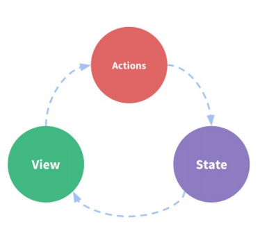
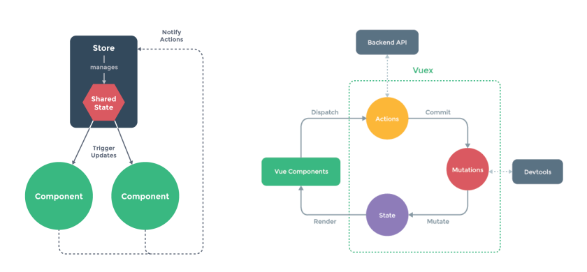
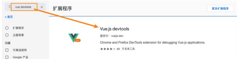
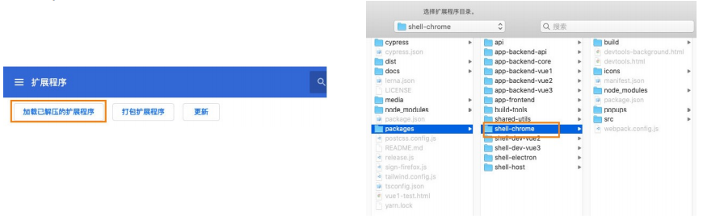
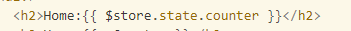
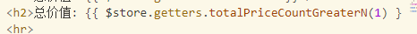

# Vuex状态管理

## 状态管理

### 什么是状态管理

- 在开发中，我们会的应用程序需要处理各种各样的数据，这些 数据需要保存在我们应用程序中的某一个位置，对于这些数据 的管理我们就称之为是 状态管理。 

- 在前面我们是如何管理自己的状态呢？ 

  - 在Vue开发中，我们使用组件化的开发方式； 

  - 而在组件中我们定义data或者在setup中返回使用的数据， 这些数据我们称之为state； 

  - 在模块template中我们可以使用这些数据，模块最终会被 渲染成DOM，我们称之为View； 

  - 在模块中我们会产生一些行为事件，处理这些行为事件时， 有可能会修改state，这些行为事件我们称之为actions；

    

### 复杂的状态惯例

- JavaScript开发的应用程序，已经变得越来越复杂了： 
  - JavaScript需要管理的状态越来越多，越来越复杂； 
  - 这些状态包括服务器返回的数据、缓存数据、用户操作产生的数据等等；
  - 也包括一些UI的状态，比如某些元素是否被选中，是否显示加载动效，当前分页； 
- 当我们的应用遇到多个组件共享状态时，单向数据流的简洁性很容易被破坏：
  - 多个视图依赖于同一状态； 
  - 来自不同视图的行为需要变更同一状态；
- 我们是否可以通过组件数据的传递来完成呢？ 
  - 对于一些简单的状态，确实可以通过props的传递或者Provide的方式来共享状态；
  - 但是对于复杂的状态管理来说，显然单纯通过传递和共享的方式是不足以解决问题的，比如兄弟组件如何共享 数据呢？

### Vuex的状态管理

- 管理不断变化的state本身是非常困难的： 

  - 状态之间相互会存在依赖，一个状态的变化会引起另一个状态的变化，View页面也有可能会引起状态的变化； 
  - 当应用程序复杂时，state在什么时候，因为什么原因而发生了变化，发生了怎么样的变化，会变得非常难以控 制和追踪； 

- 因此，我们是否可以考虑将组件的内部状态抽离出来，以一个全局单例的方式来管理呢？

  - 在这种模式下，我们的组件树构成了一个巨大的 “视图View”；
  - 不管在树的哪个位置，任何组件都能获取状态或者触发行为；
  - 通过定义和隔离状态管理中的各个概念，并通过强制性的规则来维护视图和状态间的独立性，我们的代码边会 变得更加结构化和易于维护、跟踪； 

- 这就是Vuex背后的基本思想，它借鉴了Flux、Redux、Elm（纯函数语言，redux有借鉴它的思想）：

  

## Vuex安装

### VueX的安装

- 依然我们要使用vuex，首先第一步需要安装vuex

  - 我们这里使用的是vuex4.x，安装的时候需要添加 next 指定版本；

    ```sh
    npm install vuex@next
    ```

### 创建Store

- 每一个Vuex应用的核心就是store（仓库）： 
  - store本质上是一个容器，它包含着你的应用中大部分的状态（state）；
- Vuex和单纯的全局对象有什么区别呢？ 
- 第一：Vuex的状态存储是响应式的 
  - 当Vue组件从store中读取状态的时候，若store中的状态发生变化，那么相应的组件也会被更新；
- 第二：你不能直接改变store中的状态 
  - 改变store中的状态的唯一途径就显示提交 (commit) mutation； 
  - 这样使得我们可以方便的跟踪每一个状态的变化，从而让我们能够通过一些工具帮助我们更好的管理应用的状态；
- 使用步骤：
  - 创建Store对象；
  - 在app中通过插件安装；

### 组件中使用Store

- 在组件中使用store，我们按照如下的方式：
  - 在模板中使用；
  - 在options api中使用，比如computed；
  - 在setup中使用；

### Vue devtool

- vue其实提供了一个devtools，方便我们对组件或者vuex进行调试：

- 我们需要安装beta版本支持vue3，目前是6.0.0 beta15； 

- 它有两种常见的安装方式：

  - 方式一：通过chrome的商店；
  - 方式二：手动下载代码，编译、安装；

- 方式一：通过Chrome商店安装：

  - 由于某些原因我们可能不能正常登录Chrome商店，所以可以选择第二种；

    

### 手动安装devtool

- 方式二：手动下载代码，编译、安装 

  - https://github.com/vuejs/devtools/tree/v6.0.0-beta.15下载代码； 

  - 执行 yarn install 安装相关的依赖； 

  - 执行 yarn run build 打包；

    

### 单一状态树

- Vuex 使用单一状态树：
  - 用一个对象就包含了全部的应用层级状； 
  - 采用的是SSOT，Single Source of Truth，也可以翻译成单一数据源； 
  - 这也意味着，每个应用将仅仅包含一个 store 实例；
  - 单状态树和模块化并不冲突，后面我们会讲到module的概念； 
- 单一状态树的优势：
  - 如果你的状态信息是保存到多个Store对象中的，那么之后的管理和维护等等都会变得特别困难；
  - 所以Vuex也使用了单一状态树来管理应用层级的全部状态；
  - 单一状态树能够让我们最直接的方式找到某个状态的片段，而且在之后的维护和调试过程中，也可以非常方便 的管理和维护；

### 组件获取状态

- 使用计算属性： 

  ```js
  computed: {
  	counter() {
  		return this.$store.state.counter
  	}
  }
  ```

- 如果我们有很多个状态都需要获取话，可以使用mapState的辅助函数： 

  - mapState的方式一：对象类型； 
  - mapState的方式二：数组类型； 
  - 也可以使用展开运算符和来原有的computed混合在一起；

### 在setup中使用mapState

- 在setup中如果我们单个获取是非常简单的： 

  - 通过useStore拿到store后去获取某个状态即可； 
  - 但是如果我们需要使用 mapState 的功能呢？ 

- 默认情况下，Vuex并没有提供非常方便的使用mapState的方式，这里我们进行了一个函数的封装：

  ```js
  import { useStore, mapState } from 'vuex'
  imoprt { computed } from 'vue'
  
  export function useState(mapper) {
    const store = useStore();
    
    const stateFns = mapState(mapper)
    
    const state = {}
    Object.keys(stateFns).forEach(fnKey => {
      state[fnKet] = computed(stateFns[fnKet].bind({$store: store}))
    })
  }
  ```

  ```js
  const state = useState({
    name: state => state.name,
    age: state => state.age,
    height: state => state.height
  })
  ```

## Getters

### getters的基本使用

- 某些属性需要进行变化后再来使用，这个时候可以使用getters

  `vuex`

  ```js
  const store = createStore({
    state() {
      return {
        books: [
  				{name: 'javaScipt高级程序设计', count: 1, price: 100},
  				{name: 'Css世界', count: 2, price: 80},
  				{name: '数据结构与算法', count: 3, price: 70},
        ]
      }
    },
    getters: {
      totalPrice(state) {
        let totalPrice = 0;
        for(const book of state.books) {
          totalPrice += book.count * book.price
        }
        return totalPrice
      }
    }
  })
  ```

​		`vue文件`

```html
<div>{{ Sstore.getters,totalPrice }}</div>
```

### getters第二个参数

- Getter 也可以接受其他 getter 作为第二个参数：

  ```js
  const store = createStore({
    state() {
      return {
        name: 'mjjh',
        books: [
  				{name: 'javaScipt高级程序设计', count: 1, price: 100},
  				{name: 'Css世界', count: 2, price: 80},
  				{name: '数据结构与算法', count: 3, price: 70},
        ]
      }
    },
    getters: {
      getName(state) {
        return state.name
      },
      totalPrice(state,getters) {
        let totalPrice = 0;
        for(const book of state.books) {
          totalPrice += book.count * book.price
        }
        return getters.getName + ":" + totalPrice
      }
    }
  })
  ```

### getters的返回函数

- getters中的函数本身，可以返回一个函数，那么在使用的地方相当于可以调用这个函数

  ```js
  const store = createStore({
    state() {
      return {
        books: [
  				{name: 'javaScipt高级程序设计', count: 1, price: 100},
  				{name: 'Css世界', count: 2, price: 80},
  				{name: '数据结构与算法', count: 3, price: 70},
        ]
      }
    },
    getters: {
      totalPrice(state) {
        return (price) => {
          let totalPrice = 0;
          for(const book of state.books) {
            if(book.price < price) continue
            totalPrice += book.count * book.price
          }
          return totalPrice
        }
      }
    }
  })
  ```

### mapGetters的辅助函数

- 可以使用mapGetter的辅助函数

  ```js
  computed: {
    ...mapGetters(["totalPrice", "myName"])
    ...mapGetters({
      finalPrice: "totalPrice"
      finalName: "myName"
    })
  }
  ```

- 在setup中使用

  ```js
  import { useStore, mapGetters } from 'vuex'
  imoprt { computed } from 'vue'
  
  export function useState(mapper) {
    const store = useStore();
    
    const stateFns = mapGetters(mapper)
    
    const state = {}
    Object.keys(stateFns).forEach(fnKey => {
      state[fnKet] = computed(stateFns[fnKet].bind({$store: store}))
    })
  }
  ```

## Mutation

### Mutation基本使用

- 更改 Vuex 的 store 中的状态的**唯一方法**是提交 mutation：

  ```js
  mutations: {
      increment (state) {
        // 变更状态
        state.count++
      }
    }
  ```

### Mutation携带数据

- 很多时候我们在提交mutation的时候，会携带一些数据，这个时候我们可以使用参数

  ```js
  mutations: {
    increment (state, payload) {
      state.count += payload
    }
  }
  ```

- payload为对象类型

  ```js
  mutations: {
    increment (state, payload) {
      state.count += payload.amount
    }
  }
  
  store.commit('increment', {
    amount: 10
  })
  ```

- 对象风格提交

  ```js
  store.commit({
    type: 'increment',
    amount: 10
  })
  ```

### Mutation常量类型

- 定义常量：mutation-type.js

  ```js
  // mutation-types.js
  export const SOME_MUTATION = 'SOME_MUTATION'
  ```

- 定义mutation

  ```js
  // store.js
  import { createStore } from 'vuex'
  import { SOME_MUTATION } from './mutation-types'
  
  const store = createStore({
    state: { ... },
    mutations: {
      // 我们可以使用 ES2015 风格的计算属性命名功能
      // 来使用一个常量作为函数名
      [SOME_MUTATION] (state) {
        // 修改 state
      }
    }
  })
  ```

- 提交mutation

  ```js
  $store.commit({
  	type: SOME_MUTATION,
  	count: 100
  })
  ```

### mapMutations辅助函数

- 我们也可以借助于辅助函数，帮助我们快速映射到对应的方法中： 

  ```js
  methods: {
  	...mapMutations({
      	someMutation: SOME_MUTATION,
    })
    ...mapMutations(["increment", "decrement"]),
  }
  ```

- 在setup中使用也是一样的：

  ```js
  const mutations = mapMutations(['increment', 'decrement']);
  const mutations2 = mapMutations({someMutation: SOME_MUTATION}),
  ```

### mutation重要原则

- 一条重要的原则就是要记住 mutation 必须是同步函数 
  - 这是因为devtool工具会记录mutation的日记； 
  - 每一条mutation被记录，devtools都需要捕捉到前一状态和后一状态的快照； 
  - 但是在mutation中执行异步操作，就无法追踪到数据的变化； 
  - 所以Vuex的重要原则中要求 mutation必须是同步函数；

## Actions

### actions的基本使用

- Action类似于mutation，不同在于：
  - Action提交的是mutation，而不是直接变更状态；
  - Action可以包含任意异步操作； 

```js
mutations: {
	increment(state) {
		state.counter++
	}
},
actions: {
  increment(context) {
    context.commit("increment")
  }
}
```

- 这里有一个非常重要的参数context：
  - context是一个和store实例均有相同方法和属性的context对象；
  - 所以我们可以从其中获取到commit方法来提交一个mutation，或者通过 context.state 和 context.getters 来 获取 state 和 getters； 
  - 但是为什么它不是store对象呢？这个等到我们讲Modules时再具体来说；

### actions的分发操作

- 如何使用action呢？进行action的分发： 

  - 分发使用的是 store 上的dispatch函数；

    ```js
    add() {
    	this.$store.dispatch("increment")
    }
    ```

- 同样的，它也可以携带我们的参数： 

  ```js
  add() {
  	this.$store.dispatch("increment", { count: 100 });
  }
  ```

- 也可以以对象的形式进行分发：

  ```js
  add() {
  	this.$store.dispatch({
      type: "increment",
      count: 100,
    });
  }
  ```

### actions的辅助函数

- action也有对应的辅助函数：

  - 对象类型的写法；
  - 数组类型的写法；

  ```js
  methods: {
  	...mapActions({
      add: "increment",
      sub: "decrement"
    })
    ...mapActions(["increment", "decrement"]),
  }
  ```

  ```js
  const actions1 = mapActions(["decrement"])
  const actions2 = mapActions({
    add: "increment",
    sub: "decrement"
  })
  ```

### actions的异步操作

- Action 通常是异步的，那么如何知道 action 什么时候结束呢？ 

  - 我们可以通过让action返回Promise，在Promise的then中来处理完成后的操作；

  ```js
  actions: {
    actionA (context) {
      return new Promise((resolve, reject) => {
        setTimeout(() => {
          context.commit('someMutation')
          resolve("异步完成")
        }, 1000)
      })
    }
  }
  ```

  ```js
  const store = useStore()
  const increment = () => {
    store.dispatch("increment").then(res => {
      console.log(res. "异步完成")
    })
  }
  ```

## Module

### module的基本使用

- 什么是Module？

  - 由于使用单一状态树，应用的所有状态会集中到一个比较大的对象，当应用变得非常复杂时，store 对象就有可 能变得相当臃肿； 
  - 为了解决以上问题，Vuex 允许我们将 store 分割成模块（module）； 
  - 每个模块拥有自己的 state、mutation、action、getter、甚至是嵌套子模块；

  ```js
  const moduleA = {
    state: () => ({ ... }),
    mutations: { ... },
    actions: { ... },
    getters: { ... }
  }
  
  const moduleB = {
    state: () => ({ ... }),
    mutations: { ... },
    actions: { ... }
  }
  
  const store = createStore({
    modules: {
      a: moduleA,
      b: moduleB
    }
  })
  
  store.state.a // -> moduleA 的状态
  store.state.b // -> moduleB 的状态
  
  ```

### module的局部状态

- 对于模块内部的 mutation 和 getter，接收的第一个参数是模块的局部状态对象：

  ```js
  const moduleA = {
    state: () => ({
      count: 0
    }),
    mutations: {
      increment (state) {
        // 这里的 `state` 对象是模块的局部状态
        state.count++
      }
    },
    getters: {
      doubleCount (state) {
        return state.count * 2
      }
    }
  }
  ```

- 同样，对于模块内部的 action，局部状态通过 `context.state` 暴露出来，根节点状态则为 `context.rootState`：

  ```js
  const moduleA = {
    // ...
    actions: {
      incrementIfOddOnRootSum ({ state, commit, rootState }) {
        if ((state.count + rootState.count) % 2 === 1) {
          commit('increment')
        }
      }
    }
  }
  ```

- 对于模块内部的 getter，根节点状态会作为第三个参数暴露出来：

  ```js
  const moduleA = {
    // ...
    getters: {
      sumWithRootCount (state, getters, rootState) {
        return state.count + rootState.count
      }
    }
  }
  ```

### module的命名空间

- 默认情况下，模块内部的action和mutation仍然是注册在全局的命名空间中的：

  - 这样使得多个模块能够对同一个 action 或 mutation 作出响应；
  - Getter 同样也默认注册在全局命名空间；

- 如果我们希望模块具有更高的封装度和复用性，可以添加 namespaced: true 的方式使其成为带命名空间的模块：

  - 当模块被注册后，它的所有 getter、action 及 mutation 都会自动根据模块注册的路径调整命名；


  ```js
const store = createStore({
  modules: {
    account: {
      namespaced: true,

      // 模块内容（module assets）
      state: () => ({ ... }), // 模块内的状态已经是嵌套的了，使用 `namespaced` 属性不会对其产生影响
      getters: {
        isAdmin () { ... } // -> getters['account/isAdmin']
      },
      actions: {
        login () { ... } // -> dispatch('account/login')
      },
      mutations: {
        login () { ... } // -> commit('account/login')
      },

      // 嵌套模块
      modules: {
        // 继承父模块的命名空间
        myPage: {
          state: () => ({ ... }),
          getters: {
            profile () { ... } // -> getters['account/profile']
          }
        },

        // 进一步嵌套命名空间
        posts: {
          namespaced: true,

          state: () => ({ ... }),
          getters: {
            popular () { ... } // -> getters['account/posts/popular']
          }
        }
      }
    }
  }
})
  ```

### module修改或派发根组件

- 如果我们希望在action中修改root中的state，那么有如下的方式：

  ```js
  chanegNameAction({commit, dispatch, state, rootState, getters, rootGetters}) {
  	commit("changeName", "kobe")
    commit("changeRootName", null, { root: true });
    commit("changeRootNameAction", null, { root: true });
  }
  ```

## vuex总结

- 核心就是store（仓库）：其他就是对数据库进行操作

  - state——存储状态（数据库）
  - getters——对数据加工后返回（获取数据库中的数据）
  - Mutation——改变状态（修改数据库）
  - actions——异步操作（处理数据后修改数据库）
  - module——模块化管理（分表？？） 

- state

  1. 可以直接获取到值

     

  2. 使用mapState辅助函数，计算属性 （每有一个数据就要写一个，还是过于麻烦）

     1. 导入mapState

        ```js
        import { mapState } from "vuex";
        ```

     2. 引入state属性,并用扩展运算符将导出的状态映射给计算属性

        ```vue
        computed: {
          ...mapState(["count"]),
          
          ...mapState({
          	sCount: state => state.count
          })
        },
        ```

     3. 使用

        ```html
        <div>{{ count }}</div>
        <div>{{ sCount }}</div>
        ```

  3. **在setup中对mapState和useState进行封装**

     ```js
     import { computed } from 'vue'
     import { mapState, useStore } from 'vuex'
     
     export function useState(mapper) {
       // 拿到store
       const store = useStore()
     
       // 获取到对应的对象的functions: {name: function, age: function}
       const storeStateFns = mapState(mapper)
     
       // 对数据进行转换
       const storeState = {}
       Object.keys(storeStateFns).forEach(fnKey => {
         const fn = storeStateFns[fnKey].bind({$store: store})
         storeState[fnKey] = computed(fn)
       })
     
       return storeState
     }
     ```

- getters

  - 可以直接获取到值

    

  - 使用mapGetters辅助函数，计算属性 （每有一个数据就要写一个，还是过与麻烦）

  - **在setup中对mapGetters和useState进行封装**

    ```js
    import { computed } from 'vue'
    import { mapGetters, useStore } from 'vuex'
    
    export function useGetters(mapper) {
      // 拿到store独享
      const store = useStore()
    
      // 获取到对应的对象的functions: {name: function, age: function}
      const storeStateFns = mapGetters(mapper)
    
      // 对数据进行转换
      const storeState = {}
      Object.keys(storeStateFns).forEach(fnKey => {
        const fn = storeStateFns[fnKey].bind({$store: store})
        storeState[fnKey] = computed(fn)
      })
    
      return storeState
    }
    ```

- mutation

  - 基础提交方式

    ```js
    methods: {
        addTen() {
            // this.$store.commit('incrementN', 10)
            // this.$store.commit('incrementN', {n: 10, name: "why", age: 18})
            // 另外一种提交风格
            this.$store.commit({
                type: INCREMENT_N,
                n: 10, 
                name: "why", 
                age: 18
            })
        }
    }
    ```

  - 借助辅助函数

    ```js
    methods: {
        ...mapMutations(["increment", "decrement", INCREMENT_N]),
        ...mapMutations({
        	add: "increment"
        })
        },
        setup() {
        	const storeMutations = mapMutations(["increment", "decrement", INCREMENT_N])
            return {
                ...storeMutations
            }
    }
    ```

- action

  - 由于直接在`mutation`方法中进行异步操作，将会引起数据失效。所以提供了Actions来专门进行异步操作，最终提交`mutation`方法。

  - 举个例子，比如在页面修改了数据后，给后台发送一个请求，但是等待后台返回数据后再决定是否修改store中的数据

  - 基础使用

    ```js
    methods: {
        increment() {
            this.$store.dispatch("incrementAction", {count: 100})
        },
        decrement() {
            // 3.派发风格(对象类型)
            this.$store.dispatch({
                type: "decrementAction"
            })
        }
    },
        mounted() {
            this.$store.dispatch("getHomeMultidata")
        },
            setup() {
            }
    }
    ```

  - 辅助函数

    ```js
    <script>
      import { mapActions } from 'vuex'
    
      export default {
        methods: {
          // ...mapActions(["incrementAction", "decrementAction"]),
          // ...mapActions({
          //   add: "incrementAction",
          //   sub: "decrementAction"
          // })
        },
        setup() {
          const actions = mapActions(["incrementAction", "decrementAction"])
          const actions2 = mapActions({
            add: "incrementAction",
            sub: "decrementAction"
          })
    
          return {
            ...actions,
            ...actions2
          }
        }
      }
    </script>
    ```

- module

  - 每个模块拥有自己的 `state、mutation、action、getter`、甚至是嵌套子模块——从上至下进行同样方式的分割。

  - 基本使用

    ```html
    <div>
      <h2>{{ $store.state.rootCounter }}</h2>
      <h2>{{ $store.state.home.homeCounter }}</h2>
      <h2>{{ $store.state.user.userCounter }}</h2>
    </div>
    ```