# TypeScript

## JavaScript 的特点

### JavaScript 一门优秀的语言

- 我始终相信：任何新技术的出现都是为了解决原有技术的某个痛点。
- JavaScript 是一门优秀的编程语言吗？
  - 每个人可能观点并不完全一致，但是从很多角度来看，JavaScript 是一门非常优秀的编程语言；
  - 而且，可以说在很长一段时间内这个语言不会被代替，并且会在更多的领域被大家广泛使用；
- 著名的 Atwood 定律：
  - Stack Overflow 的创立者之一的 Jeff Atwood 在 2007 年提出了著名的 Atwood 定律。
  - any application that can be written in JavaScript, will eventually be written in JavaScript.
  - 任何可以使用 JavaScript 来实现的应用都最终都会使用 JavaScript 实现。
- 其实我们已经看到了，这句话正在一步步被应验：
  - **Web 端**的开发我们一直都是使用 JavaScript；
  - **移动端**开发可以借助于 ReactNative、Weex、Uniapp 等框架实现跨平台开发；
  - **小程序端**的开发也是离不开 JavaScript；
  - **桌面端**应用程序我们可以借助于 Electron 来开发；
  - 服务器端开发可以借助于 Node 环境使用 JavaScript 来开发。

### JavaScript 的痛点

- 并且随着近几年前端领域的快速发展，让 JavaScript 迅速被普及和受广大开发者的喜爱，借助于 JavaScript 本身的 强大，也让使用 JavaScript 开发的人员越来越多。
- 优秀的 JavaScript 没有缺点吗？
  - 其实上由于各种历史因素，JavaScript 语言本身存在很多的缺点；
  - 比如 ES5 以及之前的使用的 var 关键字关于作用域的问题；
  - 比如最初 JavaScript 设计的数组类型并不是连续的内存空间；
  - 比如直到今天 JavaScript 也没有加入类型检测这一机制；
- JavaScript 正在慢慢变好
  - 不可否认的是，JavaScript 正在慢慢变得越来越好，无论是从底层设计还是应用层面。
  - ES6、7、8 等的推出，每次都会让这门语言更加现代、更加安全、更加方便。
  - 但是知道今天，JavaScript 在类型检测上依然是毫无进展（为什么类型检测如此重要，我后面会聊到）。

### 类型带来的问题

- 首先你需要知道，编程开发中我们有一个共识：错误出现的越早越好
  - 能在写代码的时候发现错误，就不要在代码编译时再发现（IDE 的优势就是在代码编写过程中帮助我们发现错 误）。
  - 能在代码编译期间发现错误，就不要在代码运行期间再发现（类型检测就可以很好的帮助我们做到这一点）。
  - 能在开发阶段发现错误，就不要在测试期间发现错误，能在测试期间发现错误，就不要在上线后发现错误。
- 现在我们想探究的就是如何在 代码编译期间 发现代码的错误：
  - JavaScript 可以做到吗？不可以，我们来看下面这段经常可能出现的代码问题。


### 类型错误

- 这是我们一个非常常见的错误：
  - 这个错误很大的原因就是因为 JavaScript 没有对我们传入的参数进行任何的限制，只能等到运行期间才发现这个 错误；
  - 并且当这个错误产生时，会影响后续代码的继续执行，也就是整个项目都因为一个小小的错误而深入崩溃；
- 当然，你可能会想：我怎么可能犯这样低级的错误呢？
  - 当我们写像我们上面这样的简单的 demo 时，这样的错误很容易避免，并且当出现错误时，也很容易检查出来；
  - 但是当我们开发一个大型项目时呢？你能保证自己一定不会出现这样的问题吗？而且如果我们是调用别人的类 库，又如何知道让我们传入的到底是什么样的参数呢？
- 但是，如果我们可以给 JavaScript 加上很多限制，在开发中就可以很好的避免这样的问题了：
  - 比如我们的 getLength 函数中 str 是一个必传的类型，没有调用者没有传编译期间就会报错；
  - 比如我们要求它的必须是一个 String 类型，传入其他类型就直接报错；
  - 那么就可以知道很多的错误问题在编译期间就被发现，而不是等到运行时再去发现和修改；

### 类型思维的缺失

- 我们已经简单体会到没有类型检查带来的一些问题，JavaScript 因为从设计之初就没有考虑类型的约束问题，所以 造成了前端开发人员关于类型思维的缺失：
  - 前端开发人员通常不关心变量或者参数是什么类型的，如果在必须确定类型时，我们往往需要使用各种判断验 证；
  - 从其他方向转到前端的人员，也会因为没有类型约束，而总是担心自己的代码不安全，不够健壮；
- 所以我们经常会说 JavaScript 不适合开发大型项目，因为当项目一旦庞大起来，这种宽松的类型约束会带来非常多 的安全隐患，多人员开发它们之间也没有良好的类型契约。
  - 比如当我们去实现一个核心类库时，如果没有类型约束，那么需要对别人传入的参数进行各种验证来保证我们 代码的健壮性；
  - 比如我们去调用别人的函数，对方没有对函数进行任何的注释，我们只能去看里面的逻辑来理解这个函数需要 传入什么参数，返回值是什么类型；

### JavaScript 添加类型约束

- 为了弥补 JavaScript 类型约束上的缺陷，增加类型约束，很多公司推出了自己的方案：
  - 2014 年，Facebook 推出了 flow 来对 JavaScript 进行类型检查；
  - 同年，Microsoft 微软也推出了 TypeScript1.0 版本；
  - 他们都致力于为 JavaScript 提供类型检查；
- 而现在，无疑 TypeScript 已经完全胜出：
  - Vue2.x 的时候采用的就是 flow 来做类型检查；
  - Vue3.x 已经全线转向 TypeScript，98.3%使用 TypeScript 进行了重构；
  - 而 Angular 在很早期就使用 TypeScript 进行了项目重构并且需要使用 TypeScript 来进行开发；
  - 而甚至 Facebook 公司一些自己的产品也在使用 TypeScript；
- 学习 TypeScript 不仅仅可以为我们的代码增加类型约束，而且可以培养我们前端程序员具备类型思维。 JavaScript 添加类型约束

## TypeScript 的邂逅

### 认识 TypeScript

- 虽然我们已经知道 TypeScript 是干什么的了，也知道它解决了什么样的问题，但是我们还是需要全面的来认识一下 TypeScript 到底是什么？
- 我们来看一下 TypeScript 在 GitHub 和官方上对自己的定义
  - GitHub 说法：TypeScript is a superset of JavaScript that compiles to clean JavaScript output.
  - TypeScript 官网：TypeScript is a typed superset of JavaScript that compiles to
    lain JavaScript.
  - 翻译一下：TypeScript 是拥有类型的 JavaScript 超集，它可以编译成普通、干净、完整的 JavaScript 代码。
- 怎么理解上面的话呢？
  - 我们可以将 TypeScript 理解成加强版的 JavaScript。
  - avaScript 所拥有的特性，TypeScript 全部都是支持的，并且它紧随 ECMAScript 的标准，所以 ES6、ES7、ES8 等新语法标准，它都是 支持的；
  - 并且在语言层面上，不仅仅增加了类型约束，而且包括一些语法的扩展，比如枚举类型（Enum）、元组类型（Tuple）等；
  - TypeScript 在实现新特性的同时，总是保持和 ES 标准的同步甚至是领先；
  - 并且 TypeScript 最终会被编译成 JavaScript 代码，所以你并不需要担心它的兼容性问题，在编译时也不需要借助于 Babel 这样的工具；
  - 所以，我们可以把 TypeScript 理解成更加强大的 JavaScript，不仅让 JavaScript 更加安全，而且给它带来了诸多好用的好用特性；

### TypeScript 的特点

- 官方对 TypeScript 有几段特点的描述，我觉得非常到位（虽然有些官方，了解一下），我们一起来分享一下：
- 始于 JavaScript，归于 JavaScript
  - TypeScript 从今天数以百万计的 JavaScript 开发者所熟悉的语法和语义开始。使用现有的 JavaScript 代码，包括流行的 JavaScript 库， 并从 JavaScript 代码中调用 TypeScript 代码；
  - TypeScript 可以编译出纯净、 简洁的 JavaScript 代码，并且可以运行在任何浏览器上、Node.js 环境中和任何支持 ECMAScript 3（或 更高版本）的 JavaScript 引擎中；
- TypeScript 是一个强大的工具，用于构建大型项目
  - 类型允许 JavaScript 开发者在开发 JavaScript 应用程序时使用高效的开发工具和常用操作比如静态检查和代码重构；
  - 类型是可选的，类型推断让一些类型的注释使你的代码的静态验证有很大的不同。类型让你定义软件组件之间的接口和洞察现有 JavaScript 库的行为；
- 拥有先进的 JavaScript
  - TypeScript 提供最新的和不断发展的 JavaScript 特性，包括那些来自 2015 年的 ECMAScript 和未来的提案中的特性，比如异步功能和 Decorators，以帮助建立健壮的组件；
  - 这些特性为高可信应用程序开发时是可用的，但是会被编译成简洁的 ECMAScript3（或更新版本）的 JavaScript；

### 众多项目采用 TypeScript

- 正是因为有这些特性，TypeScript 目前已经在很多地方被应用：
  - Angular 源码在很早就使用 TypeScript 来进行了重写，并且开发 Angular 也需要掌握 TypeScript；
  - Vue3 源码也采用了 TypeScript 进行重写，在前面阅读源码时我们看到大量 TypeScript 的语法；
  - 包括目前已经变成最流行的编辑器 VSCode 也是使用 TypeScript 来完成的；
  - 包括在 React 中已经使用的 ant-design 的 UI 库，也大量使用 TypeScript 来编写；
  - 目前公司非常流行 Vue3+TypeScript、React+TypeScript 的开发模式；
  - 包括小程序开发，也是支持 TypeScript 的；

### 前端学不懂系列

- 在之前 deno 的 issue 里面出现了一个问题： 前端学不懂系列

  

### 大前端的发展趋势

- 大前端是一群最能或者说最需要折腾的开发者：
  - 客户端开发者：从 Android 到 iOS，或者从 iOS 到 Android，到 RN，甚至现在越来越多的客户端开发者接触前端 相关知识（Vue、React、Angular、小程序）；
  - 前端开发者：从 jQuery 到 AngularJS，到三大框架并行：Vue、React、Angular，还有小程序，甚至现在也要 接触客户端开发（比如 RN、Flutter）；
  - 目前又面临着不仅仅学习 ES 的特性，还要学习 TypeScript；
  - 新框架的出现，我们又需要学习新框架的特性，比如 vue3.x、react18 等等；
- 但是每一样技术的出现都会让惊喜，因为他必然是解决了之前技术的某一个痛点的，而 TypeScript 真是解决了 JavaScript 存在的很多设计缺陷，尤其是关于类型检测的。
- 并且从开发者长远的角度来看，学习 TypeScript 有助于我们前端程序员培养 类型思维，这种思维方式对于完成大 型项目尤为重要。 大前端的发展趋势

### TypeScript 的编译环境

- 在前面我们提到过，TypeScript 最终会被编译成 JavaScript 来运行，所以我们需要搭建对应的环境：

  - 我们需要在电脑上安装 TypeScript，这样就可以通过 TypeScript 的 Compiler 将其编译成 JavaScript；

    

- 所以，我们需要先可以先进行全局的安装：

  ```
  # 安装命令
  npm install typescript -g

  # 查看版本
  tsc --version
  ```

### TypeScript 的运行环境

- 如果我们每次为了查看 TypeScript 代码的运行效果，都通过经过两个步骤的话就太繁琐了：

  - 第一步：通过 tsc 编译 TypeScript 到 JavaScript 代码；
  - 第二步：在浏览器或者 Node 环境下运行 JavaScript 代码；

- 是否可以简化这样的步骤呢？

  - 比如编写了 TypeScript 之后可以直接运行在浏览器上？
  - 比如编写了 TypeScript 之后，直接通过 node 的命令来执行？

- 上面我提到的两种方式，可以通过两个解决方案来完成：

  - 方式一：通过 webpack，配置本地的 TypeScript 编译环境和开启一个本地服务，可以直接运行在浏览器上；
  - 方式二：通过 ts-node 库，为 TypeScript 的运行提供执行环境；

- 方式一：webpack 配置

  - 方式一在之前的 TypeScript 文章中我已经有写过，如果需要可以自行查看对应的文章；
    https://mp.weixin.qq.com/s/wnL1l-ERjTDykWM76l4Ajw；

- 方式二：安装 ts-node

  ```
  npm install ts-node -g
  ```

- 另外 ts-node 需要依赖 tslib 和 @types/node 两个包：

  ```
  npm install tslib @types/node -g
  ```

- 现在，我们可以直接通过 ts-node 来运行 TypeScript 的代码：

  ```
  ts-node math.ts
  ```

## TypeScript 中的变量

### 变量的声明

- 我们已经强调过很多次，在 TypeScript 中定义变量需要指定 标识符 的类型。

- 所以完整的声明格式如下：

  - 声明了类型后 TypeScript 就会进行类型检测，声明的类型可以称之为类型注解；

    ```
    var/let/const 标识符: 数据类型 = 赋值;
    ```

- 比如我们声明一个 message，完整的写法如下：

  - 注意：这里的 string 是小写的，和 String 是有区别的

  - string 是 TypeScript 中定义的字符串类型，String 是 ECMAScript 中定义的一个类

    

- 如果我们给 message 赋值其他类型的值，那么就会报错：

  

### 声明变量的关键字

- 在 TypeScript 定义变量（标识符）和 ES6 之后一致，可以使用 var、let、const 来定义。

  

- 当然，在 tslint 中并不推荐使用 var 来声明变量：

  - 可见，在 TypeScript 中并不建议再使用 var 关键字了，主要原因和 ES6 升级后 let 和 var 的区别是一样的，var 是没 有块级作用域的，会引起很多的问题，这里不再展开探讨。 声明变量的关键字

    

### 变量的类型推导（推断）

- 在开发中，有时候为了方便起见我们并不会在声明每一个变量时都写上对应的数据类型，我们更希望可以通过 TypeScript 本身的 特性帮助我们推断出对应的变量类型：


- 如果我们给 message 赋值 123：

  

- 这是因为在一个变量第一次赋值时，会根据后面的赋值内容的类型，来推断出变量的类型：

- 上面的 message 就是因为后面赋值的是一个 string 类型，所以 message 虽然没有明确的说明，但是依然是一个 string 类型；

  

## JavaScript 和 TypeScript 的数据类型

- 我们经常说 TypeScript 是 JavaScript 的一个超集：

  

### JavaScript 类型 – number 类型

- 数字类型是我们开发中经常使用的类型，TypeScript 和 JavaScript 一样，不区分整数类型（int）和浮点型 （double），统一为 number 类型。

  

- 如果你学习过 ES6 应该知道，ES6 新增了二进制和八进制的表示方法，而 TypeScript 也是支持二进制、八进制、十 六进制的表示

  

### JavaScript 类型 – boolean 类型

- boolean 类型只有两个取值：true 和 false，非常简单

  

### JavaScript 类型 – string 类型

- string 类型是字符串类型，可以使用单引号或者双引号表示：

  

- 同时也支持 ES6 的模板字符串来拼接变量和字符串：

  

### JavaScript 类型 – Array 类型

- 数组类型的定义也非常简单，有两种方式：

  - 推荐上面的写法，

  

- 如果添加其他类型到数组中，那么会报错：

  

### JavaScript 类型 – Object 类型

- object 对象类型可以用于描述一个对象：

  

- 但是从 myinfo 中我们不能获取数据，也不能设置数据：

  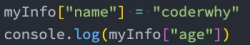
  

### JavaScript 类型 – Symbol 类型

- 在 ES5 中，如果我们是不可以在对象中添加相同的属性名称的，比如下面的做法：

  

- 通常我们的做法是定义两个不同的属性名字：比如 identity1 和 identity2。

- 但是我们也可以通过 symbol 来定义相同的名称，因为 Symbol 函数返回的是不同的值：


### JavaScript 类型 – null 和 undefined 类型

- 在 JavaScript 中，undefined 和 null 是两个基本数据类型。
- 在 TypeScript 中，它们各自的类型也是 undefined 和 null，也就意味着它们既是实际的值，也是自己的类型：


### TypeScript 类型 - any 类型

- 在某些情况下，我们确实无法确定一个变量的类型，并且可能它会发生一些变化，这个时候我们可以使用 any 类型（类似 于 Dart 语言中的 dynamic 类型）。

- any 类型有点像一种讨巧的 TypeScript 手段：

  - 我们可以对 any 类型的变量进行任何的操作，包括获取不存在的属性、方法；

  - 我们给一个 any 类型的变量赋值任何的值，比如数字、字符串的值；

    

- 如果对于某些情况的处理过于繁琐不希望添加规定的类型注解，或者在引入一些第三方库时，缺失了类型注解，这个时候 我们可以使用 any：

  - 包括在 Vue 源码中，也会使用到 any 来进行某些类型的适配；

### TypeScript 类型 - unknown 类型

- unknown 是 TypeScript 中比较特殊的一种类型，它用于描述类型不确定的变量。
- 什么意思呢？我们来看下面的场景：

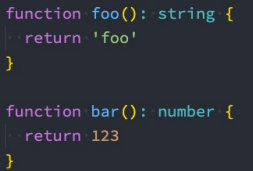

### TypeScript 类型 - void 类型

- void 通常用来指定一个函数是没有返回值的，那么它的返回值就是 void 类型：

  - 我们可以将 null 和 undefined 赋值给 void 类型，也就是函数可以返回 null 或者 undefined

    

- 这个函数我们没有写任何类型，那么它默认返回值的类型就是 void 的，我们也可以显示的来指定返回值是 void：

  

### TypeScript 类型 - never 类型

- never 表示永远不会发生值的类型，比如一个函数：

  - 如果一个函数中是一个死循环或者抛出一个异常，那么这个函数会返回东西吗？

  - 不会，那么写 void 类型或者其他类型作为返回值类型都不合适，我们就可以使用 never 类型；

    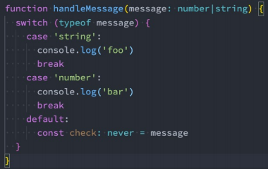

- never 有什么样的应用场景呢？这里我们举一个例子，但是它用到了联合类型，后面我们会讲到： TypeScript 类型 - never 类型

### TypeScript 类型 - tuple 类型

- tuple 是元组类型，很多语言中也有这种数据类型，比如 Python、Swift 等。

  

- 那么 tuple 和数组有什么区别呢？

  - 首先，数组中通常建议存放相同类型的元素，不同类型的元素是不推荐放在数组中。（可以放在对象或者元组 中）

  - 其次，元组中每个元素都有自己特性的类型，根据索引值获取到的值可以确定对应的类型；

    

### Tuple 的应用场景

- 那么 tuple 在什么地方使用的是最多的呢？

  - tuple 通常可以作为返回的值，在使用的时候会非常的方便；

    

## TypeScript 中的类型

### 函数的参数类型

- 函数是 JavaScript 非常重要的组成部分，TypeScript 允许我们指定函数的参数和返回值的类型。

- 参数的类型注解

  - 声明函数时，可以在每个参数后添加类型注解，以声明函数接受的参数类型：

    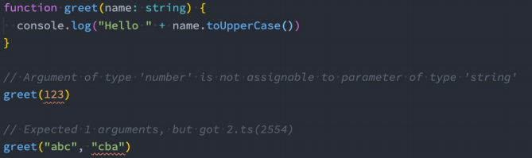

### 函数的返回值类型

- 我们也可以添加返回值的类型注解，这个注解出现在函数列表的后面：

  

- 和变量的类型注解一样，我们通常情况下不需要返回类型注解，因为 TypeScript 会根据 return 返回值推断函数的 返回类型：

  - 某些第三方库处于方便理解，会明确指定返回类型，但是这个看个人喜好；

### 匿名函数的参数

- 匿名函数与函数声明会有一些不同：

  - 当一个函数出现在 TypeScript 可以确定该函数会被如何调用的地方时；

  - 该函数的参数会自动指定类型；

    

- 我们并没有指定 item 的类型，但是 item 是一个 string 类型：

  - 这是因为 TypeScript 会根据 forEach 函数的类型以及数组的类型推断出 item 的类型；
  - 这个过程称之为上下文类型（contextual typing），因为函数执行的上下文可以帮助确定参数和返回值的类型；

### 对象类型

- 如果我们希望限定一个函数接受的参数是一个对象，这个时候要如何限定呢？

  - 我们可以使用对象类型；

    

- 在这里我们使用了一个对象来作为类型：

  - 在对象我们可以添加属性，并且告知 TypeScript 该属性需要是什么类型；
  - 属性之间可以使用 , 或者 ; 来分割，最后一个分隔符是可选的；
  - 每个属性的类型部分也是可选的，如果不指定，那么就是 any 类型；

### 可选类型

- 对象类型也可以指定哪些属性是可选的，可以在属性的后面添加一个?：

  

### 联合类型

- TypeScript 的类型系统允许我们使用多种运算符，从现有类型中构建新类型。

- 我们来使用第一种组合类型的方法：联合类型（Union Type）

  - 联合类型是由两个或者多个其他类型组成的类型；
  - 表示可以是这些类型中的任何一个值；
  - 联合类型中的每一个类型被称之为联合成员（union's members）；

  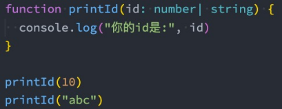

### 使用联合类型

- 传入给一个联合类型的值是非常简单的：只要保证是联合类型中的某一个类型的值即可

  - 但是我们拿到这个值之后，我们应该如何使用它呢？因为它可能是任何一种类型。

  - 比如我们拿到的值可能是 string 或者 number，我们就不能对其调用 string 上的一些方法；

- 那么我们怎么处理这样的问题呢？

  - 我们需要使用缩小（narrow）联合（后续我们还会专门讲解缩小相关的功能）；

  - TypeScript 可以根据我们缩小的代码结构，推断出更加具体的类型；


### 可选类型补充

- 其实上，可选类型可以看做是 类型 和 undefined 的联合类型：


### 类型别名

- 在前面，我们通过在类型注解中编写 对象类型 和 联合类型，但是当我们想要多次在其他地方使用时，就要编写多 次。
- 比如我们可以给对象类型起一个别名：


### 类型断言 as

- 有时候 TypeScript 无法获取具体的类型信息，这个我们需要使用类型断言（Type Assertions）。

  - 比如我们通过 document.getElementById，TypeScript 只知道该函数会返回 HTMLElement ，但并不知道它 具体的类型：

    

- TypeScript 只允许类型断言转换为 更具体 或者 不太具体 的类型版本，此规则可防止不可能的强制转换：


### 非空类型断言!

- 当我们编写下面的代码时，在执行 ts 的编译阶段会报错：

  - 这是因为传入的 message 有可能是为 undefined 的，这个时候是不能执行方法的；

    

- 但是，我们确定传入的参数是有值的，这个时候我们可以使用非空类型断言：

  - 非空断言使用的是 ! ，表示可以确定某个标识符是有值的，跳过 ts 在编译阶段对它的检测；

    

### 可选链的使用

- 可选链事实上并不是 TypeScript 独有的特性，它是 ES11（ES2020）中增加的特性：

  - 可选链使用可选链操作符 **?.**；

  - 它的作用是当对象的属性不存在时，会短路，直接返回 undefined，如果存在，那么才会继续执行；

  - 虽然可选链操作是 ECMAScript 提出的特性，但是和 TypeScript 一起使用更版本；

    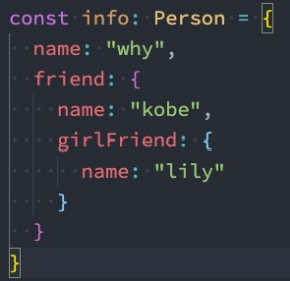

    

### ??和!!的作用

- 有时候我们还会看到 !! 和 ?? 操作符，这些都是做什么的呢？

- !!操作符：

  - 将一个其他类型转换成 boolean 类型；

  - 类似于 Boolean(变量)的方式；

- ??操作符：

  - 它是 ES11 增加的新特性；

  - **空值合并操作符（??）是一个逻辑操作符，当操作符的左侧是 null 或者 undefined 时，返回其右侧操作数， 否则返回左侧操作数；**

    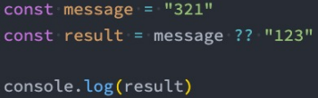

### 字面量类型

- 除了前面我们所讲过的类型之外，也可以使用字面量类型（literal types）：

  

- 那么这样做有什么意义呢？

  - 默认情况下这么做是没有太大的意义的，但是我们可以将多个类型联合在一起；

    

### 字面量推理

- 我们来看下面的代码：


- 这是因为我们的对象再进行字面量推理的时候，info 其实是一个 {url: string, method: string}，所以我们没办法将 一个 string 赋值给一个 字面量 类型。


### 类型缩小

- 什么是类型缩小呢？
  - 类型缩小的英文是 Type Narrowing；
  - 我们可以通过类似于 typeof padding === "number" 的判断语句，来改变 TypeScript 的执行路径；
  - 在给定的执行路径中，我们可以缩小比声明时更小的类型，这个过程称之为 缩小;
  - 而我们编写的 typeof padding === "number 可以称之为 类型保护（type guards）；
- 常见的类型保护有如下几种：
  - typeof
  - 平等缩小（比如===、!==）
  - instanceof
  - in
  - 等等...

#### typeof

- 在 TypeScript 中，检查返回的值 typeof 是一种类型保护：应为 TypeScript 对如何 typeof 操作不同的值进行编码


#### 平等缩小

- 我们可以使用 Switchh 或者相等的一些运算符来表达相等性（比如===，！==，==，！=）


#### instanceof

- JavaScript 有一个运算符来检查一个值是否是另一个值的实例；


#### in

- JavaScript 有一个运算符，用于缺点对象是否具有带名称的属性：in 运算符

  - 如果指定的属性在指定的对象或其原型链中，则 in 运算符返回 true

    

## TypeScript 中的函数类型

- 在 JavaScript 开发中，函数是重要的组成部分，并且函数可以作为一等公民（可以作为参数，也可以作为返回值进行传递）。

- 那么在使用函数的过程中，函数是否也可以有自己的类型呢？

  - 我们可以编写函数类型的表达式（FunctionTypeExpressions），来表示函数类型；

    

### TypeScript 函数类型解析

- 在上面的语法中(num1:number,num2:number)=>void，代表的就是一个函数类型：

  - 接收两个参数的函数：num1 和 num2，并且都是 number 类型；
  - 并且这个函数是没有返回值的，所以是 void；

- 在某些语言中，可能参数名称 num1 和 num2 是可以省略，但是 TypeScript 是不可以的：

  

### 参数的可选类型

- 可以指定某个参数是可选的：

  

- 这个时候这个参数 x 依然是有类型的，它是什么类型呢？number|undefined

  

- 另外可选类型需要在必传参数的后面：

  

### 默认参数

- 从 ES6 开始，JavaScript 是支持默认参数的，TypeScript 也是支持默认参数的：

  

- 这个时候 y 的类型其实是 undefined 和 number 类型的联合。

### 剩余参数.

- 从 ES6 开始，JavaScript 也支持剩余参数，剩余参数语法允许我们将一个不定数量的参数放到一个数组中。

  

### 可推导的 this 类型

- this 是 JavaScript 中一个比较难以理解和把握的知识点：

  - 我在公众号也有一篇文章专门讲解 this：https://mp.weixin.qq.com/s/hYm0JgBI25grNG_2sCRlTA；
  - 因为 this 在不同的情况下会绑定不同的值，所以对于它的类型就更难把握了；

- 那么，TypeScript 是如何处理 this 呢？我们先来看一个例子：

  

- 上面的代码是可以正常运行的，也就是 TypeScript 在编译时，认为我们的 this 是可以正确去使用的：

  - TypeScript 认为函数 sayHello 有一个对应的 this 的外部对象 info，所以在使用时，就会把 this 当做该对象。

### 不确定的 this 类型

- 但是对于某些情况来说，我们并不知道 this 到底是什么？

  

- 这段代码运行会报错的：

  - 这里我们再次强调一下，TypeScript 进行类型检测的目的是让我们的代码更加的安全；
  - 所以这里对于 sayHello 的调用来说，我们虽然将其放到了 info 中，通过 info 去调用，this 依然是指向 info 对象的；
  - 但是对于 TypeScript 编译器来说，这个代码是非常不安全的，因为我们也有可能直接调用函数，或者通过别的对象来调用函数；

### 指定 this 的类型

- 这个时候，通常 TypeScript 会要求我们明确的指定 this 的类型：

  

### 函数的重载

- 在 TypeScript 中，如果我们编写了一个 add 函数，希望可以对字符串和数字类型进行相加，应该如何编写呢？

- 我们可能会这样来编写，但是其实是错误的：

  

- 那么这个代码应该如何去编写呢？

  - 在 TypeScript 中，我们可以去编写不同的重载签名（overloadsignatures）来表示函数可以以不同的方式进行调用；
  - 一般是编写两个或者以上的重载签名，再去编写一个通用的函数以及实现；

### sum 函数的重载

- 比如我们对 sum 函数进行重构：

  - 在我们调用 sum 的时候，它会根据我们传入的参数类型来决定执行函数体时，到底执行哪一个函数的重载签名；

    

- 但是注意，有实现提的函数，是不能直接被调用的：

  

### 联合类型和重载

- 我们现在有一个需求：定义一个函数，可以传入字符串或者数组，获取它们的长度。

- 这里有两种实现方案：

  - 方案一：使用联合类型来实现；

  - 方案二：实现函数重载来实现；

    

    

- 在开发中我们选择使用哪一种呢？

  - 在可能的情况下，尽量选择使用联合类型来实现；

## TypeScript 类的使用

### 认识类的使用

- 在早期的 JavaScript 开发中（ES5）我们需要通过函数和原型链来实现类和继承，从 ES6 开始，引入了 class 关键字，可以更加方便的定义和使用类。
- TypeScript 作为 JavaScript 的超集，也是支持使用 class 关键字的，并且还可以对类的属性和方法等进行静态类型检测。
- 实际上在 JavaScript 的开发过程中，我们更加习惯于函数式编程：
  - 比如 React 开发中，目前更多使用的函数组件以及结合 Hook 的开发模式；
  - 比如在 Vue3 开发中，目前也更加推崇使用 CompositionAPI；
- 但是在封装某些业务的时候，类具有更强大封装性，所以我们也需要掌握它们。
- 类的定义我们通常会使用 class 关键字：
  - 在面向对象的世界里，任何事物都可以使用类的结构来描述；
  - 类中包含特有的属性和方法；

### 类的定义

- 我们来定义一个 Person 类：

  

- 使用 class 关键字来定义一个类；

- 我们可以声明一些类的属性：在类的内部声明类的属性以及对应的类型

  - 如果类型没有声明，那么它们默认是 any 的；
  - 我们也可以给属性设置初始化值；
  - 在默认的 strictPropertyInitialization 模式下面我们的属性是必须初始化的，如果没有初始化，那么编译时就会报错；
    - 如果我们在 strictPropertyInitialization 模式下确实不希望给属性初始化，可以使用 name!:string 语法；

- 类可以有自己的构造函数 constructor，当我们通过 new 关键字创建一个实例时，构造函数会被调用；

  - 构造函数不需要返回任何值，默认返回当前创建出来的实例；

- 类中可以有自己的函数，定义的函数称之为方法；

### 类的继承

- 面向对象的其中一大特性就是继承，继承不仅仅可以减少我们的代码量，也是多态的使用前提。

- 我们使用 extends 关键字来实现继承，子类中使用 super 来访问父类。

- 我们来看一下 Student 类继承自 Person：

  - Student 类可以有自己的属性和方法，并且会继承 Person 的属性和方法；

  - 在构造函数中，我们可以通过 super 来调用父类的构造方法，对父类中的属性进行初始化；

    

    

### 类的多态

- 基于继承和接口实现

  ```js
  class Animal {
    action() {
      console.log("animal action");
    }
  }

  class Dog extends Animal {
    action() {
      console.log("dog running!!!");
    }
  }

  class Fish extends Animal {
    action() {
      console.log("fish swimming");
    }
  }

  class Person extends Animal {}

  // animal: dog/fish
  // 多态的目的是为了写出更加具备通用性的代码
  function makeActions(animals: Animal[]) {
    animals.forEach((animal) => {
      animal.action();
    });
  }

  makeActions([new Dog(), new Fish(), new Person()]);
  ```

### 类的成员修饰符

- 在 TypeScript 中，类的属性和方法支持三种修饰符：public、private、protected

  - public 修饰的是在任何地方可见、公有的属性或方法，默认编写的属性就是 public 的；
  - private 修饰的是仅在同一类中可见、私有的属性或方法；
  - protected 修饰的是仅在类自身及子类中可见、受保护的属性或方法；

- public 是默认的修饰符，也是可以直接访问的，我们这里来演示一下 protected 和 private。

  

  

### 只读属性 readonly

- 如果有一个属性我们不希望外界可以任意的修改，只希望确定值后直接使用，那么可以使用 readonly：

  

### getters/setters

- 在前面一些私有属性我们是不能直接访问的，或者某些属性我们想要监听它的获取(getter)和设置(setter)的过程，这个时候我们可以使用存取器。

  

  

### 静态成员

- 前面我们在类中定义的成员和方法都属于对象级别的,在开发中,我们有时候也需要定义类级别的成员和方法。

- 在 TypeScript 中通过关键字 static 来定义：

  

### 抽象类 abstract

- 我们知道，继承是多态使用的前提。
  - 所以在定义很多通用的调用接口时,我们通常会让调用者传入父类，通过多态来实现更加灵活的调用方式。
  - 但是，父类本身可能并不需要对某些方法进行具体的实现，所以父类中定义的方法,，我们可以定义为抽象方法。
- 什么是抽象方法? 在 TypeScript 中没有具体实现的方法(没有方法体)，就是抽象方法。
  - 抽象方法，必须存在于抽象类中；
  - 抽象类是使用 abstract 声明的类；
- 抽象类有如下的特点：
  - 抽象类是不能被实例的话（也就是不能通过 new 创建）
  - 抽象方法必须被子类实现，否则该类必须是一个抽象类；

### 抽象类演练

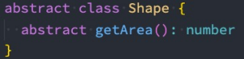


### 类的类型

- 类本身也是可以作为一种数据类型的：

  

## TypeScript 接口的使用

### 接口的声明

- 在前面我们通过 type 可以用来声明一个对象类型：

  

- 对象的另外一种声明方式就是通过接口来声明：

  

- 他们在使用上的区别，我们后续再来说明。

- 接下来我们继续学习一下接口的其他特性。

### 可选属性

- 接口中我们也可以定义可选属性：

  

### 只读属性

- 接口中也可以定义只读属性：

  - 这样就意味着我们再初始化之后，这个值是不可以被修改的；

    

    

### 索引类型

- 前面我们使用 interface 来定义对象类型，这个时候其中的属性名、类型、方法都是确定的，但是有时候我们会遇到类似下面的对象：

  

  

### 函数类型

- 前面我们都是通过 interface 来定义对象中普通的属性和方法的，实际上它也可以用来定义函数类型：

  

- 当然，除非特别的情况，还是推荐大家使用类型别名来定义函数：

  

### 接口继承

- 接口和类一样是可以进行继承的，也是使用 extends 关键字：

  - 并且我们会发现，接口是支持多继承的（类不支持多继承）

    

    

### 接口的实现

- 接口定义后，也是可以被类实现的：

  - 如果被一个类实现，那么在之后需要传入接口的地方，都可以将这个类传入；

  - 这就是面向接口开发；

    

    

- ### 交叉类型

- 前面我们学习了联合类型：

  - 联合类型表示多个类型中一个即可

    

- 还有另外一种类型合并，就是交叉类型（Intersection Types）：

  - 交叉类似表示需要满足多个类型的条件；
  - 交叉类型使用 & 符号；

- 我们来看下面的交叉类型：

  - 表达的含义是 number 和 string 要同时满足；

  - 但是有同时满足是一个 number 又是一个 string 的值吗？其实是没有的，所以 MyType 其实是一个 never 类型；

    

### 交叉类型的应用

- 所以，在开发中，我们进行交叉时，通常是对对象类型进行交叉的：

  

### interface 和 type 区别

- 我们会发现 interface 和 type 都可以用来定义对象类型，那么在开发中定义对象类型时，到底选择哪一个呢？
  - 如果是定义非对象类型，通常推荐使用 type，比如 Direction、Alignment、一些 Function；
- 如果是定义对象类型，那么他们是有区别的：
  - interface 可以重复的对某个接口来定义属性和方法；
  - 而 type 定义的是别名，别名是不能重复的；

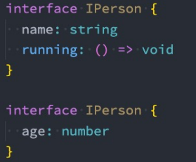

### 字面量赋值

- 我们来看下面的代码：

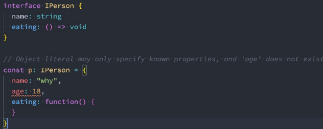

- 这是因为 TypeScript 在字面量直接赋值的过程中，为了进行类型推导会进行严格的类型限制。
  - **但是之后如果我们是将一个 变量标识符 赋值给其他的变量时，会进行 freshness 擦除操作。**

### TypeScript 枚举类型

- 枚举类型是为数不多的 TypeScript 特性有的特性之一：

  - 枚举其实就是将一组可能出现的值，一个个列举出来，定义在一个类型中，这个类型就是枚举类型；

  - 枚举允许开发者定义一组命名常量，常量可以是数字、字符串类型；

    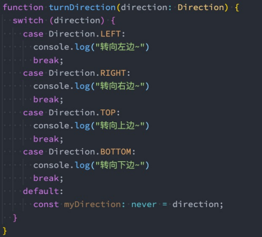

### 枚举类型的值

- 枚举类型默认是有值的，比如上面的枚举，默认值是这样的：

- 当然，我们也可以给枚举其他值：

  - 这个时候会从 100 进行递增；

- 我们也可以给他们赋值其他的类型：

  

## TypeScript 泛型的使用

### 认识泛型

- 软件工程的主要目的是构建不仅仅明确和一致的 API，还要让你的代码具有很强的可重用性：

  - 比如我们可以通过函数来封装一些 API，通过传入不同的函数参数，让函数帮助我们完成不同的操作；
  - 但是对于参数的类型是否也可以参数化呢？

- 什么是类型的参数化？

  - 我们来提一个需求：封装一个函数，传入一个参数，并且返回这个参数；

- 如果我们是 TypeScript 的思维方式，要考虑这个参数和返回值的类型需要一致：

  

- 上面的代码虽然实现了，但是不适用于其他类型，比如 string、boolean、Person 等类型：

  

### 泛型实现类型参数化

- 虽然 any 是可以的，但是定义为 any 的时候，我们其实已经丢失了类型信息：

  - 比如我们传入的是一个 number，那么我们希望返回的可不是 any 类型，而是 number 类型；
  - 所以，我们需要在函数中可以捕获到参数的类型是 number，并且同时使用它来作为返回值的类型；

- 我们需要在这里使用一种特性的变量 - 类型变量（type variable），它作用于类型，而不是值：

  

- 这里我们可以使用两种方式来调用它：

  - 方式一：通过 <类型>的方式将类型传递给函数；

  - 方式二：通过类型推到，自动推到出我们传入变量的类型：

    - 在这里会推导出它们是 字面量类型的，因为字面量类型对于我们的函数也是适用的

      

### 泛型的基本补充

- 当然我们也可以传入多个类型：

  

- 平时在开发中我们可能会看到一些常用的名称：

  - T：Type 的缩写，类型
  - K、V：key 和 value 的缩写，键值对
  - E：Element 的缩写，元素
  - O：Object 的缩写，对象

### 泛型接口

- 在定义接口的时候我们也可以使用泛型：


### 泛型类

- 我们也可以编写一个泛型类：


### 泛型约束

- 有时候我们希望传入的类型有某些共性，但是这些共性可能不是在同一种类型中：

  - 比如 string 和 array 都是有 length 的，或者某些对象也是会有 length 属性的；

  - 那么只要是拥有 length 的属性都可以作为我们的参数类型，那么应该如何操作呢？

    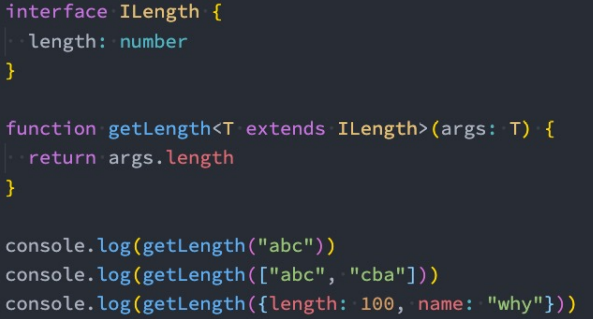

## TypeScript 内容补充

### 模块化开发

- TypeScript 支持两种方式来控制我们的作用域：

  - 模块化：每个文件可以是一个独立的模块，支持 ES Module，也支持 CommonJS；

  - 命名空间：通过 namespace 来声明一个命名空间

    

### 命名空间 namespace

- 命名空间在 TypeScript 早期时，称之为内部模块，主要目的是将一个模块内部再进行作用域的划分，防止一些命名 冲突的问题。

  

### 类型的查找

- 之前我们所有的 typescript 中的类型，几乎都是我们自己编写的，但是我们也有用到一些其他的类型：

  

- 大家是否会奇怪，我们的 HTMLImageElement 类型来自哪里呢？甚至是 document 为什么可以有 getElementById 的方 法呢？

  - 其实这里就涉及到 typescript 对类型的管理和查找规则了。

- 我们这里先给大家介绍另外的一种 typescript 文件：.d.ts 文件

  - 我们之前编写的 typescript 文件都是 .ts 文件，这些文件最终会输出 .js 文件，也是我们通常编写代码的地方；
  - 还有另外一种文件 .d.ts 文件，它是用来做类型的声明(declare)。 它仅仅用来做类型检测，告知 typescript 我们有哪 些类型；

- 那么 typescript 会在哪里查找我们的类型声明呢？

  - 内置类型声明；
  - 外部定义类型声明；
  - 自己定义类型声明；

### 内置类型声明

- 内置类型声明是 typescript 自带的、帮助我们内置了 JavaScript 运行时的一些标准化 API 的声明文件；
  - 包括比如 Math、Date 等内置类型，也包括 DOM API，比如 Window、Document 等；
- 内置类型声明通常在我们安装 typescript 的环境中会带有的；
  - https://github.com/microsoft/TypeScript/tree/main/lib

### 外部定义类型声明和自定义声明

- 外部类型声明通常是我们使用一些库（比如第三方库）时，需要的一些类型声明。
- 这些库通常有两种类型声明方式：
- 方式一：在自己库中进行类型声明（编写.d.ts 文件），比如 axios
- 方式二：通过社区的一个公有库 DefinitelyTyped 存放类型声明文件
  - 该库的 GitHub 地址：https://github.com/DefinitelyTyped/DefinitelyTyped/
  - **该库查找声明安装方式的地址**：https://www.typescriptlang.org/dt/search?search=
  - 比如我们安装 react 的类型声明： npm i @types/react --save-dev
- 什么情况下需要自己来定义声明文件呢？
  - 情况一：我们使用的第三方库是一个纯的 JavaScript 库，没有对应的声明文件；比如 lodash
  - 情况二：我们给自己的代码中声明一些类型，方便在其他地方直接进行使用；

### 声明变量-函数-类


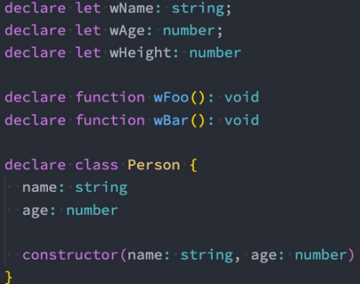

### 声明模块

- 我们也可以声明模块，比如 lodash 模块默认不能使用的情况，可以自己来声明这个模块：

  

- 声明模块的语法: declare module '模块名' {}。

  - 在声明模块的内部，我们可以通过 export 导出对应库的类、函数等；

### declare 文件

- 在某些情况下，我们也可以声明文件：

  - 比如在开发 vue 的过程中，默认是不识别我们的.vue 文件的，那么我们就需要对其进行文件的声明；

  - 比如在开发中我们使用了 jpg 这类图片文件，默认 typescript 也是不支持的，也需要对其进行声明；

    

### declare 命名空间

- 比如我们在 index.html 中直接引入了 jQuery：

- CDN 地址： https://cdn.bootcdn.net/ajax/libs/jquery/3.6.0/jquery.js

- 我们可以进行命名空间的声明：

  

- 在 main.ts 中就可以使用了：

  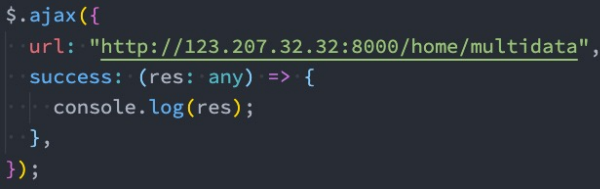

### tsconfig.json 文件

tsconfig.json 是用于配置 TypeScript 编译时的配置选项：

https://www.typescriptlang.org/tsconfig

我们这里讲解几个比较常见的：


